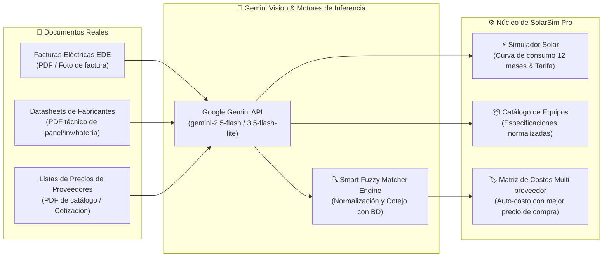
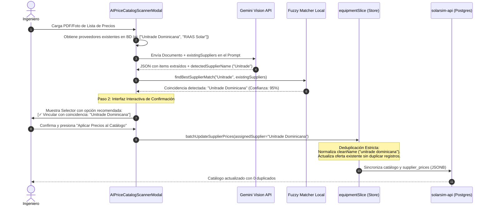

# 🧠 Manual Técnico de Motores y Escáneres de Inteligencia Artificial Multimodal (Gemini Vision)
## SolarSim Pro — Automatización Cognitiva de Ingeniería y Costos

Este documento describe la arquitectura, los modelos de lenguaje visual (VLM), los algoritmos de cotejo inteligente (*Smart Fuzzy Matching*), la normalización de entidades y la lógica de integración de los tres escáneres de Inteligencia Artificial multimodal implementados en **SolarSim Pro**.

---

## 📑 Tabla de Contenido
1. [Visión General del Subsistema de Inteligencia Artificial](#1-visión-general-del-subsistema-de-inteligencia-artificial)
2. [Escáner 1: Facturas Eléctricas Dominicanas (EDE)](#2-escáner-1-facturas-eléctricas-dominicanas-ede)
3. [Escáner 2: Fichas Técnicas de Equipos (*Datasheets*)](#3-escáner-2-fichas-técnicas-de-equipos-datasheets)
4. [Escáner 3: Listas de Precios de Proveedores & Smart Fuzzy Matching](#4-escáner-3-listas-de-precios-de-proveedores--smart-fuzzy-matching)
5. [Algoritmo de Smart Fuzzy Matching y Deduplicación de Proveedores](#5-algoritmo-de-smart-fuzzy-matching-y-deduplicación-de-proveedores)
6. [Integración con el Motor Financiero y Modo Auto-Costo](#6-integración-con-el-motor-financiero-y-modo-auto-costo)
7. [Consideraciones de Seguridad, Tokens y Cuotas de API](#7-consideraciones-de-seguridad-tokens-y-cuotas-de-api)

---

## 1. Visión General del Subsistema de Inteligencia Artificial

SolarSim Pro integra capacidades de visión artificial mediante **Google Gemini Vision API** para eliminar la digitación manual y automatizar los tres cuellos de botella más críticos en la ingeniería solar:



### Modelos de Inferencia Soportados:
- **`gemini-2.5-flash`** (Recomendado): Balance óptimo entre velocidad (<3 segundos), razonamiento multimodal complejo y precisión en extracción de tablas y números densos.
- **`gemini-3.5-flash-lite`**: Ideal para alta concurrencia y documentos sencillos de una sola página.
- **`gemini-2.0-flash`**: Soporte heredado de alta compatibilidad.

### Aislamiento de Entorno (Desktop vs Web):
- **Modo Escritorio (Electron)**: El proceso principal (`electron/aiInvoiceHandler.ts`) renderiza documentos PDF multi-página a lienzos de alta resolución (*Canvas*) en memoria para garantizar máxima legibilidad óptica de caracteres diminutos antes de transmitirlos a Gemini.
- **Modo Web**: Utiliza el API nativo `FileReader` y renderizado vía WebAssembly / Canvas sin depender de binarios nativos del sistema operativo.

---

## 2. Escáner 1: Facturas Eléctricas Dominicanas (EDE)

* **Servicio**: [`geminiInvoiceService.ts`](file:///home/ishiro/Proyectos/1_Principales/solarsim/src/services/geminiInvoiceService.ts)
* **Componente de Interfaz**: [`AIInvoiceScannerModal.tsx`](file:///home/ishiro/Proyectos/1_Principales/solarsim/src/components/common/AIInvoiceScannerModal.tsx)

### Cobertura de Distribuidoras en República Dominicana:
El escáner está específicamente entrenado y validado para reconocer los formatos de facturación de las empresas distribuidoras oficiales:
1. **EDEESTE** (Empresa Distribuidora de Electricidad del Este).
2. **EDESUR** (Empresa Distribuidora de Electricidad del Sur).
3. **EDENORTE** (Empresa Distribuidora de Electricidad del Norte).
4. **CEPM** (Consorcio Energético Punta Cana - Macao).

### Datos Extraídos y Normalizados:
| Campo | Formato | Descripción |
| :--- | :--- | :--- |
| **Distribuidora** | `EDEESTE` \| `EDESUR` \| `EDENORTE` \| `CEPM` | Identificación automática del suplidor eléctrico. |
| **NIS / NIC** | `string` | Número de Identificación de Suministro o Contrato. |
| **RNC / Cédula** | `string` | Identificación tributaria del cliente o razón social. |
| **Nombre del Cliente** | `string` | Titular del suministro eléctrico. |
| **Tarifa Oficial** | `BTS1`, `BTS2`, `BTD`, `MTD1`, `MTD2`, `MTH`, etc. | Código tarifario regulado por la Superintendencia de Electricidad (SIE). |
| **Potencia Contratada** | `number` (kW) | Demanda máxima o potencia contratada asignada. |
| **Historial de Consumo** | `number[12]` (kWh) | Matriz cronológica de los 12 meses de consumo facturado. |

### Lógica de Heurística y Corrección:
- **Detección de Cronología Invertida**: Las facturas de EDESUR y EDEESTE frecuentemente presentan los meses de derecha a izquierda o de abajo hacia arriba. El servicio detecta automáticamente el orden cronológico para garantizar que el mes actual corresponda al índice 11 (diciembre o mes en curso).
- **Interpolación de Meses Faltantes**: Si el historial contiene lagunas por medidores averiados o facturas estimadas, el servicio calcula el promedio móvil estacional para evitar distorsiones en el dimensionamiento fotovoltaico.

---

## 3. Escáner 2: Fichas Técnicas de Equipos (*Datasheets*)

* **Servicio**: [`geminiDatasheetService.ts`](file:///home/ishiro/Proyectos/1_Principales/solarsim/src/services/geminiDatasheetService.ts)
* **Componente de Interfaz**: [`AIDatasheetScannerModal.tsx`](file:///home/ishiro/Proyectos/1_Principales/solarsim/src/components/common/AIDatasheetScannerModal.tsx)

### Clasificación Autónoma del Tipo de Equipo:
El escáner analiza el encabezado y las curvas características del documento PDF y clasifica automáticamente el componente en una de tres familias:
1. **Módulo Fotovoltaico (`panel`)**: Paneles monocristalinos, bifaciales, TOPCon, HJT, PERC.
2. **Inversor Solar (`inverter`)**: Inversores híbridos split-phase, string on-grid, microinversores.
3. **Almacenamiento BESS (`battery`)**: Baterías de litio ferrofosfato (LiFePO4), alto o bajo voltaje (LV/HV).

### Especificaciones Extraídas y Unidades Normalizadas:

#### Para Paneles Fotovoltaicos:
- **Potencia Nominal ($W_p$)**: Normalizada estrictamente a Vatios Pico ($W_p$).
- **Eficiencia del Módulo ($\%$)**: Valor porcentual STC (ej. $22.2\%$).
- **Coeficiente de Temperatura de $P_{\text{max}}$ ($\%/\text{°C}$)**: Factor crítico para RD (ej. $-0.29\%/\text{°C}$).
- **Degradación Anual ($\%$)**: Tasa de degradación garantizada por el fabricante (ej. $0.4\%/\text{año}$).
- **Tecnología de Celda**: N-Type TOPCon, HJT, Monocristalino PERC, etc.

#### Para Inversores:
- **Potencia Nominal AC ($kW$)**: Convertida automáticamente de $W$ o $kVA$ a $kW$ activo.
- **Eficiencia Máxima ($\%$)**: Eficiencia ponderada europea o CEC.
- **Rango de Voltaje MPPT ($V$)**: Rango operativo en voltios DC (ej: `120V - 500V`).
- **Capacidad de Sobrecarga DC ($kWp$)**: Potencia solar máxima admitida en entrada DC.

#### Para Baterías BESS:
- **Capacidad Nominal de Almacenamiento ($kWh$)**: Energía total útil en kilovatios-hora.
- **Capacidad de Carga ($Ah$)**: Amperios-hora nominales (ej. $314\text{ Ah}$).
- **Voltaje Nominal ($V$)**: Tensión nominal DC (ej. $51.2\text{ V}$).
- **Profundidad de Descarga Recomendada ($DoD\text{ }\%$)**: Porcentaje de descarga segura (ej. $90\%$).
- **Ciclos Garantizados de Vida**: Número de ciclos a $25\text{°C}$ (ej. $6,000$ u $8,000$ ciclos).

---

## 4. Escáner 3: Listas de Precios de Proveedores & Smart Fuzzy Matching

* **Servicio**: [`geminiPriceCatalogService.ts`](file:///home/ishiro/Proyectos/1_Principales/solarsim/src/services/geminiPriceCatalogService.ts)
* **Componentes de Interfaz**:
  - [`AIPriceCatalogScannerModal.tsx`](file:///home/ishiro/Proyectos/1_Principales/solarsim/src/components/common/AIPriceCatalogScannerModal.tsx) (Escaneo, revisión interactiva y cotejo)
  - [`SupplierPricesDetailModal.tsx`](file:///home/ishiro/Proyectos/1_Principales/solarsim/src/components/common/SupplierPricesDetailModal.tsx) (Detalle de ofertas por equipo)
  - [`SupplierManagerSection.tsx`](file:///home/ishiro/Proyectos/1_Principales/solarsim/src/components/common/SupplierManagerSection.tsx) (Administración global de proveedores)

### El Desafío del Mercado Fotovoltaico Dominicano:
Cada distribuidor emite listas de precios con nomenclaturas no estandarizadas (ej: `"Can. 600W BiHiKu"`, `"LXP 8K Split"`, `"Hina PowerGem 16kWh"`). Subir múltiples cotizaciones o repetir la misma cotización sin control genera:
1. **Duplicación de Proveedores**: `"Unitrade"`, `"Unitrade Dominicana"`, `"Unitrade RD"` creados como entidades independientes.
2. **Duplicación de Ofertas**: Múltiples precios para el mismo inversor o panel en vez de actualizar el registro existente.
3. **Desconexión con el Catálogo**: Precios que no se enlazan con los equipos que el simulador utiliza.

---

## 5. Algoritmo de Smart Fuzzy Matching y Deduplicación de Proveedores

Para resolver esta problemática, SolarSim Pro implementa una arquitectura de **detección e inferencia en tres etapas**:



### 1. Inyección de Contexto en el Prompt de Gemini:
Al invocar a Gemini, el servicio inyecta en el prompt del sistema la lista de proveedores ya registrados en la base de datos:
```typescript
const systemPrompt = `
Eres un analista de compras de energía solar en República Dominicana.
Proveedores existentes actualmente en la base de datos:
${existingSuppliers.map(s => `- ${s}`).join('\n')}

Si el documento pertenece a uno de estos distribuidores o a una variante de su nombre,
indica matchedExistingSupplier con el nombre exacto de la lista anterior.
`;
```

### 2. Motor Local de Limpieza y Similitud (`findBestSupplierMatch`):
Si Gemini no identifica la correspondencia o la conexión es intermitente, el motor local ejecuta una limpieza de sufijos corporativos dominicanos:
```typescript
const SUFFIXES_TO_REMOVE = [
  'dominicana', 'rd', 'r.d.', 'srl', 's.r.l.', 'corp', 'corporation',
  'sa', 's.a.', 'inc', 'solar', 'energy', 'comercial', 'distribuidora'
];
```
Calcula la distancia de Levenshtein y coeficiente de Dice entre el nombre limpio y los proveedores de la base de datos. Si el puntaje supera el $70\%$, sugiere la vinculación automática.

### 3. Ponderación de Smart Fuzzy Matching para Equipos:
Para asociar cada fila de la lista de precios con un equipo del catálogo de referencia, el algoritmo evalúa:
$$\text{Puntaje Total} = W_{\text{marca}} \cdot S_{\text{marca}} + W_{\text{modelo}} \cdot S_{\text{modelo}} + W_{\text{potencia}} \cdot S_{\text{potencia}}$$
- **Marca ($W_{\text{marca}} = 0.35$)**: Coincidencia de fabricante (`Canadian Solar`, `Luxpower`, `HinaESS`, `Huawei`, etc.).
- **Modelo y Serie ($W_{\text{modelo}} = 0.40$)**: Coincidencia de tokens alfanuméricos (`CS6.1`, `LXP-LB-US`, `PowerGem`).
- **Potencia o Capacidad ($W_{\text{potencia}} = 0.25$)**: Coincidencia numérica de capacidad en $W$, $kW$ o $kWh$ con tolerancia del $2\%$.

Si el puntaje supera el umbral de confianza ($0.65$), el ítem se vincula automáticamente en verde (`Coincidencia Alta: 90%`). El usuario puede cambiar la vinculación a cualquier otro equipo o excluirlo del catálogo con un solo clic.

### 4. Deduplicación Estricta en el Store (`equipmentSlice.ts`):
```typescript
// Si ya existe una oferta comercial con el mismo nombre normalizado, la actualiza en lugar de duplicar
const cleanName = supplierPrice.supplierName.toLowerCase().trim();
const existingIndex = otherPrices.findIndex(
  (sp) => sp.supplierName.toLowerCase().trim() === cleanName || (supplierPrice.id && sp.id === supplierPrice.id)
);
```

---

## 6. Integración con el Motor Financiero y Modo Auto-Costo

Una vez registrados los precios de compra de los diferentes distribuidores en el catálogo:

1. **Selector Inteligente de Equipos en el Simulador**:
   - En la sección de equipamiento del simulador (`ParameterSidebar.tsx`), cada modelo muestra un indicador con el número de distribuidores que lo cotizan (ej: `3 prov.`).
   - Al hacer clic, se despliega el comparador comercial con las ofertas ordenadas de menor a mayor precio.
2. **Modo Auto-Costo**:
   - En la pestaña de Cotización & Matriz de Costos (`PricingParamsSection.tsx` / `QuotationEquipmentsTab.tsx`), el simulador permite activar el modo **Auto-costo desde proveedores**.
   - El sistema vincula los costos unitarios base del proyecto (`panelUnitPriceUSD`, `inverterUnitPriceUSD`, `batteryUnitPriceUSD`) con la **oferta más económica del mercado** disponible para los modelos seleccionados.
   - El margen de ganancia comercial de la empresa instaladora se calcula sobre el costo real de compra actualizado.

---

## 7. Consideraciones de Seguridad, Tokens y Cuotas de API

1. **Almacenamiento Seguro de la API Key**:
   - La clave de Google Gemini se almacena en el estado persistente del usuario bajo `localStorage` (`aiSlice.ts`) y **nunca** se envía al servidor central ni se expone a terceros.
2. **Eficiencia en Consumo de Tokens**:
   - Para documentos multi-página, el sistema extrae las páginas de tablas comerciales descartando portadas y hojas de términos legales que no contienen precios, optimizando la ventana de contexto.
3. **Fallback Offline**:
   - Si no hay conexión a Internet o se agota la cuota de la API de Gemini, la aplicación permite ingresar, editar o importar precios de proveedores manualmente a través de [`SupplierManagerSection.tsx`](file:///home/ishiro/Proyectos/1_Principales/solarsim/src/components/common/SupplierManagerSection.tsx).
