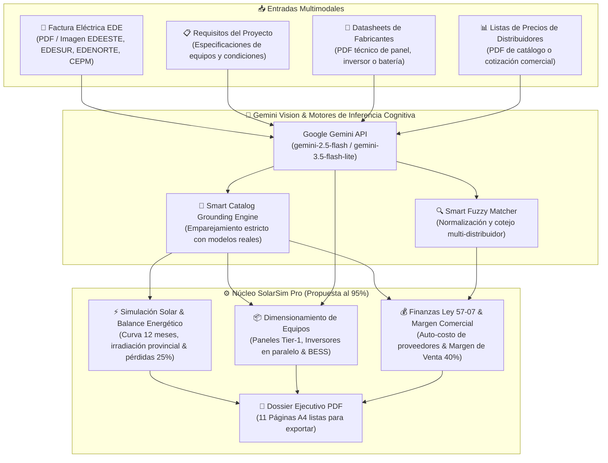
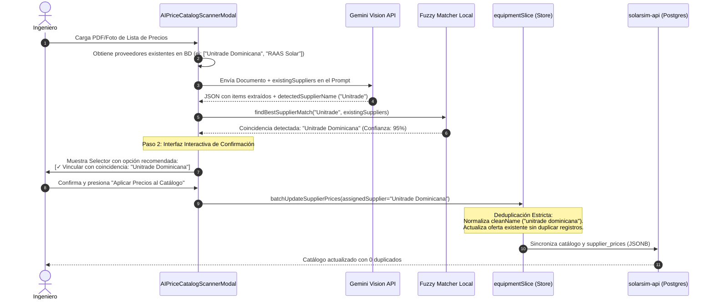

# 🧠 Manual Técnico de Motores y Escáneres de Inteligencia Artificial Multimodal (Gemini Vision)
## SolarSim Pro — Automatización Cognitiva de Ingeniería y Costos

Este documento describe la arquitectura, los modelos de lenguaje visual (VLM), los algoritmos de cotejo inteligente (*Smart Fuzzy Matching*), la normalización de entidades y la lógica de integración de los tres escáneres de Inteligencia Artificial multimodal implementados en **SolarSim Pro**.

---

## 📑 Tabla de Contenido
1. [Visión General del Subsistema de Inteligencia Artificial](#1-visión-general-del-subsistema-de-inteligencia-artificial)
2. [Smart Proposal Studio & Escáner de Facturas EDE (Grounding al 95%)](#2-smart-proposal-studio--escáner-de-facturas-ede-grounding-al-95)
3. [Escáner 2: Fichas Técnicas de Equipos (*Datasheets*)](#3-escáner-2-fichas-técnicas-de-equipos-datasheets)
4. [Escáner 3: Listas de Precios de Proveedores & Smart Fuzzy Matching](#4-escáner-3-listas-de-precios-de-proveedores--smart-fuzzy-matching)
5. [Algoritmo de Smart Fuzzy Matching y Deduplicación de Proveedores](#5-algoritmo-de-smart-fuzzy-matching-y-deduplicación-de-proveedores)
6. [Integración con el Motor Financiero y Modo Auto-Costo](#6-integración-con-el-motor-financiero-y-modo-auto-costo)
7. [Consideraciones de Seguridad, Tokens y Cuotas de API](#7-consideraciones-de-seguridad-tokens-y-cuotas-de-api)

---

## 1. Visión General del Subsistema de Inteligencia Artificial

SolarSim Pro integra capacidades avanzadas de visión e inferencia multimodal mediante **Google Gemini API** para erradicar la digitación manual y automatizar de extremo a extremo la ingeniería y comercialización solar:



### Modelos de Inferencia Soportados:
- **`gemini-2.5-flash`** (Recomendado): Máxima precisión en razonamiento multimodal, extracción de tablas densas y comprensión de requerimientos informales de chat.
- **`gemini-3.5-flash-lite`**: Inferencia ultrarrápida y económica para entornos de alta concurrencia.
- **`gemini-2.0-flash`**: Soporte estándar de alta disponibilidad.

### Aislamiento de Entorno (Desktop vs Web):
- **Modo Escritorio (Electron)**: El proceso principal (`electron/aiInvoiceHandler.ts`) renderiza documentos PDF multi-página a lienzos de alta resolución (*Canvas*) en memoria para garantizar máxima legibilidad óptica de caracteres diminutos antes de transmitirlos a Gemini.
- **Modo Web**: Utiliza el API nativo `FileReader` y renderizado vía WebAssembly / Canvas sin depender de binarios nativos del sistema operativo.

---

## 2. Smart Proposal Studio & Escáner de Facturas EDE (Grounding al 95%)

* **Servicios**: [`geminiInvoiceService.ts`](file:///home/ishiro/Proyectos/1_Principales/solarsim/src/services/geminiInvoiceService.ts) y [`electron/aiInvoiceHandler.ts`](file:///home/ishiro/Proyectos/1_Principales/solarsim/electron/aiInvoiceHandler.ts)
* **Arquitectura Modular de Interfaz**: [`src/components/common/ai-invoice/`](file:///home/ishiro/Proyectos/1_Principales/solarsim/src/components/common/ai-invoice/)
  - Hook Central desacoplado: [`useAIInvoiceScanner.ts`](file:///home/ishiro/Proyectos/1_Principales/solarsim/src/components/common/ai-invoice/hooks/useAIInvoiceScanner.ts)
  - Vista 1 (Configuración Dual): [`AIInvoiceInitialConfigView.tsx`](file:///home/ishiro/Proyectos/1_Principales/solarsim/src/components/common/ai-invoice/components/AIInvoiceInitialConfigView.tsx)
  - Vista 2 (Animación de Carga): [`AIInvoiceLoadingState.tsx`](file:///home/ishiro/Proyectos/1_Principales/solarsim/src/components/common/ai-invoice/components/AIInvoiceLoadingState.tsx)
  - Columna Izquierda (Visor & Blueprint): [`AIInvoiceDocViewer.tsx`](file:///home/ishiro/Proyectos/1_Principales/solarsim/src/components/common/ai-invoice/components/AIInvoiceDocViewer.tsx)
  - Pestaña 1 (Cliente & Suministro): [`AIInvoiceClientTab.tsx`](file:///home/ishiro/Proyectos/1_Principales/solarsim/src/components/common/ai-invoice/components/AIInvoiceClientTab.tsx)
  - Pestaña 2 (12 Meses & Mes Pico): [`AIInvoiceConsumptionTab.tsx`](file:///home/ishiro/Proyectos/1_Principales/solarsim/src/components/common/ai-invoice/components/AIInvoiceConsumptionTab.tsx)
  - Pestaña 3 (Propuesta Solar & Cobertura 95%): [`AIInvoiceSolarTab.tsx`](file:///home/ishiro/Proyectos/1_Principales/solarsim/src/components/common/ai-invoice/components/AIInvoiceSolarTab.tsx)
  - Vista 4 (Estado de Error): [`AIInvoiceErrorState.tsx`](file:///home/ishiro/Proyectos/1_Principales/solarsim/src/components/common/ai-invoice/components/AIInvoiceErrorState.tsx)
  - Re-export de Entrada: [`AIInvoiceScannerModal.tsx`](file:///home/ishiro/Proyectos/1_Principales/solarsim/src/components/common/AIInvoiceScannerModal.tsx)
* **Gestión de Estado**: [`src/store/slices/aiSlice.ts`](file:///home/ishiro/Proyectos/1_Principales/solarsim/src/store/slices/aiSlice.ts)

El **Smart Proposal Studio** representa una evolución transformadora del escáner tradicional de facturas. Permite generar propuestas técnico-comerciales completas con un **95% de avance automático**, unificando la lectura documental con requerimientos técnicos y comerciales en lenguaje natural y realizando un **Grounding estricto en tiempo real** contra el catálogo de equipos y precios de distribuidores de SolarSim Pro.

### 📥 Modos de Entrada Dual y Flexibilidad Operativa:
El estudio admite tres modalidades de trabajo sin fricción:
1. **Factura EDE + Requisitos del Proyecto (Recomendado)**:
   - Extrae el consumo real facturado (12 meses en kWh), distribuidora, NIC y tarifa desde el documento.
   - Aplica los equipos, marcas, inversores, baterías y margen comercial solicitados en la nota técnica.
2. **Sólo Requisitos del Proyecto (Sin Factura Física)**:
   - Si no se cuenta con la factura pero el texto indica condiciones como *"diseñado para 40kwh diario"*, la IA calcula automáticamente la energía equivalente ($40 \times 30.416 \approx 1,216\text{ kWh/mes}$) y sintetiza una curva mensual realista para dimensionar la propuesta.
3. **Sólo Factura Eléctrica EDE**:
   - Extrae todos los datos de consumo y tarifa, aplicando el pre-dimensionamiento fotovoltaico por defecto para cubrir el **95%** de la demanda anual del cliente.

### 🎯 Control Interactivo de Cobertura Meta (95% Base):
En la Pestaña 3 de Propuesta Solar, el usuario dispone de control total interactivo sobre la cobertura solar objetivo:
- **Valor Base Oficial**: 95% (`targetCoveragePct = 95`).
- **Redondeo Entero al Alza**: Debido a que los módulos fotovoltaicos no pueden fraccionarse, la cantidad de paneles siempre se redondea hacia arriba ($\lceil N \rceil$), lo cual resulta habitualmente en una cobertura real proyectada entre el 97% y el 100%.
- **Comparador en Tiempo Real**: La interfaz muestra en paralelo: `Meta: X%` y `Real: ~Y%`.
- **Selectores Rápidos**: Botones de un clic para `80%`, `90%`, `95% (Base)`, `100%`, `105%`, `110%` y `120%`, acompañados de un input numérico editable para valores arbitrarios (10% a 300%).

### 🛡️ Invariante de Descripción de Mano de Obra e Instalación:
- Las notas técnicas de campo (`specialTechnicalNotes`) extraídas por la IA se presentan con claridad en la pestaña técnica para referencia del proyectista.
- **Queda estrictamente prohibido** concatenar `specialTechnicalNotes` en `specs.installationServicesDesc`, preservando la descripción concisa y estándar en la tabla de cotización del simulador y en la propuesta PDF:
  > `Instalación y Accesorios (Estructura de montaje, cableado, fusibles, registros, protecciones, conexión AC-DC, desconectivo, etc.).`

### 🏢 Cobertura de Distribuidoras Oficiales en RD:
Entrenado y auditado para los formatos oficiales de facturación dominicana:
1. **EDEESTE** (Empresa Distribuidora de Electricidad del Este).
2. **EDESUR** (Empresa Distribuidora de Electricidad del Sur).
3. **EDENORTE** (Empresa Distribuidora de Electricidad del Norte).
4. **CEPM** (Consorcio Energético Punta Cana - Macao).

### 📋 Especificación de Datos Extraídos y Grounding:
| Campo | Tipo | Origen / Lógica de Grounding |
| :--- | :--- | :--- |
| **Distribuidora** | `EDEESTE` \| `EDESUR` \| `EDENORTE` \| `CEPM` | Detectado de la factura o asumido por provincia/dirección en la nota. |
| **NIS / NIC & RNC** | `string` | Extracción de metadatos de suministro e identidad fiscal. |
| **Cliente / Empresa** | `string` | Titular extraído de la factura o del saludo/nombre en el mensaje. |
| **Tarifa Oficial** | `BTS1`, `BTS2`, `BTD`, `MTD1`, `MTD2`, `MTH` | Tarifa regulada SIE detectada o deducida por nivel de consumo. |
| **Historial 12 Meses** | `number[12]` (kWh) | Curva real leída de la gráfica EDE o sintetizada de los requerimientos. |
| **Cobertura Meta** | `targetCoveragePct` (Default: `95%`) | Cobertura objetivo para dimensionamiento de paneles e inyección a la red. |
| **Panel Fotovoltaico** | `selectedPanelModel`, `selectedPanelWatts`, `selectedPanelUnitPriceUSD` | Emparejado con el catálogo oficial (ej: Canadian Solar TOPBiHiKu6 615W/620W) y su mejor precio de compra. |
| **Inversor Solar** | `selectedInverterModel`, `selectedInverterPowerKW`, `selectedInverterCount`, `selectedInverterUnitPriceUSD` | Modelo del catálogo, cálculo de potencia unitaria y **unidades en paralelo** necesarias. |
| **Almacenamiento BESS** | `hasBattery`, `selectedBatteryModel`, `selectedBatteryCapacityKWh`, `selectedBatteryCount`, `selectedBatteryUnitPriceUSD` | Detección de bancos de litio (ej: HinaESS PowerGem Max 16.08kWh o Weco), capacidad unitaria y cantidad. |
| **Margen de Venta** | `targetMarginPct` (ej: `40%`) | Activa automáticamente el modo Matriz de Costos (`cost_matrix`) y fija `saleMarginMultiplier` (ej: `1.40x`). |
| **Auto-Costo Proveedor**| `autoSupplierPricing = true`, `selectedSupplierInfo` | Asocia el distribuidor más económico registrado en la base de datos para cada equipo emparejado. |
| **Notas Técnicas** | `specialTechnicalNotes` | Advertencias de disponibilidad de stock, metas de autonomía diaria o condiciones de instalación. |
| **Razonamiento IA** | `aiReasoningSummary` | Justificación técnica en lenguaje natural de cómo se interpretó la solicitud. |

### 🧠 Regla 7 del System Prompt: Grounding Estricto y Resolución Eléctrica:
En los servicios [`geminiInvoiceService.ts`](file:///home/ishiro/Proyectos/1_Principales/solarsim/src/services/geminiInvoiceService.ts) y [`electron/aiInvoiceHandler.ts`](file:///home/ishiro/Proyectos/1_Principales/solarsim/electron/aiInvoiceHandler.ts), se instruye a Gemini bajo las siguientes heurísticas de ingeniería:
1. **Resolución de Inversores Split-Phase en RD**:
   - En República Dominicana, las cotizaciones residenciales y comerciales pequeñas que solicitan *"1 inversor de 16 kW"* split-phase se configuran técnicamente con **dos unidades de 8 kW en paralelo**. La IA traduce esta solicitud configurando `selectedInverterPowerKW: 8.0` y `selectedInverterCount: 2`.
2. **Priorización de Modelos Oficiales Verificados**:
   - Si el texto menciona *"Canadian 615w"*, la IA lo vincula con el modelo verificado `Canadian Solar TOPBiHiKu6 CS6W-615T (615W)`.
   - Si el texto menciona *"hinaes de 16kw"* o *"bateria de 16k"*, la IA lo empareja con la batería LiFePO4 de alta densidad `HinaESS PowerGem Max 16.08kWh`.
3. **Cálculo del Margen Financiero**:
   - Frases como *"Venta 40%"*, *"Porcentaje de venta 40%"* o *"Margen 35%"* se parsean como números flotantes ($40\%$, $35\%$) y se inyectan en el motor financiero para calcular el precio bruto de venta sobre el costo de adquisición de los equipos.

### ⚡ Botones de Carga Rápida para Pruebas Inmediatas:
La interfaz incorpora dos botones de un solo clic basados en casos de producción reales:
- **Giovanni Gottardo**:
  ```text
  Giovanni Gottardo.
  21 panel canadian solar 615w
  1 inversor lux power de 16 kw
  2 bateria hinaes de 16kw
  Venta 40%
  ```
- **Osia Moscoso**:
  ```text
  Osia Moscoso
  11 kwp paneles Canadian 615w
  2 bateria de 16k weco
  1 weco 8 kw
  Porcentaje de venta 40%
  Equipos según disponibilidad y especificar que el sistema esta diseñado para 40kwh diario.
  ```

### 🖥️ Experiencia en Pantalla Dividida (Split-View):
1. **Lado Izquierdo**:
   - Si hay archivo: Visor PDF/imagen con controles de zoom ($50\%$ a $250\%$) y reajuste.
   - Si no se suministra factura física: Tarjeta ejecutiva *"AI Requirements Blueprint"* con las especificaciones analizadas y la síntesis técnica del asistente.
2. **Lado Derecho**:
   - **Pestaña 1 (Cliente & Suministro)**: Validación humana de NIS/NIC, RNC, nombre y distribuidora.
   - **Pestaña 2 (Consumo 12 Meses)**: Gráfica de barras de consumo mensual, modo Mes Pico y edición individual.
   - **Pestaña 3 (Propuesta Solar & Equipos)**:
     - Banner de razonamiento del asistente con badge de Grounding activo.
     - Selector interactivo de Cobertura Meta (95% base + presets 80-120%).
     - Tarjeta de paneles solares con potencia total kWp y costo unitario de distribuidor.
     - Tarjeta de inversor solar con unidades en paralelo y capacidad total AC en kW.
     - Tarjeta de almacenamiento BESS con capacidad total en kWh.
     - Badge destacado de margen comercial configurado (ej: $40\% \rightarrow 1.40\text{x}$).
     - Botón principal de un solo clic: **`"Crear Propuesta (95% Lista) 🚀"`** o **`"Aplicar al Proyecto Activo ✨"`**.

---

## 3. Escáner 2: Fichas Técnicas de Equipos (*Datasheets*)

* **Servicio**: [`geminiDatasheetService.ts`](file:///home/ishiro/Proyectos/1_Principales/solarsim/src/services/geminiDatasheetService.ts)
* **Componente de Interfaz**: [`AIDatasheetScannerModal.tsx`](file:///home/ishiro/Proyectos/1_Principales/solarsim/src/components/common/AIDatasheetScannerModal.tsx)

### Clasificación Autónoma del Tipo de Equipo:
El escáner analiza el encabezado y las curvas características del documento PDF y clasifica automáticamente el componente en una de tres familias:
1. **Módulo Fotovoltaico (`panel`)**: Paneles monocristalinos, bifaciales, TOPCon, HJT, PERC.
2. **Inversor Solar (`inverter`)**: Inversores híbridos split-phase, string on-grid, microinversores.
3. **Almacenamiento BESS (`battery`)**: Baterías de litio ferrofosfato (LiFePO4), alto o bajo voltaje (LV/HV).

### Especificaciones Extraídas y Unidades Normalizadas:

#### Para Paneles Fotovoltaicos:
- **Potencia Nominal ($W_p$)**: Normalizada estrictamente a Vatios Pico ($W_p$).
- **Eficiencia del Módulo ($\%$)**: Valor porcentual STC (ej. $22.2\%$).
- **Coeficiente de Temperatura de $P_{\text{max}}$ ($\%/\text{°C}$)**: Factor crítico para RD (ej. $-0.29\%/\text{°C}$).
- **Degradación Anual ($\%$)**: Tasa de degradación garantizada por el fabricante (ej. $0.4\%/\text{año}$).
- **Tecnología de Celda**: N-Type TOPCon, HJT, Monocristalino PERC, etc.

#### Para Inversores:
- **Potencia Nominal AC ($kW$)**: Convertida automáticamente de $W$ o $kVA$ a $kW$ activo.
- **Eficiencia Máxima ($\%$)**: Eficiencia ponderada europea o CEC.
- **Rango de Voltaje MPPT ($V$)**: Rango operativo en voltios DC (ej: `120V - 500V`).
- **Capacidad de Sobrecarga DC ($kWp$)**: Potencia solar máxima admitida en entrada DC.

#### Para Baterías BESS:
- **Capacidad Nominal de Almacenamiento ($kWh$)**: Energía total útil en kilovatios-hora.
- **Capacidad de Carga ($Ah$)**: Amperios-hora nominales (ej. $314\text{ Ah}$).
- **Voltaje Nominal ($V$)**: Tensión nominal DC (ej. $51.2\text{ V}$).
- **Profundidad de Descarga Recomendada ($DoD\text{ }\%$)**: Porcentaje de descarga segura (ej. $90\%$).
- **Ciclos Garantizados de Vida**: Número de ciclos a $25\text{°C}$ (ej. $6,000$ u $8,000$ ciclos).

### 🔍 Detección Inteligente de Coincidencias en Catálogo y Prevención de Duplicados:
Al escanear un datasheet, es común que existan ligeras variaciones de nomenclatura respecto a un equipo ya registrado en el catálogo (por ejemplo: `"Batería Hinaess 16 KwH-48 vdc."` vs `"Batería HinaESS PowerGem Max (16.08kWh)"`).

Para evitar la polución y duplicación involuntaria del catálogo, el escáner ejecuta la función [`findCatalogMatchForVariant()`](file:///home/ishiro/Proyectos/1_Principales/solarsim/src/components/common/AIDatasheetScannerModal.tsx) antes de presentar los resultados al usuario:
1. **Cotejo de Familia, Marca Normalizada y Resolución de Alias**:
   - Utiliza [`equipmentBrandUtils.ts`](file:///home/ishiro/Proyectos/1_Principales/solarsim/src/utils/equipmentBrandUtils.ts) para normalizar la marca extraída y resolver alias comunes de la industria (ej: `Luxpower` $\Leftrightarrow$ `LuxpowerTek`, `Canadian` $\Leftrightarrow$ `Canadian Solar`, `JA` $\Leftrightarrow$ `JA Solar`, `WeCo` $\Leftrightarrow$ `We-Co`).
   - **Inferencia Defensiva**: Si un equipo legacy en la base de datos o almacenamiento local tenía el campo de marca vacío o con el valor por defecto `"Fabricante"`, el algoritmo infiere la marca a partir del `displayName` y `modelSeries` para posibilitar el emparejamiento.
2. **Cotejo Técnico Cuantitativo**:
   - **Baterías**: Compara capacidad en kWh ($\pm 0.3\text{ kWh}$) o capacidad en Ah ($\pm 15\text{ Ah}$) y compatibilidad de modelo. Certeza asignada: $95\%$ si coinciden capacidad y modelo/Ah, $85\%$ si coincide capacidad.
   - **Paneles**: Compara potencia en Vatios ($\pm 3\text{W}$) y serie de modelo. Certeza asignada: $95\%$ con modelo, $85\%$ por potencia nominal.
   - **Inversores**: Compara potencia AC en kW ($\pm 0.25\text{ kW}$) y serie de modelo. Certeza asignada: $95\%$ con modelo, $85\%$ por potencia.
3. **Decisión Soberana del Usuario (Dual Action Selector)**:
   La interfaz resalta la coincidencia detectada con un banner ámbar y proporciona dos opciones explícitas por variante:
   - **🔄 Actualizar Existente (`action: 'update'`)**: Actualiza las especificaciones técnicas del equipo existente y **asigna la marca canónica oficial extraída**, preservando su identificador único (`id`) y el historial de ofertas de precios por proveedor ya vinculadas.
   - **➕ Guardar como Nuevo (`action: 'create_new'`)**: Permite forzar la creación de un nuevo equipo independiente con un nuevo ID único y la marca indexada inmediatamente en el catálogo, cubriendo los casos donde dos modelos tienen especificaciones muy similares pero corresponden a generaciones o revisiones distintas de hardware.

---

## 4. Escáner 3: Listas de Precios de Proveedores & Smart Fuzzy Matching

* **Servicio**: [`geminiPriceCatalogService.ts`](file:///home/ishiro/Proyectos/1_Principales/solarsim/src/services/geminiPriceCatalogService.ts)
* **Componentes de Interfaz**:
  - [`AIPriceCatalogScannerModal.tsx`](file:///home/ishiro/Proyectos/1_Principales/solarsim/src/components/common/AIPriceCatalogScannerModal.tsx) (Escaneo, revisión interactiva y cotejo)
  - [`SupplierPricesDetailModal.tsx`](file:///home/ishiro/Proyectos/1_Principales/solarsim/src/components/common/SupplierPricesDetailModal.tsx) (Detalle de ofertas por equipo)
  - [`SupplierManagerSection.tsx`](file:///home/ishiro/Proyectos/1_Principales/solarsim/src/components/common/SupplierManagerSection.tsx) (Administración global de proveedores)

### El Desafío del Mercado Fotovoltaico Dominicano:
Cada distribuidor emite listas de precios con nomenclaturas no estandarizadas (ej: `"Can. 600W BiHiKu"`, `"LXP 8K Split"`, `"Hina PowerGem 16kWh"`). Subir múltiples cotizaciones o repetir la misma cotización sin control genera:
1. **Duplicación de Proveedores**: `"Unitrade"`, `"Unitrade Dominicana"`, `"Unitrade RD"` creados como entidades independientes.
2. **Duplicación de Ofertas**: Múltiples precios para el mismo inversor o panel en vez de actualizar el registro existente.
3. **Desconexión con el Catálogo**: Precios que no se enlazan con los equipos que el simulador utiliza.

---

## 5. Algoritmo de Smart Fuzzy Matching y Deduplicación de Proveedores

Para resolver esta problemática, SolarSim Pro implementa una arquitectura de **detección e inferencia en tres etapas**:



### 1. Inyección de Contexto en el Prompt de Gemini:
Al invocar a Gemini, el servicio inyecta en el prompt del sistema la lista de proveedores ya registrados en la base de datos:
```typescript
const systemPrompt = `
Eres un analista de compras de energía solar en República Dominicana.
Proveedores existentes actualmente en la base de datos:
${existingSuppliers.map(s => `- ${s}`).join('\n')}

Si el documento pertenece a uno de estos distribuidores o a una variante de su nombre,
indica matchedExistingSupplier con el nombre exacto de la lista anterior.
`;
```

### 2. Motor Local de Limpieza y Similitud (`findBestSupplierMatch`):
Si Gemini no identifica la correspondencia o la conexión es intermitente, el motor local ejecuta una limpieza de sufijos corporativos dominicanos:
```typescript
const SUFFIXES_TO_REMOVE = [
  'dominicana', 'rd', 'r.d.', 'srl', 's.r.l.', 'corp', 'corporation',
  'sa', 's.a.', 'inc', 'solar', 'energy', 'comercial', 'distribuidora'
];
```
Calcula la distancia de Levenshtein y coeficiente de Dice entre el nombre limpio y los proveedores de la base de datos. Si el puntaje supera el $70\%$, sugiere la vinculación automática.

### 3. Ponderación de Smart Fuzzy Matching para Equipos:
Para asociar cada fila de la lista de precios con un equipo del catálogo de referencia, el algoritmo evalúa:
$$\text{Puntaje Total} = W_{\text{marca}} \cdot S_{\text{marca}} + W_{\text{modelo}} \cdot S_{\text{modelo}} + W_{\text{potencia}} \cdot S_{\text{potencia}}$$
- **Marca ($W_{\text{marca}} = 0.35$)**: Coincidencia de fabricante (`Canadian Solar`, `Luxpower`, `HinaESS`, `Huawei`, etc.).
- **Modelo y Serie ($W_{\text{modelo}} = 0.40$)**: Coincidencia de tokens alfanuméricos (`CS6.1`, `LXP-LB-US`, `PowerGem`).
- **Potencia o Capacidad ($W_{\text{potencia}} = 0.25$)**: Coincidencia numérica de capacidad en $W$, $kW$ o $kWh$ con tolerancia del $2\%$.

Si el puntaje supera el umbral de confianza ($0.65$), el ítem se vincula automáticamente en verde (`Coincidencia Alta: 90%`). El usuario puede cambiar la vinculación a cualquier otro equipo o excluirlo del catálogo con un solo clic.

### 4. Deduplicación Estricta en el Store (`equipmentSlice.ts`):
```typescript
// Si ya existe una oferta comercial con el mismo nombre normalizado, la actualiza en lugar de duplicar
const cleanName = supplierPrice.supplierName.toLowerCase().trim();
const existingIndex = otherPrices.findIndex(
  (sp) => sp.supplierName.toLowerCase().trim() === cleanName || (supplierPrice.id && sp.id === supplierPrice.id)
);
```

---

## 6. Integración con el Motor Financiero y Modo Auto-Costo

Una vez registrados los precios de compra de los diferentes distribuidores en el catálogo:

1. **Selector Inteligente de Equipos en el Simulador**:
   - En la sección de equipamiento del simulador (`ParameterSidebar.tsx`), cada modelo muestra un indicador con el número de distribuidores que lo cotizan (ej: `3 prov.`).
   - Al hacer clic, se despliega el comparador comercial con las ofertas ordenadas de menor a mayor precio.
2. **Modo Auto-Costo**:
   - En la pestaña de Cotización & Matriz de Costos (`PricingParamsSection.tsx` / `QuotationEquipmentsTab.tsx`), el simulador permite activar el modo **Auto-costo desde proveedores**.
   - El sistema vincula los costos unitarios base del proyecto (`panelUnitPriceUSD`, `inverterUnitPriceUSD`, `batteryUnitPriceUSD`) con la **oferta más económica del mercado** disponible para los modelos seleccionados.
   - El margen de ganancia comercial de la empresa instaladora se calcula sobre el costo real de compra actualizado.

---

## 7. Consideraciones de Seguridad, Tokens y Cuotas de API

1. **Almacenamiento Seguro de la API Key**:
   - La clave de Google Gemini se almacena en el estado persistente del usuario bajo `localStorage` (`aiSlice.ts`) y **nunca** se envía al servidor central ni se expone a terceros.
2. **Eficiencia en Consumo de Tokens**:
   - Para documentos multi-página, el sistema extrae las páginas de tablas comerciales descartando portadas y hojas de términos legales que no contienen precios, optimizando la ventana de contexto.
3. **Fallback Offline**:
   - Si no hay conexión a Internet o se agota la cuota de la API de Gemini, la aplicación permite ingresar, editar o importar precios de proveedores manualmente a través de [`SupplierManagerSection.tsx`](file:///home/ishiro/Proyectos/1_Principales/solarsim/src/components/common/SupplierManagerSection.tsx).
