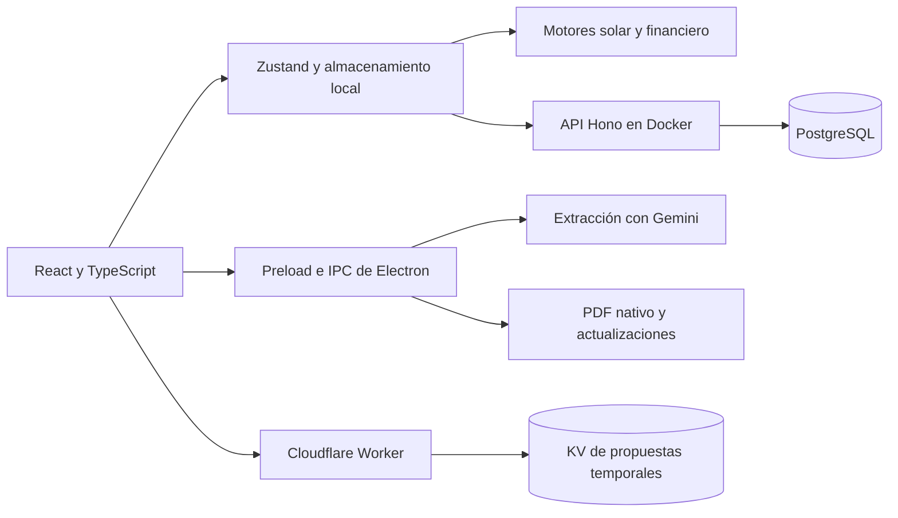

# Análisis técnico de SolarSim Pro

Fecha: 3 de octubre de 2026, zona America/Santo_Domingo. Rama analizada: `beta`, commit `8cdcfec1656bb66fcefaf21b57338b330f7e07d7`.

## Evaluación general

SolarSim Pro tiene una base útil para el negocio principal de Electsun: reúne ingeniería solar, cotización, propuestas PDF/web y colaboración en un producto de escritorio que conserva trabajo local. La separación entre interfaz, motores puros, servicios e IPC es adecuada. La infraestructura actual tiene recursos suficientes para la carga observada.

La prioridad es proteger las sesiones y corregir la integridad de sincronización y persistencia. No recomiendo una reescritura ni cambiar de plataforma como primera intervención. Las pruebas actuales pasan, pero dejan fuera varios recorridos que afectan la colaboración real y la conservación de datos.

**Hallazgo crítico confirmado en producción:** el secreto JWT configurado coincide con el valor predeterminado que está publicado en el repositorio público. La contraseña de PostgreSQL también coincide con su predeterminado público. Se comprobó únicamente la igualdad, sin imprimir ni copiar los valores reales. La API acepta los permisos del token vigente sin consultar de nuevo el usuario, lo que agrava el impacto del secreto expuesto.

## Alcance y límites

Se inspeccionaron código, instrucciones del repositorio, historial Git, metadatos de GitHub, dependencias, compilación, suites locales y datos operativos agregados del servidor. Se reprodujeron siete fallos con datos sintéticos y respuestas de red simuladas.

El acceso inicial directo a `app-server` falló. Tras la aclaración del propietario se utilizó `pve01` como salto. Las consultas a PostgreSQL se ejecutaron dentro de `BEGIN READ ONLY`; no se hicieron altas, modificaciones, borrados, cambios de configuración, despliegues ni pruebas de explotación contra producción. No se ejecutaron los scripts de RBAC y sincronización que crean registros en el servidor real.

Este análisis no incluye una prueba de restauración de respaldos, recorrido visual completo en Electron, exportación visual de cada página PDF, verificación de las fichas técnicas de cada equipo ni una auditoría jurídica de la vigencia de las normas tributarias y eléctricas. Las pruebas financieras acreditan el comportamiento implementado frente a sus casos de prueba.

## Arquitectura encontrada



| Dominio | Componentes principales | Observación |
| --- | --- | --- |
| Producto | `src/App.tsx`, dashboard, simulador, hub, PDF y empresas | Flujo de propuesta integrado; las vistas y numerosos modales se importan al inicio. |
| Cálculo | `src/engine/solarEngine.ts`, `financeEngine.ts` | Funciones separadas de la interfaz; cobertura de regresión útil. |
| Estado | `src/store/useSimulationStore.ts`, once slices | Buena división por dominio; faltan campos nuevos en la persistencia. |
| Colaboración | `syncAuthSlice.ts`, `syncService.ts`, `server/src/index.ts` | Hay historial y detección de conflictos, pero varios contratos no se cumplen de extremo a extremo. |
| Escritorio | `electron/main.ts`, preload, módulos de ventana, IA y actualizador | `contextIsolation: true` y `nodeIntegration: false`; quedan controles de seguridad por completar. |
| Propuestas externas | `workers/share-viewer` | Servicio independiente con KV y TTL; el HTML debe tratarse como una frontera de seguridad. |
| Infraestructura | Proxmox CT 100, Docker, Caddy, Cloudflare Tunnel | PostgreSQL permanece dentro de la red Docker; no tiene puerto publicado al host. |

Los perfiles locales de empresa y las organizaciones autenticadas del backend son conceptos diferentes en la implementación. Debe explicitarse su relación y la pertenencia de cada proyecto antes de ampliar el uso multiempresa.

## Comprobaciones ejecutadas

| Verificación | Resultado |
| --- | --- |
| `npm run lint` | Pasó, sin errores TypeScript. Es una comprobación de tipos, no un lint de reglas de seguridad. |
| `npm test` | Pasaron las 13 suites incluidas actualmente. |
| `npm run build` | Pasó; advertencia por tamaño del paquete principal. |
| `npm run build:electron` | Pasó. |
| `npm run build` dentro de `server/` | Pasó. |
| `tsc --noEmit` dentro de `workers/share-viewer/` | Pasó. |
| `testConcurrencyAndOfflineProfiles.ts` | Pasó por separado; verifica operaciones locales, no el ciclo HTTP completo. |
| Reproducciones locales adicionales | Los siete comportamientos defectuosos se reprodujeron. |
| Comparación API local/desplegada | SHA-256 idéntico para `dist/index.js` y `dist/db.js`. |

Hay 19 archivos de pruebas. Seis no están incluidos en `npm test`: concurrencia/perfiles, multiusuario, creación de proyecto, plantilla PDF permanente, RBAC/renovación y descuentos del visor web. Algunos de ellos apuntan directamente a producción; antes de integrarlos deben usar un entorno de pruebas aislado.

## Hallazgos y prioridad

P0 significa atención inmediata; P1 afecta seguridad o integridad de datos; P2 es una corrección importante posterior.

### P0 — Secretos públicos utilizados en producción

Referencias: `server/src/index.ts:11`, `server/src/db.ts:13` y `src/tests/testRBACAndTokenRenewal.ts`.

La inspección de las variables del contenedor confirmó que ambos valores coinciden con los predeterminados públicos. El repositorio `WilkerDev1/solarsim-pro` es público. Conocer la clave de firma permite fabricar JWT; el middleware acepta las declaraciones de un token vigente directamente. La contraseña de PostgreSQL también debe rotarse, aunque la ausencia de publicación de su puerto reduce su exposición directa.

Corrección: generar secretos independientes, rotarlos en los servicios que los consumen, retirar los valores de respaldo del código y fallar al iniciar si faltan. La rotación JWT debe invalidar las sesiones antiguas y contemplar el nuevo inicio de sesión. Quitar los valores del commit actual no invalida su presencia en el historial público. No se realizó ninguna rotación en este análisis.

### P1 — El registro público permite entrar a la organización predeterminada

Referencia: `server/src/index.ts:111`, en especial la selección de organización y rol desde la línea 128.

Una solicitud de registro sin `organizationName` se incorpora a `org-electsun-default` como EDITOR cuando esa organización ya tiene usuarios. No se requiere una invitación ni autorización de un administrador. La ruta y esta lógica también están presentes en el código desplegado.

Corrección: reservar la incorporación a organizaciones existentes para invitaciones verificadas o creación por ADMIN. Un registro público, si se conserva, debe crear una organización independiente o pasar por un proceso explícito de aprobación.

### P1 — Desactivar, eliminar o degradar una cuenta no revoca su JWT vigente

Referencia: `server/src/index.ts:34`.

`authenticate()` devuelve directamente el resultado de verificar un token no expirado. La consulta a `users.is_active` y al rol actual aparece en el camino de renovación, no en cada autorización. Los tokens nuevos duran 365 días. Por eso un token antiguo puede conservar acceso o permisos administrativos después de cambios en la cuenta. El endpoint `/api/auth/me` sí consulta al usuario, pero no sustituye una autorización consistente de las demás rutas.

Corrección: validar estado y permisos actuales en la autorización, y definir revocación mediante versión de sesión/token o una solución equivalente. Limitar la vigencia y el período máximo de renovación; un token antiguo no debe renovarse indefinidamente por el solo hecho de conservar una firma válida.

### P1 — Equipos y precios no están aislados correctamente por organización

Referencias: `server/src/index.ts:1218` y `server/src/index.ts:1259`.

El upsert usa `ON CONFLICT (id)` y cambia `organization_id` al de quien envía el lote. No comprueba que el registro existente pertenezca a esa organización. Dos empresas que usan el mismo ID de equipo pueden transferirse o sobrescribirse el registro y sus precios. La operación también reemplaza el array completo de ofertas; no implementa la fusión por proveedor descrita en la documentación.

El borrado permite eliminar equipos de la organización predeterminada desde otras organizaciones. En la consulta agregada actual no quedaban equipos asignados a esa organización; esto no demuestra la causa, pero confirma que el supuesto catálogo global requiere revisión.

Corrección: separar catálogo técnico compartido de cotizaciones y preferencias por empresa, o usar una clave y autorización que incluya la organización. Preservar y fusionar ofertas con un contrato explícito de concurrencia. El catálogo compartido necesita permisos propios de mantenimiento.

### P1 — Los cambios recibidos por pull no llegan al contenido local

Referencia: `src/store/slices/syncAuthSlice.ts:220`.

La primera fase construye el proyecto recibido del servidor, pero el merge final vuelve a expandir `freshLocal` y solo toma del servidor ID, versión y estado de sincronización. Reproducción: el servidor devuelve versión 2 con nombre `Cambio remoto`; el resultado local conserva `Local anterior`, mientras queda en versión 2 y `synced`.

Corrección: aplicar el contenido remoto cuando no hubo una edición local durante la operación, conservando únicamente los campos realmente locales. Cubrir cambios remotos de cliente, equipos, finanzas y estado de papelera en pruebas del ciclo completo.

### P1 — Los conflictos se marcan como sincronizados

Referencias: `src/store/slices/syncAuthSlice.ts:171`, `src/services/syncService.ts:28`, `server/src/index.ts:725`.

El backend devuelve `success: true` con resultados individuales `status: 'conflict'`. El cliente trata cualquier resultado presente como una confirmación exitosa y marca el proyecto `synced`. La reproducción local confirmó este comportamiento. El modal de resolución existente no se activa desde este recorrido.

Además, las mutaciones normales no establecen consistentemente `baseVersion`, el pull no la inicializa y la detección del backend depende de que exista. La comprobación de versión se hace mediante SELECT separado de UPDATE, sin bloqueo de fila ni condición de versión en UPDATE; dos solicitudes simultáneas pueden superar la comprobación antes de sobrescribir.

Corrección: tipar y manejar cada resultado, conservar los conflictos pendientes, capturar la versión base al iniciar una edición y hacer atómica la actualización condicional en PostgreSQL. Probar dos clientes editando la misma versión.

### P1 — Cambiar de cuenta puede enviar proyectos a otra organización

Referencias: `src/store/slices/syncAuthSlice.ts:77`, `:144` y `:167`.

Los proyectos sobreviven al logout dentro del mismo almacén local. Cuando el pull de la nueva cuenta no encuentra un proyecto que estaba `synced`, se cambia a `local_only`. Después se sube todo proyecto cuyo estado sea distinto de `synced`. La reproducción confirmó que un proyecto de un autor anterior se envía con la cuenta de otra organización.

Este mismo recorrido puede reinsertar un proyecto eliminado definitivamente por otro dispositivo, al interpretar su ausencia como trabajo local pendiente. La conservación local debe distinguirse de la autorización para volver a subirlo.

Corrección: registrar y comprobar pertenencia de cada proyecto, separar espacios locales por cuenta/organización y enviar únicamente cambios autorizados. Usar tombstones o un protocolo explícito para eliminaciones definitivas. Una importación entre empresas debe ser una acción visible del usuario.

### P1 — Empresas locales e hitos manuales no se persisten

Referencia: `src/store/useSimulationStore.ts:237`.

`partialize` omite `companies`, `activeCompanyId`, `localUserProfile` y `snapshotsByProject`. Se comprobó la ausencia de las cuatro claves en la representación que Zustand guarda. Al reiniciar se reconstruyen los valores iniciales y se pierden los perfiles personalizados y los hitos manuales locales. El historial automático de PostgreSQL es un mecanismo diferente y no conserva por sí solo esos hitos locales.

Corrección: persistir los campos durables y versionar su migración. Verificar un ciclo real de guardar, cerrar y rehidratar. Los stacks transitorios de deshacer/rehacer pueden tratarse por separado.

### P1 — El visor web interpola datos como HTML sin escape

Referencias: `workers/share-viewer/src/template.ts:363`, `workers/share-viewer/src/index.ts:34`.

Nombres, direcciones, texto de empresa y otros campos se interpolan en HTML y atributos. La publicación acepta solicitudes sin autenticación en el código. Una reproducción local con una etiqueta HTML inerte en el nombre del cliente confirmó que aparece como markup sin escapar. No se ejecutó JavaScript malicioso ni se publicó una propuesta de prueba. La combinación constituye una vía de inyección HTML y riesgo de XSS persistente en el dominio de propuestas.

Corrección: escapar texto y atributos, validar las URL e imágenes, proteger las inserciones JSON dentro de `<script>` y sanitizar únicamente el HTML que deba admitirse de forma deliberada. Proteger la publicación con autorización y límites. Conservar la lectura pública de enlaces que el producto decida compartir.

El ID compartido usa siete caracteres generados con `Math.random()`; sustituirlo por un identificador criptográfico. Las buenas prácticas de [Cloudflare Workers](https://developers.cloudflare.com/workers/best-practices/workers-best-practices/) respaldan el manejo explícito de secretos y seguridad del servicio.

### P2 — Una sincronización fallida informa éxito

Referencia: `src/store/slices/syncAuthSlice.ts:119`, `:171` y `:261`.

Los servicios convierten fallos de red en `{ success: false }`, pero el slice puede continuar y devolver éxito, mostrar confirmación y avanzar `lastSyncTimestamp`. Se reprodujo con pull y push fallidos simulados.

Corrección: propagar los fallos y distinguir éxito completo, éxito parcial y cambios pendientes. No actualizar la marca de sincronización como si el servidor hubiera confirmado operaciones fallidas. El cliente tampoco usa actualmente la marca almacenada para solicitar deltas; descarga el conjunto completo.

### P2 — Un mes con consumo cero se convierte en 3,000 kWh

Referencia: `src/engine/solarEngine.ts:178`.

`monthlyConsumptionKWh[i] || 3000` confunde cero válido con falta de datos. La reproducción con doce meses en cero devolvió 3,000 kWh en cada mes. Afecta consumo, balance, cobertura y ahorro estimado para locales cerrados o meses sin consumo.

Corrección: distinguir dato ausente de cero y validar valores finitos y no negativos. Agregar casos de consumo cero, consumo incompleto y datos importados inválidos.

## Dependencias, rendimiento y mantenibilidad

Resultados de `npm audit` del día de la revisión; se cuentan paquetes señalados, no vulnerabilidades independientes ni explotación confirmada:

| Paquete del proyecto | Críticas | Altas | Moderadas | Total |
| --- | ---: | ---: | ---: | ---: |
| Raíz, incluidas herramientas de desarrollo | 2 | 25 | 5 | 32 |
| Backend | 0 | 0 | 1 | 1 |
| Worker y herramientas | 0 | 4 | 1 | 5 |

Las dos entradas críticas de la raíz son `jspdf` y `tar`. `jspdf` es una dependencia directa del producto; `tar@6.2.1` aparece en electron-builder y en un `@mapbox/node-pre-gyp` instalado como extraneous. La exposición depende de los métodos utilizados y del origen de los archivos. La severidad de una alerta de Node no demuestra automáticamente explotación en el renderizador de Chromium. Electron también requiere actualización; es una dependencia de desarrollo a efectos de npm, pero su runtime se distribuye con la aplicación.

`npm audit --omit=dev` señaló seis paquetes (dos críticos, tres altos y uno moderado) en el árbol instalado. Ese resultado incluye la cadena extraneous observada y debe contrastarse con una instalación limpia y con los archivos realmente empaquetados. Se preservó el árbol actual sin reinstalar dependencias.

Debe planificarse una actualización controlada y probar importación de PDF, exportación, empaquetado y actualización de binarios. No se aplicó `npm audit fix`. El actualizador Linux descarga paquetes y ejecuta el instalador sin verificar en ese recorrido las firmas `.sig` publicadas; debe incorporar una comprobación de autenticidad antes de instalar.

El paquete JavaScript principal del frontend ocupa **6,160 kB minificado y 3,120.83 kB gzip**. Parte del peso proviene de activos y herramientas PDF cargados junto con las vistas. Priorizar carga diferida de PDF, IA, ajustes y gráficos, y separar recursos voluminosos. La medición actual es de tamaño del build; no se midieron tiempos de interacción ni consumo de memoria del cliente.

La API concentra 1,407 líneas en `server/src/index.ts`, `projectSlice.ts` tiene 891, y el store raíz 256, frente al límite orientativo de 120 del manual. Extraer rutas, autorización, validación y migraciones reducirá riesgo después de corregir la integridad. Mantener la API pública del store y los motores separados.

La clave Gemini y el token de sesión se incluyen en la persistencia de `localStorage`. Conviene mover secretos a almacenamiento protegido mediante IPC, y reforzar CSP, control de navegación, creación de ventanas y validación del emisor IPC. La [guía de seguridad de Electron](https://www.electronjs.org/docs/latest/tutorial/security) describe estos controles. El aislamiento de contexto ya implementado es una buena base.

El modelo solar usa un día equivalente por mes, no una simulación horaria de estado de carga. La eficiencia de batería reduce la capacidad utilizable y la carga/descarga se igualan en el ciclo diario; no modela por separado pérdidas de carga y descarga. Esta aproximación debe describirse con precisión y validarse antes de presentar el cálculo como despacho horario o diseño eléctrico definitivo. No se modificaron fórmulas.

## GitHub y publicación

- Repositorio: [WilkerDev1/solarsim-pro](https://github.com/WilkerDev1/solarsim-pro), público.
- `beta` remoto coincide con el commit local analizado; el árbol de trabajo estaba limpio al iniciar.
- `main` remoto está en `cf08b64`; la comparación de los refs locales coincidentes con los SHA remotos muestra diez commits adicionales en `beta`.
- `main` y `beta` no tienen protección de rama según GitHub.
- La API de GitHub Actions devolvió cero ejecuciones y el checkout no contiene `.github/`.
- Última release consultada: `v2.1.5`, publicada el 2 de octubre de 2026, con binarios Windows/Linux y firmas para Linux.
- El tag local `v2.1.5` apunta a `06539f9`, contenido en `beta` y no en `origin/main`. Revisar la coherencia entre la definición de rama estable y el proceso de publicación.

Recomendación: CI para tipos, pruebas, frontend, Electron, backend y Worker, con ramas protegidas y validación de paquetes/firmas de release. Separar las pruebas locales de las que necesitan PostgreSQL aislado y APIs externas.

## Estado operativo observado

Acceso verificado durante esta revisión:

```bash
ssh -J root@100.73.34.56 app-server
```

`pve01` tiene Tailscale; el CT 100 se alcanza a través del nodo. Su configuración de red indica DHCP. No se cambió la configuración SSH ni de red del servidor.

| Elemento | Estado observado |
| --- | --- |
| CT 100 | Encendido; 6 cores configurados y 4 GiB de RAM. |
| Sistema | Aproximadamente 389 MiB utilizados de 4 GiB; carga baja en la muestra. |
| Disco del CT | 4.7 GiB usados de 50 GiB, aproximadamente 10%. |
| Docker | API, web corporativa, tunnel, Caddy y PostgreSQL encendidos. |
| API | Ejecutándose desde el 2 de octubre; cero reinicios reportados; sin healthcheck Docker. |
| PostgreSQL | 16.15; contenedor saludable; puerto 5432 sin publicación al host. |
| Persistencia DB | `/home/agente/servicios/database/data` montado en `/var/lib/postgresql/data`. |
| API pública | Respondió HTTP 200 y anunció `2.2.0` y base conectada. |
| Versión del paquete del contenedor API | `1.0.0`, distinta de la versión anunciada y del paquete local `2.1.5`. |

Conteos agregados: **13 organizaciones, 23 usuarios, 52 proyectos (40 activos y 12 en papelera), 64 equipos, 2 registros de historial y 7 notificaciones**. Base `solarsim_prod`: aproximadamente 10 MiB. La tabla de auditoría de sincronización existe, pero está vacía en esta muestra; no debe asumirse trazabilidad completa por su presencia.

Se comprobaron respaldos del CT 100 en `hdd-1tb` de los días 1, 2 y 3 de octubre. El más reciente es `vzdump-lxc-100-2026_10_03-02_30_04.tar.zst`. El job está habilitado a las 02:30, modo snapshot, retención `keep-daily=3,keep-weekly=2`, para los guests 100, 110 y 120.

No apareció un respaldo lógico independiente ni un script de backup dentro de los directorios de usuario consultados. Esto no demuestra que no exista en otra ubicación. El backup de CT sí está confirmado; su existencia no sustituye una restauración probada. Conviene verificar una restauración aislada y una copia fuera del host físico antes de hacer cambios importantes a la base.

## Orden de intervención recomendado

1. Rotar JWT y contraseña DB, eliminar defaults públicos y asegurar la autorización real de usuarios. Coordinar el inicio de sesión posterior a la rotación.
2. Cerrar la incorporación pública a organizaciones existentes y el acceso cruzado al catálogo.
3. Corregir el ciclo completo de sincronización: contenido remoto, versión base, conflictos, fallos, separación de cuentas y eliminaciones definitivas.
4. Guardar perfiles e hitos locales; cubrir rehidratación y consumo cero; endurecer el HTML y la publicación del visor.
5. Actualizar dependencias y verificación de firmas con regresiones PDF/Electron, incorporar CI y alinear versiones/documentación con lo desplegado.

El alcance de la fase inicial fue análisis. Las observaciones anteriores describen esa línea base; los cambios posteriores de la rama se detallan a continuación.


## Remediaciones en la rama de pruebas

La rama `codex/modular-audit-feature-controls` implementa módulos HTTP por dominio, migraciones aditivas versionadas, autorización basada en el usuario actual de la base, alta de organizaciones aislada, CAS obligatorio y contratos de sincronización con ACK canónico y tombstones. El cliente conserva cambios y comandos de borrado en colas persistentes, detecta conflictos recuperables y descarta respuestas de sesiones anteriores. Perfiles, empresas e hitos locales se rehidratan sin reinyección involuntaria de equipos eliminados.

La proyección experimental se gobierna mediante un contrato compartido y política de organización; apagada recupera el reparto histórico confirmado. Simulador, hub, PDF y nuevas publicaciones usan el mismo modo efectivo. La publicación exige autoridad vigente y escapa valores HTML/JSON/Markdown; el updater Linux valida manifiesto firmado, firma del paquete, hash, tamaño y versión antes de invocar el instalador. AppImage queda manual hasta disponer de esa cadena verificada.

Se incorporan CI, integraciones PostgreSQL desechables y smoke de la imagen Docker real. Ese smoke detectó y corrigió la frontera ESM de `shared/`, un fallo que no aparecía en TypeScript local. La navegación y Ajustes se refinan con Impeccable, añadiendo lista compacta persistente. Documentación vigente en [README](README.md), límites y evidencia en [QA_RESULTS](QA_RESULTS.md).

**No se desplegó ni se modificó el CT o la base de producción.** Permanecen pendientes la rotación de los secretos expuestos de producción, restaurar un respaldo empresarial en aislamiento y coordinar la actualización de clientes/API/Worker. La eliminación de defaults en código no rota por sí sola los secretos ya desplegados. Las dependencias antiguas de Electron/empaquetado requieren una actualización mayor con matriz de instalación real.
