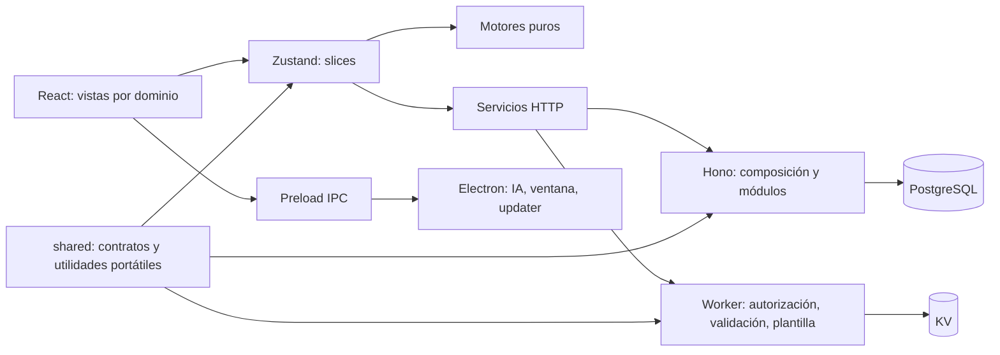

# Monolito modular

SolarSim conserva React, Zustand, Electron y Hono/PostgreSQL. El producto de escritorio agrupa dominios; la API y el visor Cloudflare tienen procesos y ciclos de despliegue propios. No se introducen microservicios por dominio.

## Dependencias permitidas

- `shared/`: contratos y normalizadores TypeScript puros, sin React, Electron ni base de datos. Excepción explícita: `geminiTransport.ts` realiza I/O HTTP portátil mediante Fetch/AbortController y transporte inyectable; no importa módulos Node ni decide permisos o estado de UI. La política de cancelación, timeout y reintentos se comparte entre navegador y Electron.
- `src/engine/`: cálculos puros con argumentos explícitos. No importa el store ni decide permisos.
- `src/features/application/`: selección del modo efectivo; adapta política del store al motor.
- `src/services/`: transporte, validación de respuestas y publicación. Sin componentes de UI.
- `src/store/slices/`: estado y operaciones del dominio. La composición raíz conserva todos sus exports públicos.
- `src/store/sync/`: reconciliación pura, pertenencia, mutaciones y comandos de eliminación. No confunde versión local con versión confirmada.
- `src/store/persistence/`: serialización durable y migración/rehidratación. Solicitudes, flags de carga y generación de sesión son transitorios.
- `src/components/`: presentación y eventos. Las vistas grandes se cargan bajo demanda en App; las decisiones matemáticas pertenecen al motor.
- `electron/`: única frontera con módulos nativos y ejecución del SO, expuesta por el preload aislado.
- `server/src/index.ts`: arranque. `app.ts`: composición inyectable. `modules/`: auth, usuarios, organización, proyectos, equipos, tarifas y notificaciones. `database/`: migraciones aditivas y acceso común.
- `workers/share-viewer/`: validación, autorización de publicación, repositorio KV, escaping y presentación separados.

## Extensión

Una nueva función se registra en `shared/applicationFeatures.ts`, define su default/etapa/visibilidad/disponibilidad y usa el selector efectivo. Cambiar solo una etiqueta de UI nunca cambia el modelo de cálculo. Una nueva ruta registra su módulo desde app y usa la autorización actual en BD. Las migraciones se numeran y no se ejecutan desde el renderizador.

Los perfiles de empresa locales personalizan documentos; las organizaciones autenticadas delimitan autorización y sincronización. Son conceptos distintos. No se adjudican automáticamente propuestas locales o de otra organización al iniciar sesión: para mover contenido se exporta/importa una copia de forma explícita.

## Subsistema IA

`shared/aiProposal.ts` concentra prompt, esquema y normalización multi-equipo. El hook de propuesta adapta catálogo, tarifas y contexto de cálculo del espacio actual; el borrador es transitorio y requiere revisión humana antes de aplicar. Los importadores de datasheets/precios preparan el lote y verifican permisos y resultado del store. La procedencia tarifaria acompaña filas y campos conservados. Véanse [escáneres IA](AI_SCANNERS_SPECIFICATION.md) y [tarifas IA](AI_TARIFF_CONTEXT.md).

`shared/aiProposalCommercial.ts` valida el contrato comercial; `src/utils/proposalDraftProject.ts` adapta el mismo borrador normalizado para cálculo previo y aplicación. El hook calcula energía y resumen financiero por separado para que un costo pendiente no invalide la vista energética. Las pestañas de consumo/dimensionamiento y cotización son componentes de presentación; no cambian los motores.
