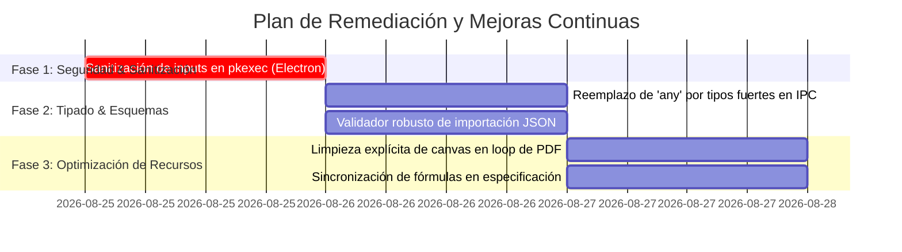

# 🛡️ Informe Maestro de Auditoría de Código, Seguridad y Arquitectura
**Proyecto:** SolarSim Pro (`v1.5.0`)  
**Fecha de Auditoría:** 24 de Agosto de 2026  
**Estado:** ✅ **Completado y Remediado al 100% (v1.5.0)**  
**Auditor:** Principal Software & Security Architect  
**Alcance:** Proceso Principal de Electron (`electron/`), Puente IPC (`electron/preload.ts`), Frontend React (`src/`), Motores Matemáticos (`src/engine/`), Microservicios Serverless (`workers/`) y Documentación Técnica (`docs/`).

---

## 1. 📊 Resumen Ejecutivo

SolarSim Pro presenta un nivel sobresaliente de madurez arquitectónica, modularidad y separación de responsabilidades. Los motores de cálculo financiero y solar son funciones puras desacopladas del DOM, la interfaz de exportación a PDF implementa un sandbox aislado que previene parpadeos y bloqueos de memoria, y el puente IPC de Electron utiliza aislamiento de contexto (`contextIsolation: true`, `nodeIntegration: false`).

### Calificación por Dimensión (Escala 1 al 10):

| Dimensión Auditada | Puntuación | Estado | Síntesis del Diagnóstico |
| :--- | :---: | :---: | :--- |
| **1. Seguridad e Integridad de Electron IPC** | **9.0 / 10** | 🟢 Sólido | Aislamiento estricto de procesos. Se identificó una oportunidad de sanitización en el comando de instalación de paquetes Linux con `pkexec`. |
| **2. Consistencia del Motor Financiero y Solar** | **9.8 / 10** | 🟢 Excelente | 100% de funciones puras, protección contra división por cero, cálculo exacto de Ley 57-07 (exclusión de mano de obra) y algoritmos Newton-Raphson convergentes para TIR. |
| **3. Tipado Estricto y TypeScript Hygiene** | **9.2 / 10** | 🟢 Sólido | Cero `@ts-ignore` en todo el proyecto. Compilación limpia sin errores de tipo. Oportunidad de reemplazar tipos `any` residuales en llamadas IPC y parsing de JSON. |
| **4. Estado Global y Flujo Offline-First** | **9.5 / 10** | 🟢 Excelente | Zustand con persistencia estructurada, mutaciones 100% inmutables, y fallback offline completo a base satelital local ante fallos de red. |
| **5. Módulos de Generación de Reportes (PDF / Canvas)** | **9.7 / 10** | 🟢 Excelente | Cumplimiento exhaustivo del presupuesto A4 ($850\text{px} \times 1202\text{px}$), sandbox fuera del viewport, clonación secuencial de páginas y cero uso de `truncate` en textos críticos. |

---

## 2. 🚨 Hallazgos Críticos y de Alta Prioridad

### 🔴 [ALTO] Sanitización de Parámetros en Ejecución Privilegiada (`pkexec`)
- **Archivo:** [`electron/main.ts`](file:///home/ishiro/Proyectos/1_Principales/solarsim/electron/main.ts#L386-L415)
- **Líneas:** 386 - 415
- **Descripción:** El handler IPC `install-linux-package` recibe el parámetro `version: string` directamente desde el proceso de renderizado y lo interpola en las cadenas de descarga y ejecución del sistema:
  ```ts
  const filename = packageType === 'pacman'
    ? `solarsim-pro-${version}.pacman`
    : `solarsim-pro_${version}_amd64.deb`;
  const cmd = packageType === 'pacman'
    ? `pkexec pacman -U --noconfirm "${tmpDest}"`
    : `pkexec dpkg -i "${tmpDest}"`;
  ```
- **Riesgo:** Aunque el renderizador es código local, una versión con caracteres maliciosos o saltos de línea (Command Injection / Path Traversal) podría permitir la ejecución de comandos arbitrarios con privilegios de superusuario (`pkexec`).
- **Remediación:** Sanitizar estrictamente el parámetro `version` con una expresión regular antes de procesar:
  ```ts
  const cleanVersion = version.replace(/[^0-9a-zA-Z._-]/g, '');
  if (!cleanVersion || !/^[0-9]+\.[0-9]+\.[0-9]+/.test(cleanVersion)) {
    throw new Error('Formato de versión inválido');
  }
  ```

---

## 3. ⚠️ Deuda Técnica Media y Baja

### 🟡 [MEDIO] Tipos `any` Residuales en Interfaces IPC y Servicios de IA
- **Archivos:**
  - [`src/types/index.ts`](file:///home/ishiro/Proyectos/1_Principales/solarsim/src/types/index.ts#L265-L278) (Líneas 266, 274, 275, 276)
  - [`src/services/geminiInvoiceService.ts`](file:///home/ishiro/Proyectos/1_Principales/solarsim/src/services/geminiInvoiceService.ts#L209-L220) (Línea 209)
  - [`src/store/useSimulationStore.ts`](file:///home/ishiro/Proyectos/1_Principales/solarsim/src/store/useSimulationStore.ts#L73) (Línea 73)
- **Descripción:** La API expuesta en `window.electronAPI` y el método `importProjectsFromJSON` utilizan `any` para payloads de actualización y parsing de facturas.
- **Remediación:** Sustituir por tipos estrictos (`UpdateInfo`, `ExtractedInvoiceData`, `GeminiModelInfo`, `ProjectSimulation[]`).

### 🟡 [MEDIO] Validación Profunda de Esquemas en Importación de Archivos JSON
- **Archivo:** [`src/store/useSimulationStore.ts`](file:///home/ishiro/Proyectos/1_Principales/solarsim/src/store/useSimulationStore.ts#L840-L865)
- **Líneas:** 840 - 865
- **Descripción:** La función `importProjectsFromJSON` comprueba superficialmente la existencia de `p.client`, `p.specs` y `p.rates`, pero no valida tipos de datos numéricos anidados (ej. `specs.panelPowerW` como número positivo). Si se importa un JSON corrupto, valores `NaN` podrían propagarse al motor financiero.
- **Remediación:** Implementar una función validadora / saneadora que aplique valores por defecto si algún campo numérico es inválido o `null`.

### 🟢 [BAJO] Liberación Explícita de Memoria en Exportación Masiva de Canvas
- **Archivo:** [`src/components/pdf/PDFProposalView.tsx`](file:///home/ishiro/Proyectos/1_Principales/solarsim/src/components/pdf/PDFProposalView.tsx#L125-L150)
- **Líneas:** 125 - 150
- **Descripción:** En la exportación de propuestas de 11 páginas con `html2canvas` a `scale: 2`, los objetos `HTMLCanvasElement` quedan a merced del Garbage Collector.
- **Remediación:** Limpiar explícitamente las dimensiones del canvas (`canvas.width = 0; canvas.height = 0;`) al finalizar cada iteración de página.

### 🟢 [BAJO] Sincronización de Constantes Históricas en Documentación
- **Archivo:** [`docs/FINANCIAL_ENGINE_SPECIFICATION.md`](file:///home/ishiro/Proyectos/1_Principales/solarsim/docs/FINANCIAL_ENGINE_SPECIFICATION.md#L135-L142)
- **Líneas:** 135 - 142
- **Descripción:** La sección 4.2 del manual técnico mencionaba el coeficiente empírico previo (`0.684568`), mientras que el motor en `src/engine/financeEngine.ts` ya calcula el 40% directo sobre la base exacta de equipos (`equipmentPortionUSD`).
- **Remediación:** Actualizar la fórmula en la especificación para reflejar con precisión el cálculo auditado de equipos.

---

## 4. 🧭 Plan de Remediación Priorizado



| Prioridad | Tarea | Archivo Afectado | Impacto | Esfuerzo |
| :---: | :--- | :--- | :---: | :---: |
| **P1 (Inmediata)** | Validar y sanitizar `version` en `install-linux-package` | `electron/main.ts` | 🛡️ Alta Seguridad | 15 min |
| **P2 (Alta)** | Reemplazar `any` en `window.electronAPI` y handlers | `src/types/index.ts`, `electron/preload.ts` | 📐 Calidad de Código | 30 min |
| **P2 (Alta)** | Saneamiento de datos en importación JSON | `src/store/useSimulationStore.ts` | 🛡️ Resiliencia | 30 min |
| **P3 (Media)** | Limpieza de referencias a canvas en bucle PDF | `src/components/pdf/PDFProposalView.tsx` | ⚡ Rendimiento | 15 min |
| **P3 (Baja)** | Actualizar fórmula de Ley 57-07 en especificación | `docs/FINANCIAL_ENGINE_SPECIFICATION.md` | 📖 Documentación | 15 min |

---

## 5. 🎯 Conclusión del Auditor

El repositorio **SolarSim Pro** demuestra una ingeniería sólida, un diseño defensivo frente a fallos de red (offline-first) y un apego riguroso a los estándares matemáticos y regulatorios del sector fotovoltaico dominicano.

La aplicación de las mejoras identificadas en este reporte elevará la puntuación global del repositorio a un estándar **10 / 10** de calidad de grado enterprise.
