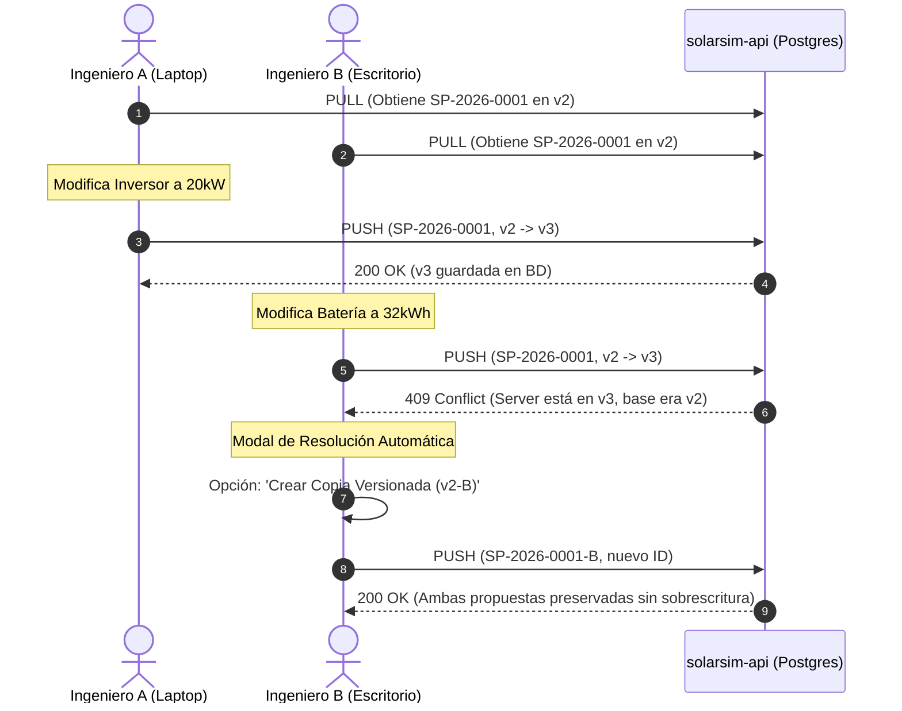

# 💾 Manual de Arquitectura de Base de Datos PostgreSQL y Especificación de APIs REST
## SolarSim Pro — Plataforma de Simulación & Gestión Comercial Fotovoltaica

Este documento contiene la especificación exhaustiva del modelo de base de datos relacional en **PostgreSQL 16**, las estructuras de almacenamiento semi-estructurado en **JSONB**, los índices GIN/B-Tree, y la documentación formal de todos los endpoints de la API de sincronización y autenticación (**`solarsim-api`**) y del microservicio serverless en Cloudflare Workers (**`solarsim-share-viewer`**).

---

## 📑 Tabla de Contenido
1. [Principios de Diseño y Arquitectura de Datos](#1-principios-de-diseño-y-arquitectura-de-datos)
2. [Esquema DDL de Base de Datos PostgreSQL](#2-esquema-ddl-de-base-de-datos-postgresql)
3. [Estructura y Esquema de `supplier_prices` (JSONB)](#3-estructura-y-esquema-de-supplier_prices-jsonb)
4. [Especificación de Endpoints REST de `solarsim-api`](#4-especificación-de-endpoints-rest-de-solarsim-api)
   - [4.1 Health Check](#41-health-check)
   - [4.2 Autenticación y Usuarios (JWT & RBAC)](#42-autenticación-y-usuarios-jwt--rbac)
   - [4.3 Proyectos & Sincronización Delta](#43-proyectos--sincronización-delta)
   - [4.4 Catálogo de Equipos & Precios de Proveedor](#44-catálogo-de-equipos--precios-de-proveedor)
5. [Microservicio Serverless Edge: `solarsim-share-viewer`](#5-microservicio-serverless-edge-solarsim-share-viewer)
6. [Mecanismo de Resolución de Conflictos y Concurrencia](#6-mecanismo-de-resolución-de-conflictos-y-concurrencia)
7. [Mantenimiento, Respaldo y Migraciones](#7-mantenimiento-respaldo-y-migraciones)

---

## 1. Principios de Diseño y Arquitectura de Datos

1. **Offline-First con Sincronización Delta Bidireccional**:
   - Los clientes de escritorio (Electron) y web almacenan el estado de proyectos, parámetros de simulación y catálogo en `localStorage` mediante Zustand persistente.
   - La sincronización con el servidor solo transmite los registros modificados desde la última marca de tiempo conocida (`lastSyncedAt`), minimizando el ancho de banda y la latencia.
2. **Modelo Híbrido Relacional + Documental (JSONB)**:
   - Metadatos clave (identificadores, organizaciones, usuarios, códigos de proyecto, capacidad kWp, marcas, modelos y fechas) se indexan relacionalmente con claves foráneas e índices B-Tree.
   - Configuraciones dinámicas, resultados del motor financiero a 25 años y el array de ofertas comerciales multi-proveedor se almacenan en columnas `JSONB` con índices GIN (*Generalized Inverted Index*) para consultas eficientes en profundidad.
3. **Aislamiento Multi-inquilino (Multi-Tenant) por Organización**:
   - Cada entidad de datos (`users`, `projects`, `equipment_catalog`) pertenece a un `organization_id`.
   - Ningún usuario puede acceder o mutar datos fuera de su organización asignada.
4. **Control de Acceso Basado en Roles (RBAC)**:
   - **`ADMIN`**: Control total. Gestión de usuarios de la organización, actualización global del catálogo, eliminación de proyectos y acceso a bitácoras de auditoría.
   - **`EDITOR`**: Creación, modificación, simulación y sincronización delta de propuestas y precios de compra.
   - **`LECTOR`**: Solo lectura. Visualización de proyectos y generación de propuestas PDF.

---

## 2. Esquema DDL de Base de Datos PostgreSQL

A continuación se detalla la definición DDL ejecutada automáticamente durante el arranque del servidor (`server/src/db.ts`):

```sql
-- 1. Tabla de Organizaciones (Multi-tenant)
CREATE TABLE IF NOT EXISTS organizations (
    id VARCHAR(64) PRIMARY KEY,
    name VARCHAR(255) NOT NULL,
    rnc VARCHAR(32),
    plan VARCHAR(32) DEFAULT 'enterprise',
    created_at TIMESTAMP WITH TIME ZONE DEFAULT NOW()
);

-- Organización por defecto (Electsun Dominicana)
INSERT INTO organizations (id, name, rnc, plan)
VALUES ('org-electsun-default', 'Electsun Dominicana', '1-31-12345-6', 'enterprise')
ON CONFLICT (id) DO NOTHING;

-- 2. Tabla de Usuarios y Credenciales
CREATE TABLE IF NOT EXISTS users (
    id VARCHAR(64) PRIMARY KEY,
    organization_id VARCHAR(64) NOT NULL REFERENCES organizations(id) ON DELETE CASCADE,
    name VARCHAR(255) NOT NULL,
    email VARCHAR(255) UNIQUE NOT NULL,
    password_hash VARCHAR(255) NOT NULL,
    role VARCHAR(32) NOT NULL DEFAULT 'EDITOR', -- 'ADMIN', 'EDITOR', 'LECTOR'
    is_active BOOLEAN DEFAULT TRUE,
    created_at TIMESTAMP WITH TIME ZONE DEFAULT NOW(),
    updated_at TIMESTAMP WITH TIME ZONE DEFAULT NOW()
);

CREATE INDEX IF NOT EXISTS idx_users_org ON users(organization_id);
CREATE INDEX IF NOT EXISTS idx_users_email ON users(email);

-- 3. Tabla de Proyectos Fotovoltaicos Versionados
CREATE TABLE IF NOT EXISTS projects (
    id VARCHAR(128) PRIMARY KEY,
    organization_id VARCHAR(64) NOT NULL REFERENCES organizations(id) ON DELETE CASCADE,
    created_by_id VARCHAR(64) REFERENCES users(id) ON DELETE SET NULL,
    created_by_name VARCHAR(255) NOT NULL,
    created_by_email VARCHAR(255),
    last_modified_by_id VARCHAR(64) REFERENCES users(id) ON DELETE SET NULL,
    last_modified_by_name VARCHAR(255) NOT NULL,
    client_name VARCHAR(255) NOT NULL,
    project_code VARCHAR(64),
    system_capacity_kwp NUMERIC(10, 2) DEFAULT 0,
    version INTEGER NOT NULL DEFAULT 1,
    data_json JSONB NOT NULL,
    is_deleted BOOLEAN DEFAULT FALSE,
    created_at TIMESTAMP WITH TIME ZONE DEFAULT NOW(),
    updated_at TIMESTAMP WITH TIME ZONE DEFAULT NOW()
);

CREATE INDEX IF NOT EXISTS idx_projects_org_updated ON projects(organization_id, updated_at);
CREATE INDEX IF NOT EXISTS idx_projects_client_name ON projects(client_name);

-- 4. Tabla de Catálogo Global de Equipos Fotovoltaicos & BESS
CREATE TABLE IF NOT EXISTS equipment_catalog (
    id VARCHAR(64) PRIMARY KEY,
    organization_id VARCHAR(64) REFERENCES organizations(id) ON DELETE CASCADE,
    type VARCHAR(32) NOT NULL,               -- 'panel' | 'inverter' | 'battery'
    brand VARCHAR(128) NOT NULL,
    model_series VARCHAR(128) NOT NULL,
    display_name VARCHAR(255) NOT NULL,
    power_w NUMERIC(10, 2),                  -- Potencia panel (Wp)
    power_kw NUMERIC(10, 2),                 -- Potencia inversor (kW AC)
    capacity_kwh NUMERIC(10, 2),             -- Capacidad nominal batería (kWh)
    voltage_v NUMERIC(8, 2),                 -- Voltaje nominal batería (V)
    dod_pct NUMERIC(5, 2),                   -- Profundidad de descarga máx (%)
    efficiency_pct NUMERIC(5, 2),            -- Eficiencia de conversión (%)
    temp_coeff NUMERIC(5, 4),                -- Coeficiente térmico Pmax (%/°C)
    category VARCHAR(64),
    voltage_mppt VARCHAR(64),
    details JSONB,
    supplier_prices JSONB DEFAULT '[]'::jsonb, -- Array de ofertas comerciales multi-proveedor
    created_at TIMESTAMP WITH TIME ZONE DEFAULT NOW(),
    updated_at TIMESTAMP WITH TIME ZONE DEFAULT NOW()
);

CREATE INDEX IF NOT EXISTS idx_equipment_org_type ON equipment_catalog(organization_id, type);
CREATE INDEX IF NOT EXISTS idx_equipment_display ON equipment_catalog(display_name);
CREATE INDEX IF NOT EXISTS idx_equipment_supplier_prices ON equipment_catalog USING gin (supplier_prices);

-- 5. Tabla de Auditoría de Sincronización
CREATE TABLE IF NOT EXISTS sync_audit_logs (
    id SERIAL PRIMARY KEY,
    user_id VARCHAR(64) REFERENCES users(id) ON DELETE SET NULL,
    project_id VARCHAR(128),
    action VARCHAR(64) NOT NULL,             -- 'PUSH', 'PULL', 'CREATE', 'UPDATE', 'DELETE', 'CONFLICT'
    details JSONB,
    ip_address VARCHAR(64),
    created_at TIMESTAMP WITH TIME ZONE DEFAULT NOW()
);
```

---

## 3. Estructura y Esquema de `supplier_prices` (JSONB)

Cada registro en `equipment_catalog` almacena sus ofertas comerciales en la columna `supplier_prices` (`JSONB`). Esto permite que un equipo (por ejemplo, el módulo Canadian Solar CS6.1-72TB-600) tenga cotizaciones independientes de múltiples suplidores en la República Dominicana:

```json
[
  {
    "id": "sp-1725372910-abc4",
    "supplierName": "Unitrade Dominicana",
    "priceUSD": 85.50,
    "originalCurrency": "USD",
    "sku": "CS6.1-72TB-600W-TOPCON",
    "updatedAt": "2026-09-03T10:15:00.000Z",
    "stockStatus": "in_stock",
    "notes": "Precio aplica por pallet completo (36 uds).",
    "source": "ai_catalog"
  },
  {
    "id": "sp-1725372950-xyz8",
    "supplierName": "RAAS Solar",
    "priceUSD": 89.00,
    "originalCurrency": "USD",
    "sku": "CAN-TOPCON-600",
    "updatedAt": "2026-09-01T14:30:00.000Z",
    "stockStatus": "on_order",
    "notes": "Entrega en 10 días laborables desde almacén Haina.",
    "source": "manual"
  }
]
```

### Campos de cada Oferta Comercial:
| Propiedad | Tipo | Obligatorio | Descripción |
| :--- | :--- | :---: | :--- |
| `id` | `string` | Sí | Identificador único de la oferta comercial (`sp-<timestamp>-<hash>`). |
| `supplierName` | `string` | Sí | Nombre comercial del distribuidor (normalizado). |
| `priceUSD` | `number` | Sí | Precio unitario de compra en Dólares Estadounidenses (USD). |
| `originalCurrency` | `string` | No | Moneda original de la cotización (`USD`, `DOP`, `EUR`). |
| `originalPrice` | `number` | No | Monto en la moneda original antes de la conversión a USD. |
| `sku` | `string` | No | Código de artículo o número de parte en el catálogo del distribuidor. |
| `stockStatus` | `string` | Sí | Estado de inventario: `'in_stock'` (en stock), `'on_order'` (bajo pedido), `'out_of_stock'` (agotado), `'consult'` (consultar). |
| `notes` | `string` | No | Restricciones de compra (ej: compra mínima, entrega, puerto). |
| `updatedAt` | `string` | Sí | Marca de tiempo ISO-8601 de la última cotización. |
| `source` | `string` | Sí | Método de captura: `'ai_catalog'` (escáner multimodal Gemini) o `'manual'`. |

---

## 4. Especificación de Endpoints REST de `solarsim-api`

* **Servidor Base**: `https://solarsim.electsun.net` o `http://10.0.0.103:3000` (Directo CT 100).
* **Autenticación**: Todos los endpoints protegidos requieren cabecera HTTP:
  ```http
  Authorization: Bearer <JWT_TOKEN>
  ```

---

### 4.1 Health Check

#### `GET /api/health`
Verifica la disponibilidad del servidor y la conectividad con PostgreSQL.

* **Autenticación**: Pública (sin token).
* **Respuesta Exitosa (200 OK)**:
  ```json
  {
    "status": "ok",
    "service": "SolarSim Pro Enterprise Sync Engine",
    "version": "1.6.0",
    "database": "connected",
    "timestamp": "2026-09-03T10:45:00.000Z"
  }
  ```

---

### 4.2 Autenticación y Usuarios (JWT & RBAC)

#### `POST /api/auth/register`
Registra un nuevo usuario y, opcionalmente, crea una nueva organización.

* **Payload**:
  ```json
  {
    "name": "Ing. Carlos Mendoza",
    "email": "cmendoza@electsun.net",
    "password": "PasswordSegura2026!",
    "organizationName": "Electsun Dominicana",
    "organizationRnc": "1-31-12345-6"
  }
  ```
* **Respuesta Exitosa (200 OK)**:
  ```json
  {
    "success": true,
    "message": "Usuario registrado exitosamente",
    "token": "eyJhbGciOiJIUzI1NiIsInR5cCI6IkpXVCJ9...",
    "user": {
      "id": "usr-1725372000-abc1",
      "name": "Ing. Carlos Mendoza",
      "email": "cmendoza@electsun.net",
      "role": "ADMIN",
      "organizationId": "org-electsun-default"
    }
  }
  ```

#### `POST /api/auth/login`
Autentica un usuario existente con email y contraseña, emitiendo un token JWT con vigencia de 30 días.

* **Payload**:
  ```json
  {
    "email": "cmendoza@electsun.net",
    "password": "PasswordSegura2026!"
  }
  ```
* **Respuesta Exitosa (200 OK)**:
  Devuelve token y datos del usuario y de su organización.

#### `GET /api/auth/me`
Valida la vigencia del token y devuelve la sesión actual del usuario autenticado.

---

### 4.3 Proyectos & Sincronización Delta

#### `POST /api/projects/pull`
Solicita todos los proyectos creados o actualizados en la organización a partir de una fecha específica.

* **Payload**:
  ```json
  {
    "lastSyncedAt": "2026-09-01T00:00:00.000Z"
  }
  ```
* **Respuesta Exitosa (200 OK)**:
  ```json
  {
    "success": true,
    "serverTime": "2026-09-03T10:46:12.000Z",
    "projects": [
      {
        "id": "SP-2026-0042",
        "clientName": "Hotel Boutique Las Galeras",
        "projectCode": "SP-2026-0042",
        "systemCapacityKWp": 45.60,
        "version": 4,
        "isDeleted": false,
        "dataJson": { ... },
        "lastModifiedByName": "Ing. Carlos Mendoza",
        "updatedAt": "2026-09-02T18:30:00.000Z"
      }
    ]
  }
  ```

#### `POST /api/projects/push`
Sube un lote de proyectos locales para persistir en la base de datos central.

* **Payload**:
  ```json
  {
    "projects": [
      {
        "id": "SP-2026-0042",
        "clientName": "Hotel Boutique Las Galeras",
        "version": 4,
        "dataJson": { ... }
      }
    ]
  }
  ```
* **Lógica del Servidor**:
  - Si el proyecto no existe: se inserta con `version = 1`.
  - Si el proyecto existe y `localVersion >= serverVersion`: se actualiza e incrementa la versión.
  - Si `localVersion < serverVersion`: se detecta colisión concurrente y se responde con información del conflicto para bifurcación controlada.

#### `DELETE /api/projects/:id`
Marca un proyecto como eliminado (`is_deleted = TRUE`) para propagar la eliminación delta al resto de los clientes.

---

### 4.4 Catálogo de Equipos & Precios de Proveedor

#### `GET /api/equipment`
Obtiene el catálogo completo de equipos fotovoltaicos, inversores y baterías disponibles para la organización del usuario, incluyendo todas las ofertas comerciales registradas en `supplier_prices`.

* **Respuesta Exitosa (200 OK)**:
  ```json
  {
    "success": true,
    "count": 35,
    "equipment": [
      {
        "id": "eq-canadian-600-topcon",
        "type": "panel",
        "brand": "Canadian Solar",
        "modelSeries": "CS6.1-72TB-600",
        "displayName": "Módulos Canadian Solar CS6.1-72TB-600 (600W)",
        "powerW": 600,
        "efficiencyPct": 22.2,
        "tempCoeff": -0.29,
        "category": "Bifacial N-Type TOPCon",
        "supplierPrices": [
          {
            "id": "sp-1725372910-abc4",
            "supplierName": "Unitrade Dominicana",
            "priceUSD": 85.50,
            "sku": "CS6.1-72TB-600W-TOPCON",
            "stockStatus": "in_stock",
            "updatedAt": "2026-09-03T10:15:00.000Z"
          }
        ],
        "updatedAt": "2026-09-03T10:15:00.000Z"
      }
    ]
  }
  ```

#### `POST /api/equipment/batch`
Sincroniza un lote de equipos y precios de distribuidores (utilizado por el escáner de IA y el gestor de proveedores).

* **Payload**:
  ```json
  {
    "items": [
      {
        "id": "eq-canadian-600-topcon",
        "type": "panel",
        "brand": "Canadian Solar",
        "modelSeries": "CS6.1-72TB-600",
        "displayName": "Módulos Canadian Solar CS6.1-72TB-600 (600W)",
        "powerW": 600,
        "supplierPrices": [ ... ]
      }
    ]
  }
  ```
* **Lógica de Fusión**:
  - Si el equipo ya existe en la base de datos, el servidor fusiona las ofertas de `supplier_prices` por nombre de proveedor normalizado (`toLowerCase().trim()`), preservando las cotizaciones más recientes de otros proveedores y actualizando las coincidentes.

---

## 5. Microservicio Serverless Edge: `solarsim-share-viewer`

* **Tecnología**: Cloudflare Workers + Hono TypeScript.
* **Almacenamiento**: Cloudflare Workers KV (`PROPOSALS_KV`).
* **Dominio Público**: `https://propuesta.electsun.net`

### Endpoints del Worker:

#### `POST /api/share`
Publica una propuesta temporal para visualización externa por parte de un cliente o inversionista.

* **Payload**:
  ```json
  {
    "proposalData": { ... },
    "expiresInDays": 15,
    "passcode": "opcional_1234"
  }
  ```
* **Respuesta**:
  ```json
  {
    "success": true,
    "shareId": "prop-8f92a1c",
    "url": "https://propuesta.electsun.net/p/prop-8f92a1c",
    "expiresAt": "2026-09-18T10:00:00.000Z"
  }
  ```

#### `GET /p/:id`
Renderiza la propuesta fotovoltaica interactiva completa en HTML5/CSS3 con gráficos de flujo de caja, balance de energía mensual, desglose de equipos y botón para descargar PDF o contactar al instalador vía WhatsApp.

---

## 6. Mecanismo de Resolución de Conflictos y Concurrencia

SolarSim Pro implementa **Optimistic Concurrency Control (OCC)**:



---

## 7. Mantenimiento, Respaldo y Migraciones

### 1. Extracción de Respaldo Lógico de PostgreSQL:
```bash
ssh app-server "docker exec -t solarsim-db pg_dump -U solarsim_user -d solarsim_prod -F c" > solarsim_backup_$(date +%Y%m%d).dump
```

### 2. Restauración de Base de Datos:
```bash
ssh app-server "docker exec -i solarsim-db pg_restore -U solarsim_user -d solarsim_prod --clean --if-exists" < solarsim_backup.dump
```

### 3. Inspección del Índice GIN de Precios:
```sql
SELECT brand, model_series, jsonb_array_length(supplier_prices) as proveedores_cotizando
FROM equipment_catalog
WHERE jsonb_array_length(supplier_prices) > 0;
```
