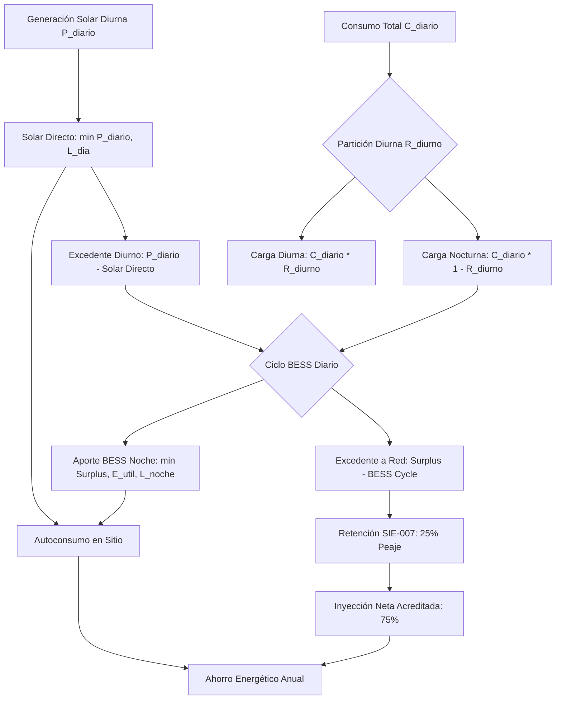

# ☀️ Especificación Técnica: Balance de Energía, Autoconsumo Físico y Despacho BESS

Este documento detalla la **arquitectura matemática, los principios físicos de termodinámica y conservación de carga, el modelo regulatorio dominicano (SIE-007-2026-REG) y los algoritmos de simulación** implementados en el motor de **SolarSim Pro** (`src/engine/solarEngine.ts`), explicando en profundidad cómo se calcula el **autoconsumo en sitio**, la **inyección a red**, el **ciclado de baterías BESS** y el **ahorro facturable**.

---

## 1. 📖 Contexto: Del Modelo Antiguo al Modelo Físico Transparente

### 1.1 ¿Cómo funcionaba antes (Modelo Legacy)?
En versiones tempranas de la plataforma, el cálculo del autoconsumo dependía de simplificaciones estáticas:
* Se asumía un porcentaje fijo o plano que no interactuaba con el perfil de consumo horario del cliente.
* En sistemas con baterías, se caía con frecuencia en el error conceptual de asumir un **100% de autoconsumo artificial** sobre todo el consumo mensual, ignorando si el tamaño de la batería realmente alcanzaba para abastecer la noche o si la generación solar diurna superaba la demanda simultánea.
* El excedente solar se acreditaba sin una separación clara entre lo que el cliente realmente consumió dentro de su propiedad y lo que inyectó a la red de la distribuidora (**EDEESTE, EDESUR, EDENORTE o CEPM**).

### 1.2 ¿Por qué era necesario un nuevo motor físico?
En la República Dominicana rige la **Resolución SIE-007-2026-REG**, la cual establece una retención oficial del **25% de peaje de red** sobre toda la energía exportada bajo medición neta. 
* **1 kWh autoconsumido en sitio** (directo o vía batería) tiene un valor del **100% de la tarifa eléctrica** (ej. $\$0.18\text{ USD/kWh}$).
* **1 kWh inyectado a la red** sufre el peaje del 25%, por lo que la distribuidora solo acredita el **75% del valor** (ej. $\$0.135\text{ USD/kWh}$).

Por esta razón, **autoconsumir en el sitio es financieramente un 33% más valioso que exportar a la red**. Era imperativo modelar con exactitud cuánta energía se consume en horas de sol, cuánta se almacena para la noche, y cuánta sale al medidor bidireccional.

---

## 2. 🔬 Arquitectura Matemática del Nuevo Motor Físico

El motor opera bajo un balance diario representativo para cada uno de los 12 meses del año calendario, considerando los días de cada mes ($D_m \in \{28, 30, 31\}$) y la irradiación satelital mensual ($\text{HSP}_m$).

---

### 2.1 Paso 1: Partición Física de Carga Diurna vs. Nocturna

Dado el consumo mensual $C_m$, el consumo diario promedio es:

$$C_{diario} = \frac{C_m}{D_m}$$

La demanda de un inmueble no es uniforme durante las 24 horas. Se define la **Razón de Carga Diurna ($R_{diurno}$)** entre las 8:00 AM y las 5:00 PM (ventana solar efectiva):

$$\begin{aligned}
L_{dia} &= C_{diario} \times R_{diurno} \\
L_{noche} &= C_{diario} \times (1 - R_{diurno})
\end{aligned}$$

#### Inferencia Automática según Tarifa Eléctrica:
Si el usuario no especifica un valor manual, el motor deduce el perfil típico según la tarifa dominicana contratada:
* **Residencial (`BTS1`, `BTS2`, `RBT-1`) $\rightarrow R_{diurno} = 35\%$**: La mayor parte del consumo ocurre al final de la tarde y en la noche (iluminación, televisores, aires acondicionados inverter).
* **Comercial (`BTD`, `CBT-1`, `VMT1`) $\rightarrow R_{diurno} = 75\%$**: Oficinas, bancos y locales operan de 8:00 AM a 6:00 PM con cargas concentradas de climatización, cómputo y refrigeración.
* **Industrial (`MTD1`, `MTD2`, `MTH`) $\rightarrow R_{diurno} = 90\%$**: Fábricas y naves con turnos intensivos de producción en horas diurnas.
* **Ajuste Manual**: Slider interactivo continuo entre **$15\%$ y $95\%$**.

---

### 2.2 Paso 2: Autoconsumo Solar Directo Instantáneo

La producción solar diaria promedio ($P_{diario}$) se calcula a partir de la capacidad DC ($P_{dc}$ en kWp), la radiación satelital provincial ($\text{HSP}$) y el factor de pérdidas auditado ($L_{sys} = 25.0\%$):

$$P_{diario} = P_{dc} \times \text{HSP}_m \times (1 - L_{sys})$$

En horas de sol, la energía solar alimenta prioritariamente la carga diurna instantánea del inmueble:

$$E_{solar\_directo, diario} = \min(P_{diario}, L_{dia})$$

El remanente que no se consumió en el momento constituye el **Excedente Solar Diurno**:

$$E_{excedente, diario} = \max(0, P_{diario} - E_{solar\_directo, diario})$$

---

### 2.3 Paso 3: Despacho Físico de Baterías BESS & Ciclado Diario

Si el sistema fotovoltaico cuenta con un banco de almacenamiento en baterías de litio ($\text{LiFePO}_4$), se calcula primero la **Capacidad Útil Diaria ($E_{bat, util}$)** considerando la profundidad máxima de descarga permitida ($\text{DoD}$, típicamente $90\%$) y la eficiencia de ida y vuelta ($\eta_{rt}$, típicamente $90\% - 95\%$):

$$E_{bat, util} = C_{nominal, BESS} \times \left(\frac{\text{DoD}}{100}\right) \times \left(\frac{\eta_{rt}}{100}\right)$$

*Ejemplo:* Con 2 baterías HinaESS de $5.12\text{ kWh}$ ($10.24\text{ kWh}$ nominales), $\text{DoD} = 90\%$ y $\eta = 95\%$:
$$E_{bat, util} = 10.24 \times 0.90 \times 0.95 = \mathbf{8.755\text{ kWh útiles/día}}$$

---

### 2.4 Paso 4: Principio de Conservación Cíclica de Carga (Ley de Régimen Permanente)

> [!IMPORTANT]
> **El Principio de Conservación de Carga Cíclica:**
> En una simulación diaria estacionaria, **una batería solo puede recargar al día siguiente la cantidad exacta de energía que descargó la noche anterior**.
> Si la demanda nocturna del cliente ($L_{noche}$) es menor que la capacidad de la batería, la batería no se vacía completamente. Por ende, al amanecer conserva energía y no puede absorber más que el espacio liberado. Todo excedente solar que sobrepase esa recarga necesaria **fluye obligatoriamente hacia la red eléctrica**.

El ciclo real diario de la batería ($E_{ciclo, diario}$) está acotado simultáneamente por tres techos físicos:

$$E_{ciclo, diario} = \min\Big(E_{excedente, diario}, \ E_{bat, util}, \ L_{noche}\Big)$$

1. **Techo de Generación ($E_{excedente}$):** No puede cargar más excedente del que los paneles solares generaron.
2. **Techo Químico ($E_{bat, util}$):** No puede almacenar más de la capacidad útil del banco.
3. **Techo de Demanda ($L_{noche}$):** No puede ciclar más energía de la que la propiedad consume durante la noche.

Por tanto:
$$\begin{aligned}
E_{bat\_carga, diario} &= E_{ciclo, diario} \\
E_{bat\_descarga, diario} &= E_{ciclo, diario}
\end{aligned}$$

---

### 2.5 Paso 5: Autoconsumo Total en Sitio

El autoconsumo físico total dentro de la propiedad ($E_{autoconsumo}$) es la suma del sol directo diurno y la descarga nocturna de las baterías:

$$E_{autoconsumo, diario} = E_{solar\_directo, diario} + E_{bat\_descarga, diario}$$

Para el mes completo de $D_m$ días:

$$E_{autoconsumo, m} = \min\Big(C_m, \ E_{autoconsumo, diario} \times D_m\Big)$$

---

### 2.6 Paso 6: Inyección a Red y Retención SIE-007-2026-REG

La energía que no fue consumida de forma directa ni absorbida por el ciclo de recarga de la batería se exporta a través del medidor bidireccional:

$$E_{exp, diario} = \max\Big(0, \ E_{excedente, diario} - E_{bat\_carga, diario}\Big)$$

$$E_{exp, m} = E_{exp, diario} \times D_m$$

#### Acreditación con Medición Neta:
Bajo la resolución SIE-007-2026-REG, la distribuidora descuenta un **25% de peaje de red**:

$$\begin{aligned}
E_{net\_credit, m} &= E_{exp, m} \times \left(1 - \frac{25}{100}\right) = E_{exp, m} \times 0.75 \\
E_{retained, m} &= E_{exp, m} \times 0.25
\end{aligned}$$

#### Modalidad Inyección Cero (Zero-Export):
Si el proyecto opera en modo anti-vertido (sin medición neta aprobada o limitación de transformador):
$$E_{exp, m} = 0, \quad E_{net\_credit, m} = 0$$
*(El excedente solar no utilizado se corta mediante modulación electrónica de los inversores).*

---

### 2.7 Paso 7: Ahorro Energético y Monetario Facturable

El ahorro físico en la factura eléctrica del mes se compone de la suma del autoconsumo (100% de valor) y el crédito neto reconocido por exportación (75% de valor):

$$E_{ahorro\_facturable, m} = E_{autoconsumo, m} + E_{net\_credit, m}$$

$$\text{Ahorro USD}_{m} = E_{ahorro\_facturable, m} \times \text{Tarifa}_{USD/kWh}$$

El ahorro monetario anual es la sumatoria de los 12 meses:

$$\text{Ahorro USD}_{anual} = \sum_{m=1}^{12} \text{Ahorro USD}_{m}$$

---

## 3. 📉 El Fenómeno de los "Rendimientos Decrecientes" a partir del ~67%

Un caso común que genera dudas al manipular el simulador es: **¿Por qué al subir la partición diurna más allá del 67% (ej. 75%, 90% o 95%), el ahorro económico y la eficiencia de la batería parecen estancarse o disminuir?**

### 3.1 La Razón Matemática: El "Punto Dulce" de la Batería
Tomemos el caso de un cliente con:
* **Consumo total:** $853\text{ kWh/mes} \rightarrow \mathbf{28.4\text{ kWh/día}}$.
* **Banco BESS:** 2 baterías de $5.12\text{ kWh}$ $\rightarrow \mathbf{8.8\text{ kWh útiles/día}}$.

Calculamos la fracción del consumo que representa la batería:
$$\text{Cobertura BESS} = \frac{8.8\text{ kWh}}{28.4\text{ kWh}} = \mathbf{30.9\% \approx 31\%}$$

La batería está dimensionada exactamente para suplir el **$31\%$ del consumo del cliente** durante la noche. 
El complemento diurno exacto para cerrar el 100% es:
$$100\% - 31\% = \mathbf{69\% \text{ (en torno al 67\%)}}$$

| Partición Diurna ($R_{diurno}$) | Carga Día ($L_{dia}$) | Carga Noche ($L_{noche}$) | Capacidad Útil Batería | Ciclado Real BESS | Estado de la Batería |
| :--- | :---: | :---: | :---: | :---: | :--- |
| **35% (Residencial)** | $9.9\text{ kWh/d}$ | $18.5\text{ kWh/d}$ | $8.8\text{ kWh/d}$ | **$8.8\text{ kWh/d}$** | **100% utilizada** (Falta batería) |
| **67% (Punto Óptimo)** | $19.1\text{ kWh/d}$ | $9.3\text{ kWh/d}$ | $8.8\text{ kWh/d}$ | **$8.8\text{ kWh/d}$** | **100% utilizada (Sweet Spot)** |
| **80% (Comercial)** | $22.7\text{ kWh/d}$ | $5.7\text{ kWh/d}$ | $8.8\text{ kWh/d}$ | **$5.7\text{ kWh/d}$** | **35% ociosa / sin ciclar** |
| **95% (Industrial/Oficina)**| $27.0\text{ kWh/d}$ | $1.4\text{ kWh/d}$ | $8.8\text{ kWh/d}$ | **$1.4\text{ kWh/d}$** | **84% ociosa / sin ciclar** |

---

### 3.2 La Penalización Económica de la SIE-007
* **A 67% Día:** Los $8.8\text{ kWh}$ de la batería se descargan en la noche para desplazar consumo de red valorado al **$100\%$ de la tarifa** ($\$0.18\text{ USD/kWh}$).
* **A 95% Día:** En la noche solo se consumen $1.4\text{ kWh}$. Los otros $7.4\text{ kWh}$ que la batería ya no puede descargar no se pueden quedar guardados día tras día; se ven obligados a exportarse a la red como excedente solar diurno. Al inyectarse a la red, sufren la **retención del 25% de la SIE-007**, cobrándose únicamente al **$75\%$ de su valor** ($\$0.135\text{ USD/kWh}$).

> [!NOTE]
> **Conclusión:** Por encima del 67%, la batería pierde utilidad porque el cliente no tiene suficiente consumo nocturno para justificarla. La energía solar que antes se guardaba para desplazar tarifa al 100% ahora se exporta a la red al 75%, produciendo rendimientos marginales decrecientes.

---

## 4. 📊 Auditoría Numérica Comparativa: Caso Benchmark Real

A continuación se presenta la corrida numérica exacta para el sistema de **$8.19\text{ kWp}$** ($13\text{ paneles} \times 630\text{W}$) con **$10.24\text{ kWh}$ BESS** ($8.8\text{ kWh}$ útiles) y consumo de **$853\text{ kWh/mes}$** ($10,236\text{ kWh/año}$), con generación de **$11,843.8\text{ kWh/año}$** ($32.45\text{ kWh/día}$ promedio) y tarifa de **$\$0.18\text{ USD/kWh}$**:

| Métrica | Modo Residencial (35% Día) | Modo Óptimo BESS (67% Día) | Modo Extremo (95% Día) |
| :--- | :---: | :---: | :---: |
| **Consumo Diario** | $28.4\text{ kWh/d}$ | $28.4\text{ kWh/d}$ | $28.4\text{ kWh/d}$ |
| **Consumo en Horas de Sol ($L_{dia}$)** | $9.9\text{ kWh/d}$ | $19.1\text{ kWh/d}$ | $27.0\text{ kWh/d}$ |
| **Consumo en la Noche ($L_{noche}$)** | $18.5\text{ kWh/d}$ | $9.3\text{ kWh/d}$ | $1.4\text{ kWh/d}$ |
| **Solar Directo Diurno** | $9.9\text{ kWh/d}$ | $19.1\text{ kWh/d}$ | $27.0\text{ kWh/d}$ |
| **Excedente Solar Diurno** | $22.5\text{ kWh/d}$ | $13.4\text{ kWh/d}$ | $5.4\text{ kWh/d}$ |
| **Ciclado Diario de Batería BESS** | **$8.8\text{ kWh/d}$** (Tope BESS) | **$8.8\text{ kWh/d}$** (Tope BESS) | **$1.4\text{ kWh/d}$** (Tope Noche) |
| **Total Autoconsumo en Sitio** | **$18.7\text{ kWh/d} \ (65.8\%)$** | **$27.9\text{ kWh/d} \ (97.8\%)$** | **$28.4\text{ kWh/d} \ (100.0\%)$** |
| **Inyección Bruta a Red** | $13.7\text{ kWh/d}$ | $4.6\text{ kWh/d}$ | $4.0\text{ kWh/d}$ |
| **Inyección Neta Acreditada (75%)** | $10.3\text{ kWh/d}$ | $3.4\text{ kWh/d}$ | $3.0\text{ kWh/d}$ |
| **Ahorro Físico Facturable Anual** | **$10,580\text{ kWh/año}$** | **$11,397\text{ kWh/año}$** | **$11,335\text{ kWh/año}$** |
| **Ahorro Financiero Anual ($0.18)** | **$\$1,904.4\text{ USD}$** | **$\$2,051.4\text{ USD}$** | **$\$2,040.3\text{ USD}$** |

---

## 5. 🎛️ Modos de Visualización: Transparente vs. Clásico (Legacy Toggle)

Para satisfacer tanto a ingenieros auditores que requieren desglose al detalle como a clientes comerciales que prefieren la simplicidad histórica, SolarSim Pro ofrece un conmutador bidireccional:

### 5.1 Modo Transparente (Moderno)
* **Gráfica:** Muestra las barras de Consumo y Producción Solar, junto con una **curva continua azul brillante** de Autoconsumo en Sitio superpuesta.
* **Tabla Mensual (7 Columnas):** `Mes` | `Consumo` | `Producción` | `Autoconsumo (kWh)` | `Inyección (kWh)` | `Ahorro Facturable` | `% Cobertura`.
* **Sidebar:** Barra proporcional segmentada con métricas en tiempo real de Solar Directo (☀️ Ámbar), BESS Nocturno (🔋 Cian) y Red Noche (🔌 Pizarra).

### 5.2 Modo Clásico (Legacy)
* **Gráfica:** Únicamente las dos barras tradicionales de **Consumo (kWh)** y **Producción Solar (kWh)** sin líneas superpuestas.
* **Tabla Mensual (5 Columnas):** `Mes` | `Consumo` | `Producción` | `Ahorro Facturable` | `% Cobertura`.
* **Propuestas PDF:** Ajusta automáticamente el ancho de columnas en hoja A4 y oculta las columnas intermedias manteniendo la maquetación limpia.

---

## 6. 📁 Archivos Relacionados en el Código Fuente

* [src/engine/solarEngine.ts](file:///home/ishiro/Proyectos/1_Principales/solarsim/src/engine/solarEngine.ts): Motor de cálculo de producción solar mensual, partición diurna y balance BESS.
* [src/engine/financeEngine.ts](file:///home/ishiro/Proyectos/1_Principales/solarsim/src/engine/financeEngine.ts): Flujo de caja a 25 años, Ley 57-07, Payback, VAN y TIR.
* [src/components/simulator/sidebar/RatesParamsSection.tsx](file:///home/ishiro/Proyectos/1_Principales/solarsim/src/components/simulator/sidebar/RatesParamsSection.tsx): Control interactivo de partición diurna y barra de distribución visual.
* [src/components/simulator/tabs/EnergyAnalysisTab.tsx](file:///home/ishiro/Proyectos/1_Principales/solarsim/src/components/simulator/tabs/EnergyAnalysisTab.tsx): Gráfica de energía, conmutador de modo clásico y tabla de 7/5 columnas.
* [src/components/pdf/pages/PDFPage1Energy.tsx](file:///home/ishiro/Proyectos/1_Principales/solarsim/src/components/pdf/pages/PDFPage1Energy.tsx): Página 1 del dossier PDF con soporte para exportación en modo transparente o clásico.
* [src/tests/testEnergyBalanceTransparency.ts](file:///home/ishiro/Proyectos/1_Principales/solarsim/src/tests/testEnergyBalanceTransparency.ts): Suite automatizada de 25 pruebas unitarias de balance y conservación energética.
