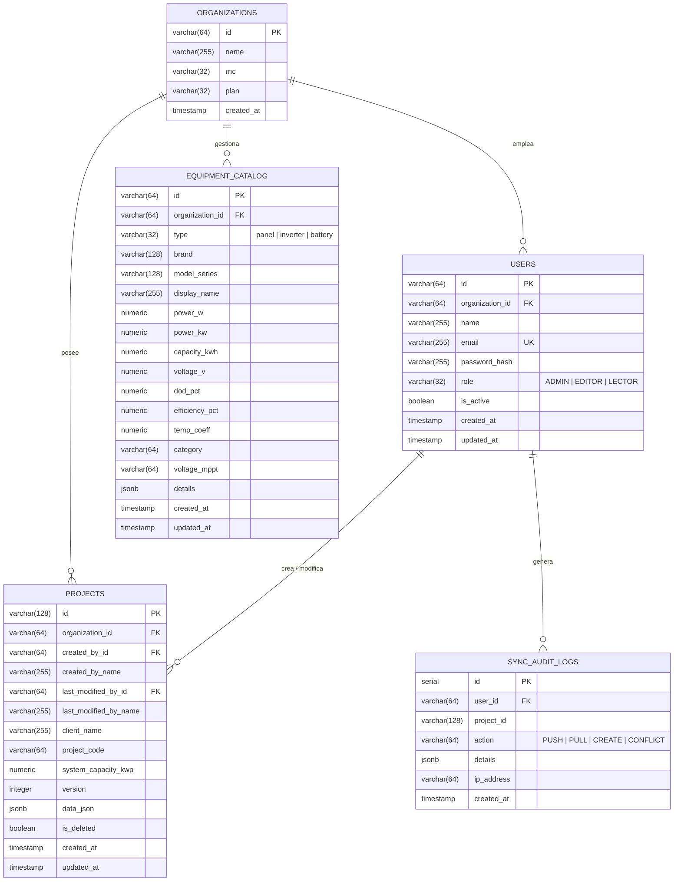

# 🏗️ Manual de Arquitectura de Infraestructura, Servidor Host y Servicios
## SolarSim Pro & Electsun Dominicana

Este documento detalla exhaustivamente la arquitectura técnica, la topología de red, la estructura de virtualización en **Proxmox VE**, la configuración de contenedores Docker, la base de datos PostgreSQL, el proxy inverso Caddy y la API de sincronización de **SolarSim Pro**.

---

## 📑 Tabla de Contenido
1. [Visión General y Diagrama de Arquitectura](#1-visión-general-y-diagrama-de-arquitectura)
2. [Servidor Host y Virtualización (Proxmox VE & LXC)](#2-servidor-host-y-virtualización-proxmox-ve--lxc)
3. [Topología de Red Interna y Aislamiento de Red](#3-topología-de-red-interna-y-aislamiento-de-red)
4. [Desglose y Configuración de los Servicios Docker](#4-desglose-y-configuración-de-los-servicios-docker)
   - [4.1 Ingress Proxy & TLS: `caddy-proxy`](#41-ingress-proxy--tls-caddy-proxy)
   - [4.2 Motor de Datos Relacional: `solarsim-db`](#42-motor-de-datos-relacional-solarsim-db)
   - [4.3 API REST & Motor de Sincronización: `solarsim-api`](#43-api-rest--motor-de-sincronización-solarsim-api)
   - [4.4 Sitio Corporativo: `electsun-web`](#44-sitio-corporativo-electsun-web)
5. [Modelo de Base de Datos y Esquemas Relacionales](#5-modelo-de-base-de-datos-y-esquemas-relacionales)
6. [Arquitectura de Sincronización en la Nube y Multi-usuario (RBAC)](#6-arquitectura-de-sincronización-en-la-nube-y-multi-usuario-rbac)
7. [Manual Operativo y Comandos de Mantenimiento](#7-manual-operativo-y-comandos-de-mantenimiento)
8. [Políticas de Seguridad y Respaldo](#8-políticas-de-seguridad-y-respaldo)

---

## 1. Visión General y Diagrama de Arquitectura

La infraestructura está diseñada bajo un modelo **modular de microservicios auto-hospedados (Self-Hosted)** que garantiza soberanía de datos, latencia ultra-baja en red local/VPN y alta disponibilidad para los ingenieros y consultores de SolarSim Pro.

```mermaid
graph TB
    subgraph CLOUDFLARE_EDGE ["☁️ Cloudflare Global Edge Network"]
        CFDNS["🌐 DNS: electsun.net"]
        CFWorker["📄 solarsim-share-viewer (Worker + KV)\nhttps://propuesta.electsun.net"]
        CFTunnel["🚇 Zero Trust Tunnel: eletcsun-tunnel\nhttps://solarsim.electsun.net & https://electsun.net"]
    end

    subgraph PROXMOX ["🖥️ Proxmox VE 9.x (Host: pve01 - 10.0.0.83)"]
        subgraph CT100 ["📦 LXC Container: CT 100 (app-server - 10.0.0.103)"]
            
            subgraph INGRESS ["Ingress"]
                CFTunnelConn["☁️ cloudflared-tunnel (Connector)"]
                Caddy["🛡️ Caddy 2 Reverse Proxy (:80 / :443)"]
            end

            subgraph DOCKER_NET ["🌐 Docker Network Bridge: solarsim_net"]
                API["⚡ solarsim-api (Node.js + Hono)\nPuerto Interno :3000"]
                DB[("🐘 PostgreSQL 16 Alpine\nsolarsim-db :5432")]
                Web["🏢 electsun-web (Nginx)\nPuerto Interno :80"]
            end

            subgraph STORAGE ["💾 Almacenamiento Persistente NVMe / ZFS"]
                VolDB["/home/agente/servicios/database/data/"]
                VolCaddy["caddy_data / caddy_config"]
            end
        end
    end

    DesktopApp -->|POST /api/share| CFWorker
    BrowserApp -->|GET /p/:id (Propuestas Web)| CFWorker
    DesktopApp -->|Sync & Auth REST| CFTunnel
    BrowserApp -->|HTTP / HTTPS| CFTunnel
    
    CFTunnel --> CFTunnelConn
    CFTunnelConn -->|HTTP Interno| Caddy
    
    Caddy -->|Enruta solarsim.* / api.*| API
    Caddy -->|Enruta electsun.net| Web
    
    API -->|TCP Pool Interno| DB
    
    DB -.->|Montaje Persistente| VolDB
    Caddy -.->|Certificados SSL| VolCaddy
```

---

## 2. Servidor Host y Virtualización (Proxmox VE & LXC)

La infraestructura física está gestionada mediante el hipervisor **Proxmox Virtual Environment (PVE)**.

### Ficha Técnica del Host & Contenedor:

| Parámetro | Detalle Técnico |
| :--- | :--- |
| **Hipervisor Host** | Proxmox VE 9.x (`pve01`) |
| **Dirección IP del Host** | `10.0.0.83/24` |
| **Identificador de Contenedor** | **LXC CT 100** (`app-server`) |
| **Dirección IP del Contenedor** | `10.0.0.103/24` |
| **Sistema Operativo del Contenedor** | Debian GNU/Linux 13 (Trixie) x86_64 |
| **Usuario de Operación** | `agente` (con pertenencia a los grupos `sudo` y `docker`) |
| **Acceso Administrativo** | SSH con autenticación exclusiva por clave pública (`ssh app-server`) |
| **Directorio Raíz de Servicios** | `/home/agente/servicios/` |

### ¿Por qué LXC en lugar de una Máquina Virtual (KVM/QEMU)?
1. **Rendimiento Bare-Metal**: Los contenedores LXC comparten el kernel del host sin sobrecarga de emulación de hardware, ofreciendo tiempos de acceso a disco NVMe y CPU prácticamente nativos.
2. **Uso Eficiente de Memoria**: A diferencia de una VM completa, LXC solo consume la memoria RAM exacta que los contenedores Docker en su interior requieren.
3. **Snapshots Instantáneos ZFS**: Proxmox realiza copias de seguridad consistentes en caliente del CT 100 en segundos sin interrumpir el servicio de sincronización.

---

## 3. Topología de Red Interna y Aislamiento de Red

Para cumplir con el estándar de **Defensa en Profundidad (Defense-in-Depth)** y el **Principio de Menor Privilegio**:

1. **Red Virtual Dedicada (`solarsim_net`)**:
   - Creada en Docker como red tipo puente (`bridge`) aislada.
   - Ningún contenedor expone puertos de bases de datos al host.
2. **Cero Exposición de PostgreSQL**:
   - `solarsim-db` **no** tiene mapeado el puerto `5432:5432` hacia el exterior. Solo es accesible por nombre de host DNS interno (`solarsim-db`) para los contenedores que coexisten en `solarsim_net`.
3. **Punto Único de Entrada (Single Entry Point)**:
   - Los únicos puertos abiertos hacia la IP del servidor (`10.0.0.103`) son el **80** (HTTP) y el **443** (HTTPS), administrados exclusivamente por el contenedor `caddy-proxy`.

---

## 4. Desglose y Configuración de los Servicios Docker

La infraestructura en `/home/agente/servicios/` está dividida en composiciones independientes de Docker Compose para permitir arranques, actualizaciones y mantenimientos aislados:

```
/home/agente/servicios/
├── caddy/
│   ├── Caddyfile
│   └── docker-compose.yml
├── database/
│   ├── data/                 <-- Volumen persistente PostgreSQL
│   └── docker-compose.yml
├── solarsim-api/
│   ├── .env                  <-- Credenciales y secretos JWT
│   └── docker-compose.yml
└── electsun-web/
    └── docker-compose.yml
```

---

### 4.1 Ingress Proxy & TLS: `caddy-proxy`

* **Imagen**: `caddy:2-alpine`
* **Contenedor**: `caddy-proxy`
* **Función**: Gateway perimetral, compresión moderna en tiempo real (Zstandard + Gzip) y enrutamiento inteligente de peticiones.

#### Configuración `Caddyfile`:
```caddy
{
    admin off
    auto_https off
}

:80 {
    encode zstd gzip

    # 1. Redirección canónica de www hacia el dominio raíz
    @wwwHost host www.electsun.net
    handle @wwwHost {
        redir https://electsun.net{uri} permanent
    }

    # 2. Subdominios dedicados para SolarSim API & Sync
    @solarsimHost host solarsim.electsun.net api.solarsim.electsun.net api.electsun.net
    handle @solarsimHost {
        reverse_proxy solarsim-api:3000
    }

    # 3. Web Corporativa Electsun (electsun.net y cualquier otra petición)
    handle {
        reverse_proxy electsun-web:3000
    }
}
```

#### `docker-compose.yml` de Caddy:
```yaml
services:
  caddy:
    image: caddy:2-alpine
    container_name: caddy-proxy
    restart: unless-stopped
    ports:
      - "80:80"
      - "443:443"
    volumes:
      - ./Caddyfile:/etc/caddy/Caddyfile:ro
      - caddy_data:/data
      - caddy_config:/config
    networks:
      - solarsim_net

volumes:
  caddy_data:
  caddy_config:

networks:
  solarsim_net:
    external: true
```

---

### 4.2 Motor de Datos Relacional: `solarsim-db`

* **Imagen**: `postgres:16-alpine`
* **Contenedor**: `solarsim-db`
* **Healthcheck**: Monitorea disponibilidad con `pg_isready` cada 10 segundos antes de permitir que la API inicie.

#### `docker-compose.yml` de Base de Datos:
```yaml
services:
  postgres:
    image: postgres:16-alpine
    container_name: solarsim-db
    restart: unless-stopped
    environment:
      POSTGRES_USER: ${DB_USER:-solarsim_user}
      POSTGRES_PASSWORD: ${DB_PASSWORD:-solarsim_secret_2026}
      POSTGRES_DB: ${DB_NAME:-solarsim_prod}
    volumes:
      - ./data:/var/lib/postgresql/data
    networks:
      - solarsim_net
    healthcheck:
      test: ["CMD-SHELL", "pg_isready -U ${DB_USER:-solarsim_user} -d ${DB_NAME:-solarsim_prod}"]
      interval: 10s
      timeout: 5s
      retries: 5

networks:
  solarsim_net:
    external: true
```

---

### 4.3 API REST & Motor de Sincronización: `solarsim-api`

* **Tecnología**: Node.js 20 LTS + Hono Framework + TypeScript + `pg` Connection Pooling.
* **Contenedor**: `solarsim-api`
* **Puerto Interno**: `3000`
* **Capacidades**:
  - Middleware CORS configurado para clientes web y de escritorio.
  - Generación y verificación de JSON Web Tokens (JWT con algoritmo HS256).
  - Encriptación de contraseñas con `bcryptjs` (salt rounds: 10).
  - Inicialización y migración automática de esquemas en el arranque (`initDatabase()`).

#### `docker-compose.yml` de la API:
```yaml
services:
  api:
    build:
      context: ../../../server
      dockerfile: Dockerfile
    container_name: solarsim-api
    restart: unless-stopped
    environment:
      PORT: 3000
      DB_HOST: solarsim-db
      DB_PORT: 5432
      DB_USER: ${DB_USER:-solarsim_user}
      DB_PASSWORD: ${DB_PASSWORD:-solarsim_secret_2026}
      DB_NAME: ${DB_NAME:-solarsim_prod}
      JWT_SECRET: ${JWT_SECRET:-solarsim_enterprise_jwt_secret_key_2026}
    depends_on:
      postgres:
        condition: service_healthy
    networks:
      - solarsim_net

networks:
  solarsim_net:
    external: true
```

---

### 4.4 Sitio Corporativo: `electsun-web`

* **Imagen**: `nginx:alpine`
* **Contenedor**: `electsun-web`
* **Puerto Interno**: `80`
* **Función**: Servir la landing page corporativa de Electsun cuando se accede a `https://electsun.net`.

---

### 4.5 Conector Edge: `cloudflared-tunnel`

* **Imagen**: `cloudflare/cloudflared:latest`
* **Contenedor**: `cloudflared-tunnel`
* **Túnel**: `eletcsun-tunnel`
* **Función**: Establece 4 túneles QUIC encriptados salientes hacia la red perimetral de Cloudflare. Recibe tráfico para `https://solarsim.electsun.net` y `https://electsun.net` y lo entrega a `caddy-proxy:80` dentro de `solarsim_net` sin requerir puertos abiertos en el firewall del servidor.

#### `docker-compose.yml` de Cloudflare Tunnel:
```yaml
services:
  cloudflared:
    image: cloudflare/cloudflared:latest
    container_name: cloudflared-tunnel
    restart: unless-stopped
    command: tunnel --no-autoupdate run
    environment:
      - TUNNEL_TOKEN=${TUNNEL_TOKEN}
    networks:
      - solarsim_net

networks:
  solarsim_net:
    external: true
```

---

### 4.6 Microservicio Serverless en el Borde: `solarsim-share-viewer`

* **Tecnología**: Cloudflare Workers + Hono (TypeScript) + Cloudflare KV (`PROPOSALS_KV`).
* **Dominio Oficial**: `https://propuesta.electsun.net`
* **Función**: Almacenar y renderizar propuestas web interactivas con gráficos interactivos y códigos QR para clientes e inversionistas con expiración automática (TTL de 1 a 90 días).
* **Independencia Operativa**: Opera al 100% en la red global de Cloudflare Edge, garantizando que los clientes puedan consultar sus propuestas incluso si el servidor local Proxmox se encuentra en mantenimiento.

---

## 5. Modelo de Base de Datos y Esquemas Relacionales

PostgreSQL maneja una estructura relacional altamente optimizada con soporte para campos `JSONB` indexados:



---

## 6. Arquitectura de Sincronización en la Nube y Multi-usuario (RBAC)

### 1. Control de Acceso Basado en Roles (RBAC)
* **`ADMIN`**: Control total. Gestión de usuarios, asignación de roles, eliminación de proyectos de la organización, actualización del catálogo global de equipos.
* **`EDITOR`**: Creación, edición, simulación y sincronización delta de propuestas fotovoltaicas.
* **`LECTOR`**: Visualización de proyectos y exportación de propuestas en PDF (sin permisos de escritura en la base de datos).

### 2. Protocolo de Sincronización Delta
* **`POST /api/sync/pull`**: El cliente envía su `lastSyncedAt`. El servidor devuelve únicamente los proyectos que han cambiado desde esa marca de tiempo en la organización.
* **`POST /api/sync/push`**: El cliente envía un lote de proyectos locales.
  - Si el proyecto no existe en el servidor: Se inserta con `version = 1`.
  - Si el proyecto existe y no hay colisión: Se actualiza e incrementa su `version = version + 1`.
  - Si existe un conflicto de edición simultánea: El servidor detecta la colisión y genera una bifurcación segura (V2, V3...) preservando ambos registros sin pérdida de datos.

### 3. Catálogo Global de Equipos Inteligente
* **`GET /api/equipment`**: Devuelve tanto los equipos estándar oficiales certificados (Canadian Solar, Luxpower, HinaESS) como los equipos personalizados agregados por los ingenieros mediante el escáner de fichas técnicas con IA multimodal (`gemini-2.0-flash` / `gemini-2.5-flash`).

---

## 7. Manual Operativo y Comandos de Mantenimiento

Todos los comandos se pueden ejecutar directamente mediante la conexión SSH configurada:

### 1. Verificación del Estado General
```bash
# Ver estado y puertos de todos los contenedores
ssh app-server "docker ps"

# Comprobar el uso de CPU y memoria en tiempo real
ssh app-server "docker stats --no-stream"
```

### 2. Consulta de Logs en Tiempo Real
```bash
# Ver logs de la API de sincronización
ssh app-server "cd /home/agente/servicios/solarsim-api && docker compose logs --tail=100 -f"

# Ver logs del proxy Caddy
ssh app-server "cd /home/agente/servicios/caddy && docker compose logs --tail=100 -f"

# Ver logs de PostgreSQL
ssh app-server "cd /home/agente/servicios/database && docker compose logs --tail=100 -f"
```

### 3. Reinicio y Despliegue de Nuevas Versiones
```bash
# Actualizar y recompilar solarsim-api
ssh app-server "cd /home/agente/servicios/solarsim-api && docker compose up -d --build"

# Recargar configuración de Caddy sin tiempo de inactividad
ssh app-server "docker exec caddy-proxy caddy reload --config /etc/caddy/Caddyfile"

# Reiniciar la base de datos de forma segura
ssh app-server "cd /home/agente/servicios/database && docker compose restart"
```

### 4. Healthcheck Vía Terminal
```bash
# Verificar endpoint de salud de la API
ssh app-server "curl -s http://localhost/api/health"
```
*Respuesta esperada:*
```json
{
  "status": "ok",
  "service": "SolarSim Pro Enterprise Sync Engine",
  "version": "1.5.0",
  "database": "connected",
  "timestamp": "2026-09-02T14:30:00.000Z"
}
```

---

## 8. Políticas de Seguridad y Respaldo

1. **Gestión de Secretos**:
   - Ninguna clave o credencial en texto plano está incrustada en el código fuente.
   - Las variables residen en `/home/agente/servicios/solarsim-api/.env` con permisos restringidos (`chmod 600 .env`).
2. **Estrategia de Copias de Seguridad Unificada (Backups)**:
   - **Nivel 1 (Respaldo Unificado PostgreSQL)**: Script `scripts/backup-databases.sh` que ejecuta `pg_dumpall | gzip` respaldando atómicamente tanto `solarsim_prod` como `electsun_prod`, roles, permisos y esquemas hacia `~/backups/electsun/postgres_full_YYYY-MM-DD_HH-MM-SS.sql.gz` con rotación automática de 14 días.
   - **Nivel 2 (Host Proxmox)**: Copias de seguridad programadas de todo el contenedor **CT 100** vía Proxmox Backup Server / VZDump hacia almacenamiento NFS/ZFS externo.
3. **Persistencia y Aislamiento Garantizados**:
   - **Segregación DB**: `solarsim_user` administra `solarsim_prod`, mientras que `electsun_user` opera con principio de mínimo privilegio sobre `electsun_prod` sin permisos de acceso a las tablas de SolarSim.
   - El volumen `./data` de PostgreSQL en `/home/agente/servicios/database/data/` se mantiene intacto independientemente del ciclo de vida de los contenedores Docker.

---
*Documento técnico de infraestructura generado y auditado para SolarSim Pro & Electsun.*

