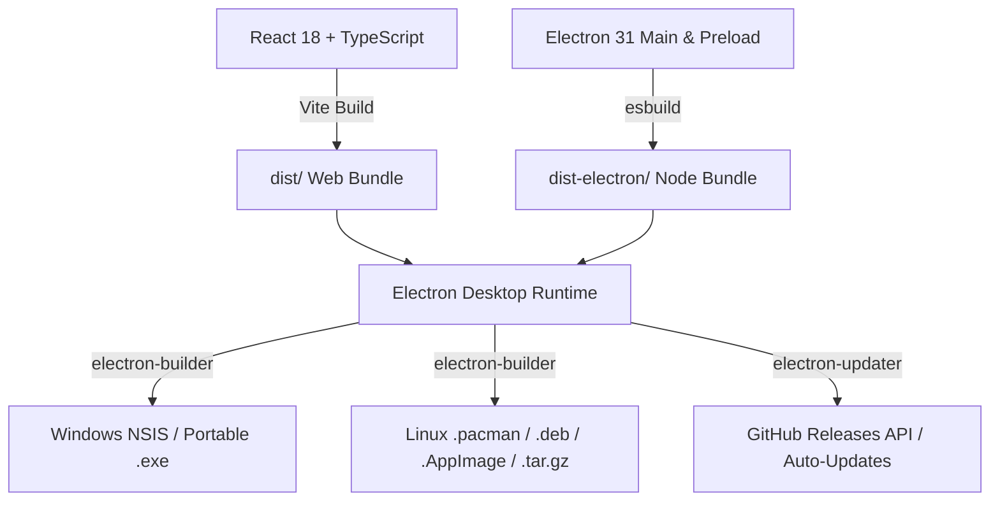

# 📚 Guía de Mantenimiento, Dependencias & Servicio de Actualizaciones
**SolarSim Pro** — Simulador Fotovoltaico Técnico-Económico Profesional

---

## 1. 🏗️ Arquitectura del Sistema & Stack Tecnológico

El proyecto está diseñado bajo una arquitectura híbrida de alto rendimiento que combina aplicaciones web modernas con un runtime de escritorio nativo:



### Componentes Clave:
* **Frontend**: React 18, TypeScript, Tailwind CSS, Lucide React, Recharts (gráficos solares e inversión), Zustand (estado global y persistencia).
* **Motor de Simulación**: Módulos puros en TypeScript (`src/engine/`) para cálculo de balance de energía horaria/mensual, degradación de paneles, autoconsumo, tarifas EDES (BTS1/BTS2), Ley 57-07, Payback, VAN, TIR y ROI a 25 años.
* **Generador de Documentos PDF**: `jspdf` + `html2canvas`. Todos los activos visuales (renders 3D, diagramas de flujo y logos) están pre-convertidos a Base64 en `src/assets/pdfGraphicAssets.ts` para evitar bloqueos por CORS o canvas tainting durante la exportación.
* **Desktop & Actualizador**: Electron 31 + `electron-updater` conectado al repositorio `WilkerDev1/solarsim-pro`.

---

## 2. 🛡️ Política de Dependencias & Matriz de Compatibilidad

Para evitar roturas graves en el simulador y en los empaquetadores de escritorio, se debe seguir esta matriz de compatibilidad:

| Paquete / Área | Versión Bloqueada / Rango | Motivo Técnico / Restricción |
| :--- | :--- | :--- |
| `react` / `react-dom` | `^18.3.1` (React 18) | Recharts 2.x y varias utilidades de UI dependen del reconciliador de React 18. **No actualizar a React 19** hasta que el ecosistema Recharts 3 sea completamente estable. |
| `electron` | `^31.7.7` | Probado y validado para Wayland en Linux y compatibilidad con NSIS en Windows. |
| `electron-builder` | `^24.13.3` | Genera paquetes nativos (`pacman`, `deb`, `AppImage`, `nsis`) de forma consistente con Wine y librerías del sistema. |
| `tailwindcss` | `^3.4.10` | Tailwind v3 con configuración personalizada de temas y plugins. **No migrar a v4** sin adaptar la configuración CSS y selectores dinámicos. |
| `jspdf` | `^2.5.2` | Compatible con el renderizado modular de páginas por canvas. |

### 🔍 Procedimiento para Actualizar Dependencias con Seguridad

1. **Auditoría de Versiones**:
   ```bash
   npm outdated
   ```
2. **Actualizaciones de Parches y Menores Seguras**:
   ```bash
   # Solo actualizar parches compatibles sin forzar majors
   npm update
   ```
3. **Verificación Obligatoria de Tipos y Pruebas**:
   ```bash
   npm run lint                  # tsc --noEmit
   npx tsx src/engine/testBenchmark.ts   # Validación matemática del motor
   npm run build:electron && npm run build # Compilación de bundles
   ```
4. **Si hay Advertencias de Scripts (`allowScripts`)**:
   Revisar el listado en `package.json` bajo la clave `"allowScripts"` antes de aprobar nuevos paquetes con scripts de post-instalación:
   ```json
   "allowScripts": {
     "electron@31.7.7": true,
     "esbuild@0.21.5": true,
     "core-js@3.50.0": true
   }
   ```

---

## 3. 🔄 Arquitectura del Servicio de Actualizaciones (`electron-updater`)

El servicio de auto-actualización permite que cualquier usuario en Windows o Linux reciba las nuevas versiones sin necesidad de descargar el instalador manualmente de la web.

### 🌐 Flujo de Funcionamiento:

```
[ SolarSim Pro Cliente (v1.X) ]
            │
            ▼ (1. Al pulsar 'Buscar Actualizaciones' o en segundo plano)
[ GitHub Releases API: WilkerDev1/solarsim-pro ]
            │
            ├─► Windows: Descarga 'latest.yml' ──► Compara versión (ej. 1.2.0 vs 1.1.0)
            │      └─► Si hay nueva versión: Descarga 'SolarSim-Pro-Setup-1.2.0.exe'
            │             └─► Ejecuta instalador NSIS silencioso al reiniciar la app.
            │
            └─► Linux: Descarga 'latest-linux.yml' ──► Detecta distro (Arch, Debian, Universal)
                   ├─► Arch / Manjaro: Ofrece comando `sudo pacman -U <url.pacman>` o 1-clic.
                   └─► AppImage / Deb: Descarga paquete verificado con firma criptográfica GPG.
```

### ⚠️ Reglas Críticas de Nombrado de Archivos (Para evitar Errores 404):

* `electron-updater` en Windows lee el manifiesto `latest.yml`.
* **Regla Mandatoria**: El nombre del archivo en la URL de GitHub **DEBE COINCIDIR EXACTAMENTE** con el valor de `path` y `url` dentro de `latest.yml`.
  * ✅ Correcto: `SolarSim-Pro-Setup-1.2.0.exe` (con guiones).
  * ❌ Incorrecto: `SolarSim.Pro.Setup.1.2.0.exe` (si tiene puntos o espacios en la release pero guiones en el yml, causará **Error 404**).
* Para máxima compatibilidad, el script de publicación siempre sube versiones con guiones y copias de seguridad con espacios.

---

## 4. 🔐 Firmas Criptográficas GPG (Para Arch Linux / AUR y Distribuciones Linux)

Para evitar rechazos de seguridad en gestores de paquetes como `pacman` (`error: missing signature / 404`), todos los binarios de Linux se firman con la clave oficial de desarrollo.

### Información de la Clave GPG Oficial:
* **Key ID**: `C22D550C3A2C8FAF`
* **Huella Digital**: `B55E 8CBF E8DC DEC4 7343 A390 C22D 550C 3A2C 8FAF`
* **UID**: `WilkerDev1 <capellancoronadowilker@gmail.com>`
* **Tipo**: RSA 4096 bits

### Comandos de Firma para Releases:
```bash
# Exportar clave pública (si se requiere actualizar)
gpg --armor --export C22D550C3A2C8FAF > release/solarsim-public-key.asc

# Firmar paquete pacman
gpg --detach-sign --yes release/solarsim-pro-1.2.0.pacman

# Firmar paquete tar.gz
gpg --detach-sign --yes release/solarsim-pro-1.2.0.tar.gz

# Firmar AppImage
gpg --detach-sign --yes release/SolarSim-Pro-1.2.0.AppImage
```

---

## 5. 🚀 Protocolo Paso a Paso para Publicar una Nueva Versión (Release Runbook)

Sigue esta lista de verificación cada vez que vayas a lanzar una actualización para los clientes:

### Paso 1: Incrementar Versión en `package.json`
Modificar la clave `"version"` (ejemplo: `"1.3.0"`):
```json
{
  "name": "solarsim-pro",
  "version": "1.3.0"
}
```

### Paso 2: Compilar el Frontend y el Runtime de Electron
```bash
npm run build && npm run build:electron
```

### Paso 3: Empaquetar Binarios para Windows y Linux
```bash
npx electron-builder --win --linux
```
*(Esto genera los instaladores en la carpeta `release/` junto con los manifiestos `latest.yml` y `latest-linux.yml`).*

### Paso 4: Preparar Nombres de Archivo y Firmas Criptográficas
Ejecutar el script de preparación:
```bash
python3 -c "
import shutil, os, subprocess

v = '1.3.0' # Sustituir por la versión actual

# Copias con nombres exactos para electron-updater
shutil.copyfile(f'release/SolarSim Pro Setup {v}.exe', f'release/SolarSim-Pro-Setup-{v}.exe')
shutil.copyfile(f'release/SolarSim Pro Setup {v}.exe.blockmap', f'release/SolarSim-Pro-Setup-{v}.exe.blockmap')
shutil.copyfile(f'release/SolarSim Pro {v}.exe', f'release/SolarSim-Pro-{v}.exe')
shutil.copyfile(f'release/SolarSim Pro-{v}.AppImage', f'release/SolarSim-Pro-{v}.AppImage')

# Exportar clave pública GPG
subprocess.run(['gpg', '--armor', '--export', 'C22D550C3A2C8FAF'], stdout=open('release/solarsim-public-key.asc', 'w'), check=True)

# Firmar paquetes de Linux
for target in [f'release/solarsim-pro-{v}.pacman', f'release/solarsim-pro-{v}.tar.gz', f'release/SolarSim-Pro-{v}.AppImage']:
    sig = target + '.sig'
    if os.path.exists(sig):
        os.remove(sig)
    subprocess.run(['gpg', '--detach-sign', '--yes', target], check=True)
    print(f'Firmado: {target} -> {sig}')
"
```

### Paso 5: Commit, Tag y Push a GitHub
```bash
git add package.json
git commit -m "chore(release): bump version to 1.3.0"
git tag -a v1.3.0 -m "Release v1.3.0 - Resumen de novedades"
git push origin main --tags
```

### Paso 6: Publicar la Release en GitHub
```bash
gh release create v1.3.0 \
  --title "☀️ SolarSim Pro v1.3.0 - Título del Lanzamiento" \
  --notes-file "release/release-notes-v1.3.0.md" \
  "release/latest.yml" \
  "release/latest-linux.yml" \
  "release/SolarSim-Pro-Setup-1.3.0.exe" \
  "release/SolarSim-Pro-Setup-1.3.0.exe.blockmap" \
  "release/SolarSim-Pro-1.3.0.exe" \
  "release/SolarSim-Pro-1.3.0.AppImage" \
  "release/SolarSim-Pro-1.3.0.AppImage.sig" \
  "release/solarsim-pro-1.3.0.pacman" \
  "release/solarsim-pro-1.3.0.pacman.sig" \
  "release/solarsim-pro_1.3.0_amd64.deb" \
  "release/solarsim-pro-1.3.0.tar.gz" \
  "release/solarsim-pro-1.3.0.tar.gz.sig" \
  "release/solarsim-public-key.asc"
```

---

## 6. 🛠️ Solución de Problemas Frecuentes (Troubleshooting)

### A. Error 404 al descargar la actualización en Windows
* **Causa**: El archivo `latest.yml` apunta a `SolarSim-Pro-Setup-X.Y.Z.exe` pero en la release de GitHub se subió con otro nombre (ej. con espacios o puntos).
* **Solución**: Subir el archivo con el nombre exacto usando `gh release upload vX.Y.Z "release/SolarSim-Pro-Setup-X.Y.Z.exe" --clobber`.

### B. Pacman rechaza la instalación remota en Arch Linux
* **Causa**: Pacman busca el archivo criptográfico de firma `.sig` en la misma ruta URL.
* **Solución**: Asegurarse de haber firmado el paquete con `gpg --detach-sign` y subir `solarsim-pro-X.Y.Z.pacman.sig` a la release de GitHub.

### C. La aplicación abre pero no recibe teclas en Wayland (Linux)
* **Causa**: Incompatibilidad del protocolo de entrada de Electron bajo Wayland nativo sin parámetros de IME.
* **Solución**: El acceso directo `.desktop` incluye los flags `--ozone-platform-hint=auto --enable-features=WaylandWindowDecorations` y `--no-sandbox` para garantizar compatibilidad total con GNOME/KDE.

### D. Exportación PDF sale cortada o faltan imágenes
* **Causa**: Imágenes cargadas mediante URLs externas bloqueadas por CORS o no resueltas al invocar `html2canvas`.
* **Solución**: Convertir siempre las imágenes a Base64 e importarlas desde `src/assets/pdfGraphicAssets.ts`.
