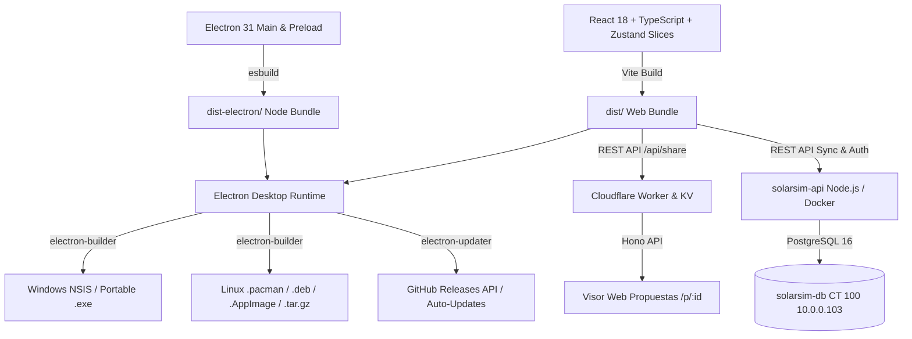

# 📚 Guía de Mantenimiento, Dependencias & Servicio de Actualizaciones
**SolarSim Pro** — Simulador Fotovoltaico Técnico-Económico Profesional

---

## 1. 🏗️ Arquitectura del Sistema & Stack Tecnológico

El proyecto está diseñado bajo una arquitectura híbrida de alto rendimiento que combina aplicaciones web modernas con un runtime de escritorio nativo, servicios serverless y un backend auto-hospedado:


000d
### Componentes Clave:
* **Frontend**: React 18, TypeScript, Tailwind CSS, Lucide React, Recharts (gráficos solares e inversión), Zustand con Arquitectura de Slices (`projectSlice`, `equipmentSlice`, `syncAuthSlice`, `importExportSlice`, `aiSlice`, `uiSlice`).
* **Motor de Simulación**: Módulos puros en TypeScript (`src/engine/`) para cálculo de balance de energía horaria/mensual, degradación de paneles, autoconsumo, tarifas EDES (BTS1/BTS2/MTD1/MTD2/etc.), Ley 57-07, Payback, VAN, TIR y ROI a 25 años.
* **Inteligencia Artificial Multimodal**: Google Gemini Vision (`gemini-3.5-flash-lite`) para escaneo de facturas eléctricas dominicanas y extracción de fichas técnicas (*datasheets*) de módulos fotovoltaicos, inversores y almacenamiento BESS.
* **Backend de Sincronización & Auth**: Servidor Node.js + Hono (`server/`) en contenedor Docker conectado a PostgreSQL 16 Alpine en Proxmox LXC CT 100 (`10.0.0.103`), con autenticación JWT, RBAC y sincronización delta de proyectos y catálogo.
* **Generador de Documentos PDF**: `jspdf` + `html2canvas`. Todos los activos visuales están pre-convertidos a Base64 en `src/assets/pdfGraphicAssets.ts` para garantizar renderizado instantáneo y evitar tainting de canvas.
* **Servicio Serverless de Propuestas Web**: Cloudflare Workers + KV (`workers/share-viewer/`) con Hono, generación de códigos QR y renderizado interactivo en la nube con TTL de expiración automática.
* **Desktop & Actualizador**: Electron 31 + `electron-updater` conectado al repositorio `WilkerDev1/solarsim-pro`.

---

## 2. 🛡️ Política de Dependencias & Matriz de Compatibilidad

Para evitar roturas graves en el simulador y en los empaquetadores de escritorio, se debe seguir esta matriz de compatibilidad:

| Paquete / Área | Versión Bloqueada / Rango | Motivo Técnico / Restricción |
| :--- | :--- | :--- |
| `react` / `react-dom` | `^18.3.1` (React 18) | Recharts 2.x y varias utilidades de UI dependen del reconciliador de React 18. **No actualizar a React 19** hasta que el ecosistema Recharts 3 sea completamente estable. |
| `electron` | `^31.7.7` | Probado y validado para Wayland en Linux y compatibilidad con NSIS en Windows. |
| `electron-builder` | `^24.13.3` | Genera paquetes nativos (`pacman`, `deb`, `AppImage`, `nsis`) de forma consistente con Wine y librerías del sistema. |
| `tailwindcss` | `^3.4.10` | Tailwind v3 con configuración personalizada de temas y plugins. **No migrar a v4** sin adaptar la configuración CSS y selectores dinámicos. |
| `jspdf` | `^2.5.2` | Compatible con el renderizado modular de páginas por canvas. |

### 🔍 Procedimiento para Actualizar Dependencias con Seguridad

1. **Auditoría de Versiones**:
   ```bash
   npm outdated
   ```
2. **Actualizaciones de Parches y Menores Seguras**:
   ```bash
   npm update
   ```
3. **Verificación Obligatoria de Tipos y Pruebas**:
   ```bash
   npm run lint                                            # tsc --noEmit (Cero errores)
   npx tsx src/tests/testBenchmark.ts                     # Validación contra benchmark oficial
   npx tsx src/tests/testFinancialEngineComprehensive.ts  # Suite integral de 9 pruebas financieras
   npm test                                               # Ejecutar todas las pruebas unitarias
   npm run build && npm run build:electron                 # Compilación completa de bundles
   npm run context:pack                                    # Snapshot empaquetado Repomix
   ```
4. **Si hay Advertencias de Scripts (`allowScripts`)**:
   Revisar el listado en `package.json` bajo la clave `"allowScripts"` antes de aprobar nuevos paquetes con scripts de post-instalación:
   ```json
   "allowScripts": {
     "electron@31.7.7": true,
     "esbuild@0.21.5": true,
     "core-js@3.50.0": true
   }
   ```

---

## 3. 🔄 Arquitectura del Servicio de Actualizaciones (`electron-updater`)

El servicio de auto-actualización permite que cualquier usuario en Windows o Linux reciba las nuevas versiones sin necesidad de descargar el instalador manualmente de la web.

### 🌐 Flujo de Funcionamiento:

```
[ SolarSim Pro Cliente (v1.X) ]
            │
            ▼ (1. Al pulsar 'Buscar Actualizaciones' o en segundo plano)
[ GitHub Releases API: WilkerDev1/solarsim-pro ]
            │
            ├─► Windows: Descarga 'latest.yml' ──► Compara versión (ej. 1.5.0 vs 1.4.1)
            │      └─► Si hay nueva versión: Descarga 'SolarSim-Pro-Setup-1.5.0.exe'
            │             └─► Ejecuta instalador NSIS silencioso al reiniciar la app.
            │
            └─► Linux: Descarga 'latest-linux.yml' ──► Detecta distro (Arch, Debian, Universal)
                   ├─► Arch / Manjaro: Ofrece comando `sudo pacman -U <url.pacman>` o 1-clic.
                   └─► AppImage / Deb: Descarga paquete verificado con firma criptográfica GPG.
```

### ⚠️ Reglas Críticas de Nombrado de Archivos & Nomenclatura Canónica:

* **Nomenclatura Unificada sin Espacios**: Todos los paquetes oficiales generados por `electron-builder` utilizan nombres estandarizados mediante `artifactName` en `package.json`:
  - **Windows (Instalador NSIS)**: `SolarSim-Pro-Setup-${version}.exe` y `SolarSim-Pro-Setup-${version}.exe.blockmap`
  - **Windows (Portable)**: `SolarSim-Pro-${version}.exe`
  - **Linux (AppImage)**: `SolarSim-Pro-${version}.AppImage`
  - **Linux (Arch / Pacman)**: `solarsim-pro-${version}.pacman`
  - **Linux (Debian / DEB)**: `solarsim-pro_${version}_amd64.deb`
  - **Linux (Tarball)**: `solarsim-pro-${version}.tar.gz`
* **Eliminación de Aliases Legacy**: Las versiones antiguas (v1.1.0/v1.4.0) utilizaban enlaces simbólicos y duplicados con espacios (`SolarSim Pro...`). A partir de la versión **v2.0.0**, se eliminó esta sobrecarga de mantenimiento; todos los clientes y actualizadores leen exclusivamente la nomenclatura estándar con guiones.
* **Consistencia con Manifiestos**: El valor de `url` y `path` en `latest.yml` y `latest-linux.yml` coincide directamente con estos archivos sin necesidad de scripts de copiado.

---

## 4. 📋 Manifiestos de Actualización: YAML & JSON

SolarSim Pro soporta tanto actualizadores basados en YAML de `electron-updater` como clientes HTTP y scripts de terceros que consumen JSON:

| Archivo Manifiesto | Propósito & Consumidor | Ubicación en Release |
| :--- | :--- | :--- |
| `latest.yml` | Manifiesto nativo de `electron-updater` para Windows (NSIS). Contiene versión, SHA-512 y tamaño en bytes de `SolarSim-Pro-Setup-X.Y.Z.exe`. | `release/latest.yml` |
| `latest-linux.yml` | Manifiesto nativo de `electron-updater` para Linux (`AppImage`, `.deb`). | `release/latest-linux.yml` |
| `latest.json` | Manifiesto JSON estructurado con enlaces directos, hashes SHA-256 / SHA-512 y notas de versión para todos los instaladores (Windows, Pacman, Deb, AppImage, Tarball). | `release/latest.json` |
| `update.json` | Alias JSON de `latest.json` para clientes heredados y scripts de auto-despliegue. | `release/update.json` |

---

## 5. 🚀 Flujo Oficial de Compilación, Firma y Publicación de Releases

### ⚠️ Causa Raíz de Versiones Desfasadas al Actualizar:
Si únicamente se crea y empuja un tag de Git (`git push origin v2.0.0`), la API de GitHub (`/repos/WilkerDev1/solarsim-pro/releases/latest`) **NO** reconoce el nuevo tag como un lanzamiento disponible hasta que se cree formalmente el **GitHub Release**. Si el usuario pulsa *"Buscar Actualizaciones"* en la app antes de que el release esté publicado en GitHub, la app consultará la API, obtendrá la versión anterior (ej. v1.6.0) y descargará el paquete antiguo, sobreescribiendo la instalación.

### 🛠️ Protocolo Paso a Paso para Nuevas Versiones:

1. **Sincronización de Versión en Archivos JSON**:
   - `package.json`: `"version": "X.Y.Z"`
   - `server/package.json`: `"version": "X.Y.Z"`
   - `workers/share-viewer/package.json`: `"version": "X.Y.Z"`
   - Sincronizar lockfiles (`npm install --package-lock-only`).

2. **Compilación de Producción Multiplataforma**:
   ```bash
   npm run build && npm run build:electron
   npx electron-builder --win --linux
   ```
   *(Los binarios se generan directamente con nombres limpios sin espacios gracias a `artifactName` en `package.json`).*

3. **Firma Criptográfica GPG de Paquetes Linux**:
   ```bash
   gpg --batch --yes --detach-sign --armor --output release/SolarSim-Pro-X.Y.Z.AppImage.sig release/SolarSim-Pro-X.Y.Z.AppImage
   gpg --batch --yes --detach-sign --armor --output release/solarsim-pro-X.Y.Z.pacman.sig release/solarsim-pro-X.Y.Z.pacman
   gpg --batch --yes --detach-sign --armor --output release/solarsim-pro-X.Y.Z.tar.gz.sig release/solarsim-pro-X.Y.Z.tar.gz
   ```

4. **Generar y Sincronizar Manifiestos JSON (`latest.json` & `update.json`)**:
   - Calcular hashes SHA-256 con `sha256sum release/*X.Y.Z*`.
   - Exportar metadatos en `release/latest.json` y copiar a `release/update.json`.

5. **Crear y Publicar el Release Oficial en GitHub**:
   ```bash
   gh release create vX.Y.Z \
     --title "⚡ SolarSim Pro vX.Y.Z — <Título de la Versión>" \
     --notes-file release/release-notes-vX.Y.Z.md \
     release/SolarSim-Pro-Setup-X.Y.Z.exe \
     release/SolarSim-Pro-Setup-X.Y.Z.exe.blockmap \
     release/SolarSim-Pro-X.Y.Z.exe \
     release/SolarSim-Pro-X.Y.Z.AppImage \
     release/SolarSim-Pro-X.Y.Z.AppImage.sig \
     release/solarsim-pro_X.Y.Z_amd64.deb \
     release/solarsim-pro-X.Y.Z.pacman \
     release/solarsim-pro-X.Y.Z.pacman.sig \
     release/solarsim-pro-X.Y.Z.tar.gz \
     release/solarsim-pro-X.Y.Z.tar.gz.sig \
     release/solarsim-public-key.asc \
     release/latest.yml \
     release/latest-linux.yml \
     release/latest.json \
     release/update.json
   ```

6. **Instalación Local para Validación Inmediata**:
   ```bash
   sudo pacman -U --noconfirm release/solarsim-pro-X.Y.Z.pacman
   ```

