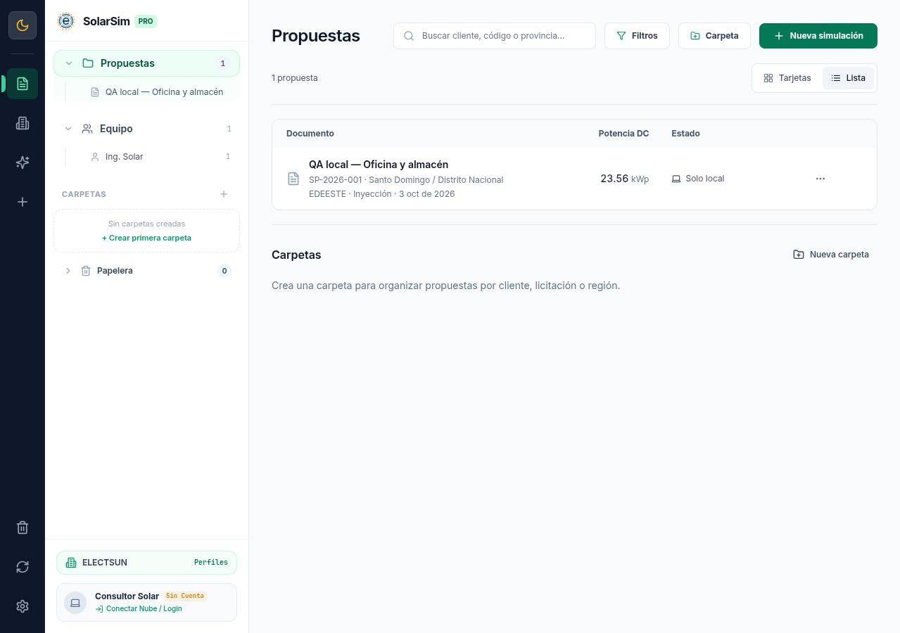
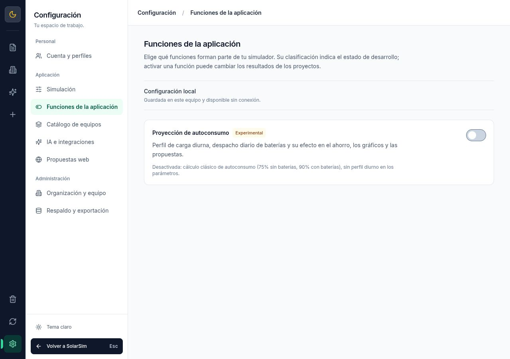
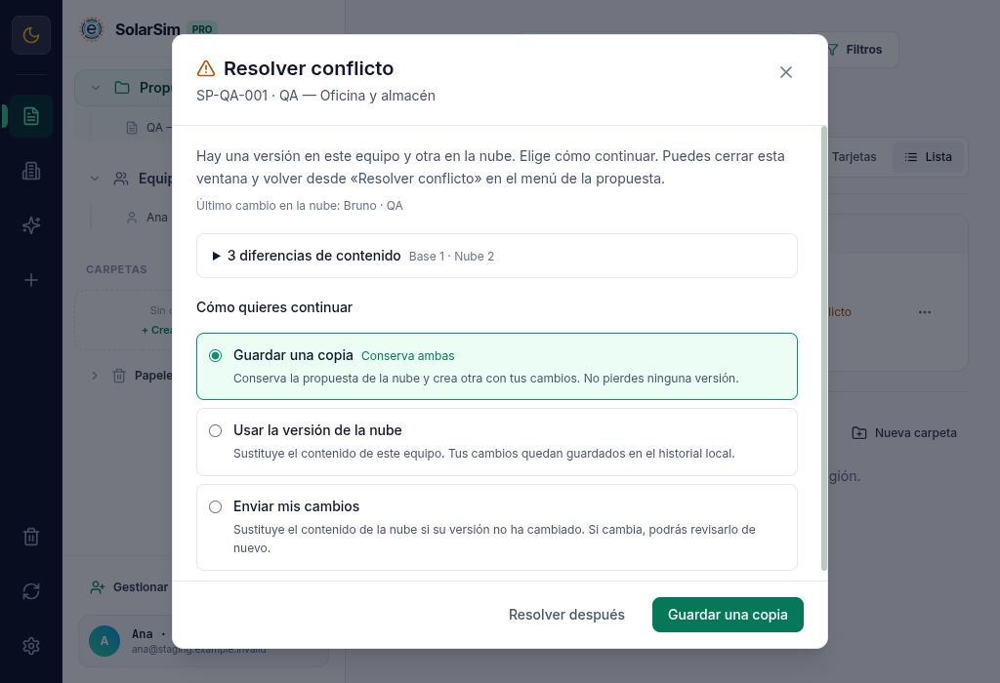
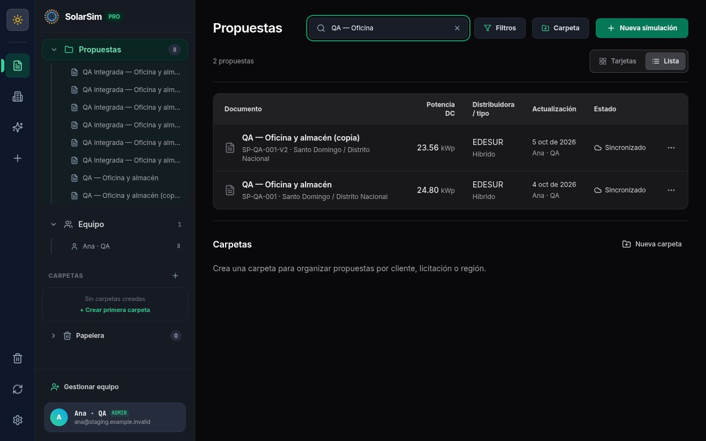

# Resultados de la rama de pruebas — actualización 4 octubre 2026

Rama `codex/modular-audit-feature-controls`, desde `beta` en `8cdcfec`. Estos resultados certifican los casos ejecutados en el checkout de la rama; no constituyen un despliegue ni una certificación de producción.

## Gates ejecutados

| Comprobación | Resultado y alcance |
| --- | --- |
| `npm run lint` | Sin errores TypeScript. |
| `npm test` | 24 suites: motores, funciones, persistencia, sincronización, colas de eliminación, catálogo, carpetas, IA, tarifas, PDF y updater. Fetch externo bloqueado por defecto. |
| `npm run build` | Frontend correcto. Queda advertencia de chunks grandes, especialmente assets del PDF; no se oculta. Vistas pesadas cargadas con lazy/Suspense. |
| `npm run build:electron` | Main/preload compilados. No se instaló un paquete nuevo sobre la aplicación del usuario. |
| Backend `test`, `format:check`, `build` | 17 pruebas con PostgreSQL 16 efímero: RBAC, organizaciones, JWT vigente, migraciones, CAS, conflictos, trash, snapshots, política y JSON inválido. |
| Imagen Docker Node 24 | Build y `server/tests/containerSmoke.ts` correctos: proceso no root, health con BD, alta sintética y lectura/actualización CAS de funciones. El smoke corrigió un fallo ESM de contratos compartidos invisible en el build local. |
| Worker `test`, `build` | Dos suites, tipos y bundling correctos; KV y autoridad simulados, sin publicación empresarial. |
| Repomix | Regenerado con dominios nuevos, docs y scripts. Excluye binarios, secretos y archivos sospechosos; no se versiona el snapshot generado. |
| `git diff --check` | Sin errores de whitespace. |

## Navegador y revisión visual

QA local con propuesta sintética «QA local — Oficina y almacén», 23.56 kWp, 38 módulos, sin cuenta empresarial. Se comprobaron tarjetas/lista y persistencia de la elección, temas claro/oscuro, categorías de Ajustes, aislamiento accesible del fondo, y tamaño mínimo Electron 1024×700 con acciones de la tabla visibles. El refinamiento conserva SolarSim y el documento PDF existente.

La revisión independiente Impeccable cerró con `ship` tras corregir el registro de contexto PRODUCT.md, el contorno del interruptor apagado y el contraste del placeholder. Las capturas finales muestran el contenido realmente seleccionado, sin datos de clientes:

## Coherencia de cálculo y exportación

El proyecto sintético muestra ahorro de primer año USD 7,059.05 con legacy y USD 6,408.17 con proyección. Simulador, hub y páginas PDF coinciden; al apagar desaparece el perfil diurno y la tabla vuelve a cinco columnas con dos series en gráfica. Los datos experimentales introducidos se conservan. El tooltip clásico se verificó sobre la primera columna: «Consumo» y «Producción FV», sin etiquetas de autoconsumo para esas dos series. Las pruebas de dominio cubren BESS, cero consumo, retención, permisos de política y precedencia local/organización.

El PDF preview presenta 11 páginas. `testPDFExportCompatibility.ts` serializa un dossier raster A4 de 11 páginas con JPEG real, comprueba tamaño/recursos de imagen y fusiona un anexo con pdf-lib (12 páginas). La exportación desde el hub llegó al estado final sin errores de consola, pero la automatización del navegador no entregó el evento/archivo de descarga; no se afirma haber inspeccionado ese PDF descargado. El4 de octubre el usuario aportó y aprobó un PDF real de15páginas con anexos: ese entregable queda aceptado y se excluyó expresamente del trabajo pendiente. Impresión nativa es una operación distinta, sin evidencia de ejecución.

## Revisiones de código y correcciones

Revisores independientes de sincronización, backend, publicación, updater e interfaz inspeccionaron los contratos y reprodujeron fallos. Se corrigieron carreras de último ADMIN, autorización tras esperar bloqueos, comandos de borrado durante uploads, conflictos recuperables de catálogo, respuestas de sesiones anteriores, publicación HTML hostil, créditos fiscales cero y el camino AppImage que podía saltarse la verificación. Las regresiones automatizadas protegen esos casos. La revisión no sustituye pruebas de uso en producción.

## Conflictos, staging y beta — 4 de octubre

La API2.2.0 desplegada confirma creación con id/versión sin documento canónico. El cliente rechazaba ese ACK, conservaba base0 y podía entrar en conflicto al reenviarlo. Además JSONB reordena claves y `JSON.stringify` producía diferencias falsas. El SELECT del backend antiguo omitía el nombre del último autor: «Otro consultor» era un fallback inventado, no prueba de otro usuario.

Ahora el cliente verifica ACK legacy con un full pull; si falla conserva un recibo durable, identidad/base y contenido pendiente sin declarar synced ni reenviar antes de verificar. Comparación semántica excluye metadatos y normaliza papelera. Los conflictos se conservan por servidor/organización y se reabren desde tarjeta/lista incluso después de recargar. El modal muestra campos legibles, autor solo si se conoce, tres decisiones con una confirmación y checkpoint local previo. Tombstone sobre cambios locales preserva copia recuperable; un modal ya abierto sigue el registro vigente.

QA de navegador con usuarios Ana ADMIN y Bruno EDITOR produjo conflicto real base1/nube2; enero4000vs3279 y módulos38vs40. Se probaron cierre/reapertura/recarga, ambos menús, temas,1024×700, Tab/ShiftTab/Escape y foco. La opción Guardar una copia conservó el original de40módulos y creó una propuesta independiente de38; tras Sincronizar ahora ambos quedaron sincronizados. Fixture de componentes separada verifica consulta pendiente y deleted+VIEWER, sin red ni datos empresariales.

Prueba HTTP integrada cliente/API/Worker con KV local y HTTPS temporal: creación, CAS multiusuario, VIEWER, rechazo sinbaseVersion, política, snapshots de publicación legacy/físico y papelera/restauración. Detectó y corrigió `redirect:error` incompatible con workerd; ahora se usa manual y se rechazan redirecciones. No se probó contra producción.

Restauración real del respaldo CT y dump lógico, migraciones idempotentes, contenido/conteos y rollback de la imagen anterior: [evidencia y límites](BETA_ROLLOUT.md). La rotación DB/JWT pasó en contenedores efímeros. Producción no fue actualizada.

Electron44.5.1/builder26.15.3 y paquetes2.3.0-beta.1 Linux/Windows generados sin publicar. El harness de ASAR real con perfil privado pasó en Linux: arranque, contexto aislado, renderizador sinNode, IPCversión/plataforma y cleanup de suscripción. CI añade empaquetado, instalación deb y upgrade NSIS2.1.5 a beta en runners efímeros. El harness ejecuta el ASAR instalado mediante Electron de node_modules de la misma versión; no acredita arranque directo del binario instalado ni interacción con SmartScreen/pkexec.

El commit56af783 pasó en GitHub [contratos](https://github.com/WilkerDev1/solarsim-pro/actions/runs/37300154074) e [instalación/empaquetado nativo](https://github.com/WilkerDev1/solarsim-pro/actions/runs/37300154064), Ubuntu y Windows.

## Riesgos y operaciones pendientes

- Despliegue coordinado y rotación de secretos de producción pendientes. No desplegar API aislada mientras clientes antiguos escriban. El volumen PostgreSQL se conserva; no requiere cambio de major/SO según la revisión del CT.
- Las firmas GPG de ambos manifiestos y cuatro formatos Linux se verificaron con la clave fijada; tamaño/SHA256 de los seis paquetes también pasó. Authenticode, SmartScreen e instalación interactiva/pkexec siguen pendientes; AppImage usa sustitución manual. Instalación deb y actualización NSIS desde2.1.5 pasaron en runners efímeros.
- Auditoría npm raíz actual:6 avisos altos en dependencias dev de Tailwind/braces; producción0. No se aplicó upgrade forzado de Tailwind4. Auditorías actuales de backend y Worker:0 avisos. Son resultados de esta ejecución, no garantía permanente.
- Chunks grandes siguen como optimización futura; PDF aprobado sin rediseño. Drag-and-drop real e impresión nativa no acreditados por este ensayo.

Revisiones independientes de sincronización, updater e interfaz cerraron conformes después de corregir los hallazgos y sus regresiones. El revisor operativo detectó una ruta insegura al preparar secretos; el guard corregido se verificó desde repo, subdirectorio, carpeta externa y enlace simbólico.

Estado histórico al4 de octubre: PR a beta y paquetes locales, sin merge ni deploy. El estado vigente está en la actualización siguiente. El plan operativo registra las tareas abiertas con protección del dato y rollback.

## Actualización vigente — release 2.2.1, 5 de octubre

PR1 integrado en beta; macOS excluido por decisión del usuario. Windows/Linuxx64 compilados en [GitHub CI37315592565](https://github.com/WilkerDev1/solarsim-pro/actions/runs/37315592565), todos los jobs correctos. Betas sin empaquetado de SO: `verify.yml` comprueba dev/gates y el antiguo workflow de paquetes beta se retiró/desactivó. Los checks push cancelados de PR1 eran ejecuciones duplicadas por concurrencia; ahora las ramas codex reciben solo el check de PR.

Linux: deb instalado en Ubuntu, AppImage arrancado sinFUSE mediante extracción, pacman instalado/arrancado en Arch aislado. Windows: NSIS2.1.5 actualizado a2.2.1 y ejecutable instalado arrancado. Ambos ASAR verifican aislamiento/IPC. Portable Windows y tar.gz Linux generados; hashes/tamaños correctos, sin afirmar pruebas interactivas de esos dos formatos.

El primer draft falló por alias que solo diferían en mayúsculas; se conservan nombres canónicos y solo el alias Debian distinto. La agregación también mezclaba YAML tracked del otro SO: se sustituyó la metadata del borrador antes de publicar y se añadió validación de versión, paquete principal, entradas permitidas, SHA512 y tamaños. El checker rechazó el YAML antiguo en una regresión reproducida con archivos reales.

Verificación local de los seis archivos descargados y firmas GPG con la clave fijada: PASS. Los manifiestos JSON firmados y ambos YAML corresponden a2.2.1. Revisión independiente del updater/pipeline sin bloqueantes. Se volvieron a descargar los manifiestos/YAML y firmas del borrador: ambos verificadores pasaron. Los 20 assets remotos coincidieron en tamaño/SHA256; después se publicó la [release 2.2.1](https://github.com/WilkerDev1/solarsim-pro/releases/tag/v2.2.1).

Audit actual: raíz7 altos dev, producción0; backend0, Worker0. Producción conserva API2.2.0 y PostgreSQL conectado; no se desplegó ni se escribió en datos empresariales. [Runbook vigente y límites](BETA_ROLLOUT.md).

## Actualización vigente — Reparación de Publicación Web y Despliegue de Producción, 6 de octubre 2026

Despliegue coordinado de backend y Cloudflare Worker, resolución de incompatibilidad en generación de propuestas web y certificación de contratos PR #2:

1. **Diagnóstico y Reparación de Contratos**:
   - Se resolvió el error «No se pudo confirmar la configuración de simulación del servidor»: la API 2.2.0 anterior no implementaba `GET /api/organization/features` ni `POST /api/auth/share-authorization`.
   - Se reparó `src/services/shareProposalService.ts` propagando errores específicos de política en lugar del mensaje genérico.
   - Se corrigieron las rutas en el comprobador de compatibilidad (`/api/organization/profile`, `/api/auth/switch-organization`) exigiendo HTTP 401 ante accesos anónimos y salida con código de error ante fallos.

2. **Respaldo Privado y Ensayo de Restauración**:
   - Generación de dump binario PostgreSQL en `app-server` (CT 100): `~/servicios/database/backups/solarsim_prod_pre_deploy_20261006.dump` (505 KB, permisos estrictos `0600`).
   - Ensayo de restauración en contenedor PostgreSQL aislado (`--network none`) verificando integridad estructural y recuento exacto de las 8 tablas de negocio: 13 organizaciones, 23 usuarios, 55 proyectos, 68 equipos, 65 registros de historial, 73 notificaciones y 2 tarifas.

3. **Construcción y Despliegue de la API (Producción)**:
   - Compilación Docker con contexto raíz (`server/` y `shared/`): imagen `solarsim-api-api:2.2.1-ac7abbc` (Digest: `sha256:3ef36a8fa0b6f1fcadf5992daf7e3976de93bc222f837603fac10df88fa180c6`).
   - Preservación de imagen de rollback: `solarsim-api-api:rollback-2.2.0` (`sha256:7d5bf277df56ee123a5ef89318434cb1ed36b52cb3353f3e202237bd2f37563e`).
   - Generación y asignación de secretos criptográficos privados (32+ caracteres) en `.env` (`0600`), rechazando credenciales por defecto.
   - Recreación en caliente de `solarsim-api` con `docker compose up -d --force-recreate api` conservando el volumen de datos de PostgreSQL.
   - Ejecución automática e idempotente de las migraciones 001 (`baseline`), 002 (`feature_policy_and_tombstones`) y 003 (`company_management`).
   - Estado de producción: `https://solarsim.electsun.net/api/health` reporta versión `2.2.1` y base de datos `connected`.

4. **Despliegue del Cloudflare Worker**:
   - Despliegue de `workers/share-viewer` a `https://propuesta.electsun.net` con Wrangler (Version ID `65bdc436-2d78-447e-8fc7-a051aa262454`).
   - Bindings verificados: KV `e6793f84550d449899f59aa80c872067` y variable `AUTH_API_URL: "https://solarsim.electsun.net"`.

5. **Verificación Ejecutable de Compatibilidad**:
   - `npm run verify:compatibility` ejecutado contra endpoints reales de producción: 9/9 comprobaciones aprobadas, 0 fallos, código de salida 0.
   - Suite automatizada de pruebas del verificador: 5/5 casos aprobados (`scripts/qa/tests/verifyDeploymentCompatibility.test.ts`).

6. **Gates y Calidad**:
   - `npm test`: 25 suites pasadas (100%).
   - `npm --prefix server test`: 26 pruebas pasadas (100%), incluyendo migración 003 y staging E2E.
   - `npm --prefix workers/share-viewer test`: 2 suites pasadas (100%).
   - `npm run lint`: código TypeScript limpio sin errores.
   - `npm run build` y `npm run build:electron`: artefactos frontend y electron generados correctamente.
