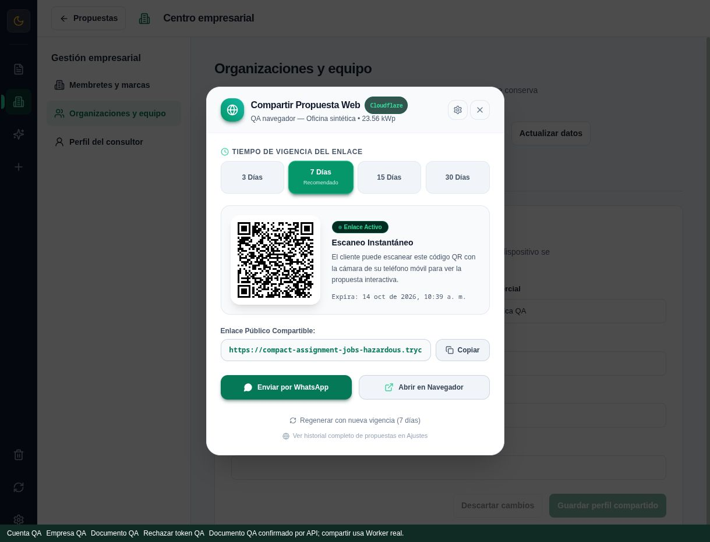

# QA de navegador — 7 de octubre de 2026

Solo datos sintéticos. La [revisión principal](../../REVIEW_2026_10_07.md) separa runtime real, transporte simulado, producción de solo lectura y pendientes. No guardar capturas de credenciales, tokens, URLs empresariales privadas ni contenido de clientes.

## Aplicación completa y servicios reales

Fixture `scripts/qa/fixtures/runtimeFlow.html`, iniciada después de `scripts/qa/runRuntimeStaging.ts` y `npm run dev`. Monta `App` completa. API HTTP, PostgreSQL desechable, workerd/KV local y HTTPS temporal son reales; no hay mock de transporte en esta fixture. Configuración sintética, marcador de instancia y almacenamiento QA separado evitan dirigir mutaciones a producción.

Recorridos observados: login Ana QA, carga de equipo ADMIN/EDITOR/VIEWER, invitación de Eva QA, token inválido rechazado por la API, aviso y reautenticación, propuesta sintética sincronizada, publicación y QR visible. La lectura de la publicación corresponde al snapshot QA del Worker local.

QR decodificado con jsQR desde `runtime-share.jpg`: coincidencia exacta con el enlace HTTPS mostrado; GET público 200 con cliente sintético preservado. No publicar la configuración temporal ni JWTs; `Ctrl+C` cierra el runner y elimina sus recursos.

## Ciclo de vida de borradores

Fixture `scripts/qa/fixtures/draftLifecycle.html`: componentes reales con transporte simulado, diseñada para ejercer invalidación/renovación sin alterar servicios. Se observó conservación del membrete sin guardar, perfil compartido y endpoint de integración en el mismo ámbito. El perfil compartido conserva su versión CAS; el ámbito B permanece aislado.

Este recorrido no acredita autenticación HTTP, persistencia PostgreSQL o despliegue de producción. Las regresiones de store/transporte y el ensayo de runtime real son pruebas complementarias.

## Evidencia y límites

La captura sintética `runtime-share.jpg` muestra el modal claro corregido y el QR HTTPS verificado. Los gates finales, la revisión independiente y el despliegue Worker con lectura KV intacta se registran en la revisión principal. No presentar capturas de una fixture simulada como evidencia de API real.

