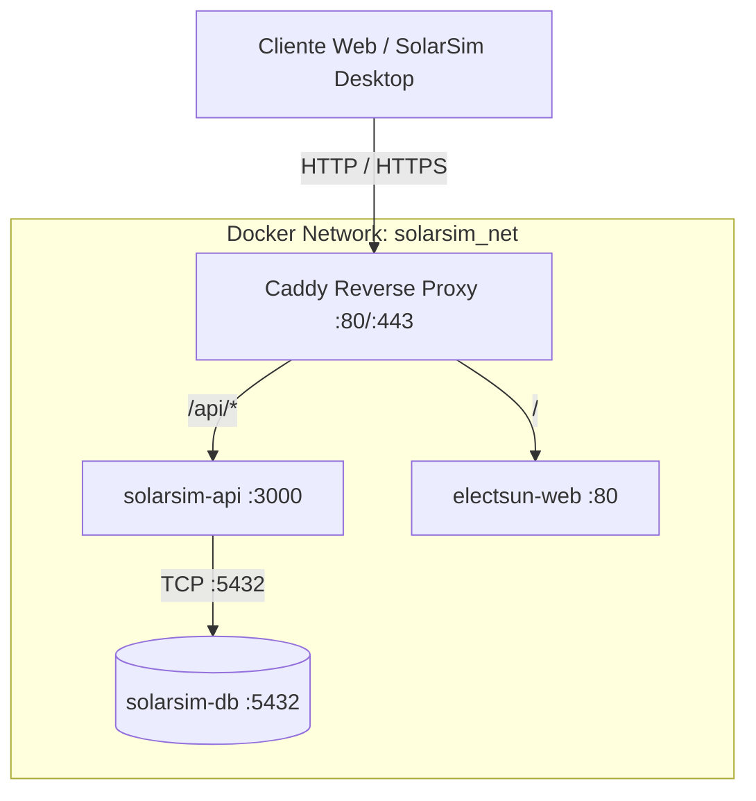

# 🗺️ Mapa de Infraestructura Electsun / SolarSim Pro

Este documento define la topología de red, especificaciones del host, contenedores, servicios desplegados y reglas operativas para la infraestructura en servidor de **Electsun** y **SolarSim Pro**.

---

## 🖥️ 1. Servidor Host & Virtualización

| Componente | Detalle / Configuración |
| :--- | :--- |
| **Hypervisor** | Proxmox VE 9.x (`pve01` - `10.0.0.83`) |
| **Contenedor Principal** | LXC CT 100 (`app-server` - `10.0.0.103`) |
| **Sistema Operativo** | Debian GNU/Linux 13 (Trixie) x86_64 |
| **Acceso SSH** | `ssh app-server` (Usuario: `agente`, autenticación por clave pública) |
| **Permisos de Contenedor** | Grupo `docker` (acceso directo a Docker y Docker Compose sin sudo) |
| **Ruta Base de Servicios** | `/home/agente/servicios/` |

---

## 🌐 2. Topología de Red y Servicios

Todos los servicios de aplicaciones se ejecutan en contenedores Docker y se comunican a través de una red puente interna (`solarsim_net`), aislados del exterior y expuestos únicamente mediante **Caddy Proxy**.



### 📦 Catálogo de Servicios:

1. **`caddy-proxy` (Proxy Inverso & SSL)**:
   - **Ruta**: `/home/agente/servicios/caddy/`
   - **Puertos Host**: `80:80`, `443:443`
   - **Red**: `solarsim_net`
   - **Función**: Manejo automático de certificados SSL/TLS, compresión Zstandard/Gzip, enrutamiento a microservicios.

2. **`solarsim-db` (Base de Datos Relacional)**:
   - **Ruta**: `/home/agente/servicios/database/`
   - **Motor**: PostgreSQL 16 Alpine
   - **Puerto Interno**: `5432` (sin exposición directa al host)
   - **Volumen Persistente**: `/home/agente/servicios/database/data/`
   - **Tablas Principales**:
     - `users` (id, email, password_hash, name, role, organization_id)
     - `organizations` (id, name, created_at)
     - `projects` (id, organization_id, client_data, specs, rates, financials, sync_status, updated_at)
     - `equipment_catalog` (id, organization_id, type, brand, model_series, display_name, power_w, power_kw, capacity_kwh, voltage_v, dod_pct, efficiency_pct, temp_coeff, category, voltage_mppt, details)
     - `audit_logs` (id, user_id, action, timestamp)

3. **`solarsim-api` (Motor de Sincronización, Catálogo & Auth)**:
   - **Ruta**: `/home/agente/servicios/solarsim-api/`
   - **Puerto Interno**: `3000`
   - **Endpoints Principales**:
     - `POST /api/auth/login` (Autenticación JWT)
     - `POST /api/auth/register` (Registro de usuario y organización)
     - `GET /api/projects` (Pull de proyectos con timestamp delta)
     - `POST /api/projects/sync` (Push de proyectos modificados)
     - `GET /api/equipment` (Pull del catálogo global de equipos)
     - `POST /api/equipment/batch` (Push por lotes de nuevos equipos o fichas técnicas escaneadas)
     - `GET /api/health` (Healthcheck)

4. **`electsun-web` (Sitio Web Corporativo)**:
   - **Ruta**: `/home/agente/servicios/electsun-web/`
   - **Puerto Interno**: `80`
   - **Función**: Página web oficial y landing page de Electsun.

---

## 🛠️ 3. Protocolo de Despliegue y Comandos

### Comandos de Operación Remota:
```bash
# Comprobar estado de contenedores en app-server
ssh app-server "docker ps"

# Entrar a un directorio de servicio y ver logs
ssh app-server "cd /home/agente/servicios/<servicio> && docker compose logs --tail=50 -f"

# Recargar configuración de Caddy sin tiempo de inactividad
ssh app-server "docker exec caddy-proxy caddy reload --config /etc/caddy/Caddyfile"

# Desplegar / actualizar un servicio
ssh app-server "cd /home/agente/servicios/<servicio> && docker compose up -d --build"
```

---

## 🔒 4. Políticas de Seguridad e Invariantes
1. **Sin Exposición de Puertos de DB**: PostgreSQL nunca debe mapear `5432:5432` hacia el host; el tráfico debe fluir exclusivamente por la red `solarsim_net`.
2. **Variables de Entorno**: Las credenciales de base de datos y secretos JWT deben residir en archivos `.env` protegidos en `/home/agente/servicios/<servicio>/.env` (con permisos `chmod 600 .env`).
3. **Persistencia de Volúmenes**: Todos los volúmenes de PostgreSQL y almacenamiento de archivos deben montarse en rutas explícitas dentro del subdirectorio del servicio para facilitar respaldos automáticos con `restic` o snapshots de Proxmox.
