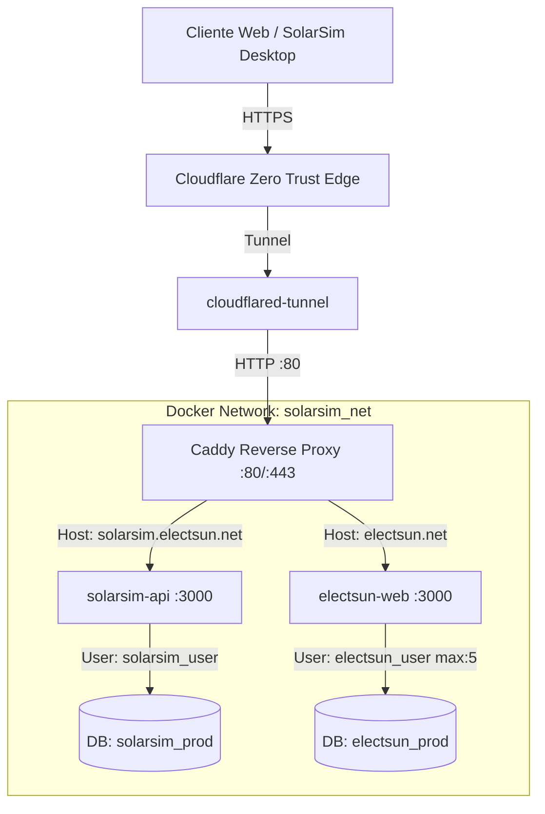

# 🗺️ Mapa de Infraestructura Electsun / SolarSim Pro

Este documento define la topología de red, especificaciones del host, contenedores, servicios desplegados y reglas operativas para la infraestructura en servidor de **Electsun** y **SolarSim Pro**.

---

## 🖥️ 1. Servidor Host & Virtualización

| Componente | Detalle / Configuración |
| :--- | :--- |
| **Hypervisor** | Proxmox VE 9.x (`pve01` - `10.0.0.83`) |
| **Contenedor Principal** | LXC CT 100 (`app-server` - `10.0.0.103`) |
| **Sistema Operativo** | Debian GNU/Linux 13 (Trixie) x86_64 |
| **Acceso SSH** | `ssh app-server` (Usuario: `agente`, autenticación por clave pública) |
| **Permisos de Contenedor** | Grupo `docker` (acceso directo a Docker y Docker Compose sin sudo) |
| **Ruta Base de Servicios** | `/home/agente/servicios/` |

---

## 🌐 2. Topología de Red y Servicios

Todos los servicios de aplicaciones se ejecutan en contenedores Docker y se comunican a través de una red puente interna (`solarsim_net`), aislados del exterior y expuestos únicamente mediante **Caddy Proxy**.



### 📦 Catálogo de Servicios y Segregación:

1. **`caddy-proxy` (Proxy Inverso & Enrutador por Host)**:
   - **Ruta**: `/home/agente/servicios/caddy/`
   - **Puertos Host**: `80:80`, `443:443`
   - **Red**: `solarsim_net`
   - **Función**: Manejo de compresión Zstandard/Gzip y enrutamiento granular basado en el encabezado `Host`:
     - `solarsim.electsun.net`, `api.electsun.net`, `api.solarsim.electsun.net` ➔ `solarsim-api:3000`
     - `www.electsun.net` ➔ Redirección canónica 301 a `https://electsun.net`
     - `electsun.net` (y sus rutas internas `/api/*`) ➔ `electsun-web:3000`

2. **`solarsim-db` (Instancia Central de PostgreSQL 16 Alpine)**:
   - **Ruta**: `/home/agente/servicios/database/`
   - **Puerto Interno**: `5432` (sin exposición al host Proxmox)
   - **Volumen Persistente**: `/home/agente/servicios/database/data/`
   - **Segregación de Bases de Datos & RBAC**:
     - `solarsim_prod`: Propietario `solarsim_user`. Contiene las tablas de autenticación, proyectos multi-usuario y catálogo de equipos fotovoltaicos.
     - `electsun_prod`: Propietario `electsun_user` (principio de mínimo privilegio; no posee acceso a las tablas de SolarSim). Almacena configuración del CMS web, proyectos públicos y leads.

3. **`solarsim-api` (Motor de Sincronización, Catálogo & Auth)**:
   - **Ruta**: `/home/agente/servicios/solarsim-api/`
   - **Puerto Interno**: `3000`
   - **Tecnología**: Node.js + Hono + `pg.Pool`
   - **Endpoints Principales**:
     - `POST /api/auth/login` (Autenticación JWT y retorno de perfil de usuario)
     - `POST /api/auth/register` (Registro de organización y cuenta ADMIN)
     - `GET /api/auth/me` (Validación de token y datos de sesión activa)
     - `GET /api/users` (Listado de integrantes de la organización - Solo ADMIN)
     - `POST /api/users` (Invitación y creación de nuevos miembros de equipo - Solo ADMIN)
     - `PATCH /api/users/:id` (Activación, desactivación y cambio de rol RBAC - Solo ADMIN)
     - `POST /api/sync/pull` (Pull de propuestas autoritativas de toda la organización / Servidor como Fuente de Verdad)
     - `POST /api/sync/push` (Push delta con resolución automática de colisiones de IDs y bifurcación a versiones V2, V3, V4...)
     - `GET /api/equipment` (Catálogo global estándar de equipos + equipos personalizados de la empresa)
     - `POST /api/equipment/batch` (Upsert por lotes de equipos escaneados con IA o creados manualmente)
     - `GET /api/health` (Healthcheck y medición de latencia)

4. **`electsun-web` (Portal Corporativo de Electsun)**:
   - **Ruta**: `/home/agente/servicios/electsun-web/`
   - **Puerto Interno**: `3000`
   - **Tecnología**: Next.js 16 (Standalone Output) + React 19 + Prisma / pg adapter
   - **Control de Recursos**: Límite de conexiones acotado (`max: 5`, `idleTimeoutMillis: 30000`) para evitar inanición de conexiones en PostgreSQL.

5. **`cloudflared-tunnel` (Conector Cloudflare Zero Trust Edge)**:
   - **Ruta**: `/home/agente/servicios/cloudflared/`
   - **Red**: `solarsim_net`
   - **Túnel**: `eletcsun-tunnel`
   - **Función**: Enrutamiento seguro hacia internet de `solarsim.electsun.net`, `api.electsun.net` y `electsun.net` sin abrir puertos en el firewall.

6. **Estrategia Unificada de Respaldo (`scripts/backup-databases.sh`)**:
   - Respaldo atómico de todas las bases de datos (`solarsim_prod` y `electsun_prod`), roles y permisos vía `pg_dumpall | gzip`.
   - Archivo generado con timestamp en `~/backups/electsun/postgres_full_YYYY-MM-DD_HH-MM-SS.sql.gz` con política de retención automática de 14 días.

---

## 🛠️ 3. Protocolo de Despliegue y Comandos

### Comandos de Operación Remota:
```bash
# Comprobar estado de contenedores en app-server
ssh app-server "docker ps"

# Entrar a un directorio de servicio y ver logs
ssh app-server "cd /home/agente/servicios/<servicio> && docker compose logs --tail=50 -f"

# Recargar configuración de Caddy sin tiempo de inactividad
ssh app-server "docker exec caddy-proxy caddy reload --config /etc/caddy/Caddyfile"

# Desplegar / actualizar un servicio
ssh app-server "cd /home/agente/servicios/<servicio> && docker compose up -d --build"
```

---

## 🔒 4. Políticas de Seguridad e Invariantes
1. **Sin Exposición de Puertos de DB**: PostgreSQL nunca debe mapear `5432:5432` hacia el host; el tráfico debe fluir exclusivamente por la red `solarsim_net`.
2. **Variables de Entorno**: Las credenciales de base de datos y secretos JWT deben residir en archivos `.env` protegidos en `/home/agente/servicios/<servicio>/.env` (con permisos `chmod 600 .env`).
3. **Persistencia de Volúmenes**: Todos los volúmenes de PostgreSQL y almacenamiento de archivos deben montarse en rutas explícitas dentro del subdirectorio del servicio para facilitar respaldos automáticos con `restic` o snapshots de Proxmox.
